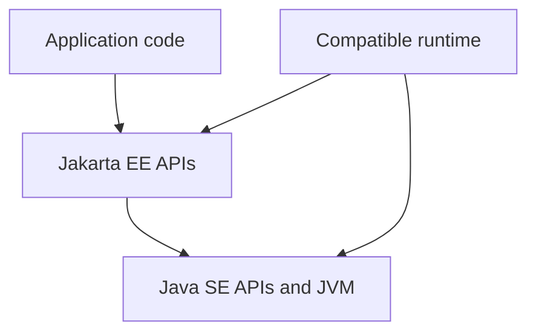
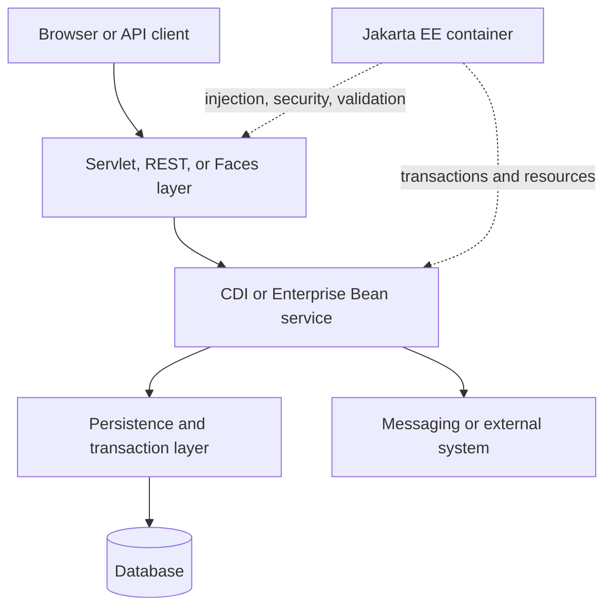
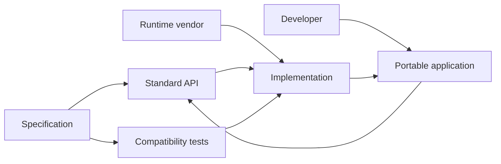
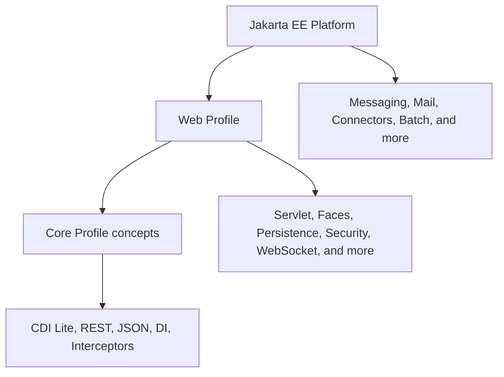
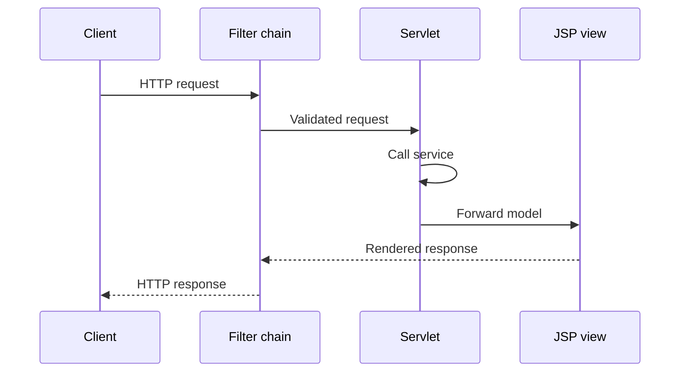
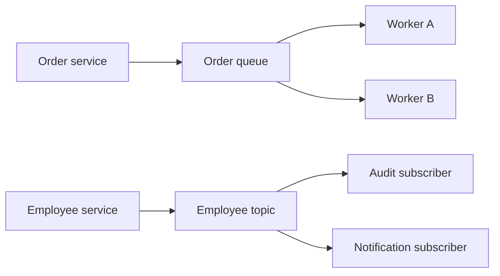
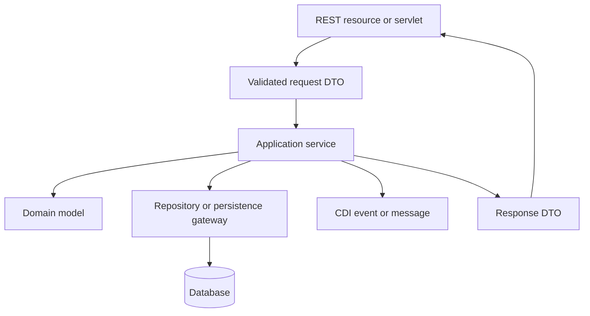
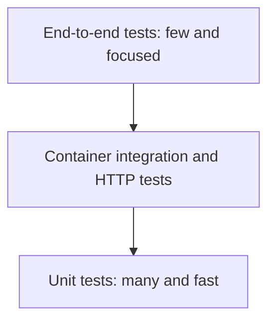

# Jakarta EE Reference Material

> # Jakarta EE 10 with Java 21

🏚️ [Home](index.md) 🔸 ⬅️ Previous: [Jakarta Server Pages](jsp.md) 🔸 ➡️ Next: [Spring Web MVC](spring-web-mvc.md)

## Table of Contents

1. [What Is Jakarta EE?](#1-what-is-jakarta-ee)
2. [Why Is Jakarta EE Used?](#2-why-is-jakarta-ee-used)
3. [Java SE vs Jakarta EE](#3-java-se-vs-jakarta-ee)
4. [Platform Architecture and Request Flow](#4-platform-architecture-and-request-flow)
5. [Java 21 and Jakarta EE 10 Baseline](#5-java-21-and-jakarta-ee-10-baseline)
6. [Specifications, APIs, Implementations, and Compatibility](#6-specifications-apis-implementations-and-compatibility)
7. [Jakarta EE Profiles](#7-jakarta-ee-profiles)
8. [Main Specifications at a Glance](#8-main-specifications-at-a-glance)
9. [Containers, Components, and Life Cycles](#9-containers-components-and-life-cycles)
10. [Project Structure, Maven, and Deployment](#10-project-structure-maven-and-deployment)
11. [Dependency Injection with CDI](#11-dependency-injection-with-cdi)
12. [CDI Scopes and Contexts](#12-cdi-scopes-and-contexts)
13. [Qualifiers, Producers, Events, and Interceptors](#13-qualifiers-producers-events-and-interceptors)
14. [Servlet and Web Request Layer](#14-servlet-and-web-request-layer)
15. [JSP, EL, JSTL, and Jakarta Faces](#15-jsp-el-jstl-and-jakarta-faces)
16. [RESTful Web Services](#16-restful-web-services)
17. [REST Requests, Responses, and Errors](#17-rest-requests-responses-and-errors)
18. [JSON Processing and JSON Binding](#18-json-processing-and-json-binding)
19. [Persistence with Jakarta Persistence](#19-persistence-with-jakarta-persistence)
20. [Entity Relationships, JPQL, and Fetching](#20-entity-relationships-jpql-and-fetching)
21. [Transactions](#21-transactions)
22. [Bean Validation](#22-bean-validation)
23. [Security, Authentication, and Authorization](#23-security-authentication-and-authorization)
24. [Jakarta Enterprise Beans](#24-jakarta-enterprise-beans)
25. [Jakarta Messaging](#25-jakarta-messaging)
26. [Jakarta WebSocket](#26-jakarta-websocket)
27. [Concurrency and Asynchronous Work](#27-concurrency-and-asynchronous-work)
28. [Naming, Resources, and Configuration](#28-naming-resources-and-configuration)
29. [Packaging with WAR, JAR, and EAR Files](#29-packaging-with-war-jar-and-ear-files)
30. [Layered Architecture and Example Flow](#30-layered-architecture-and-example-flow)
31. [Testing Strategies](#31-testing-strategies)
32. [Exception Handling, Logging, and Observability](#32-exception-handling-logging-and-observability)
33. [Cloud-Native Jakarta EE and MicroProfile](#33-cloud-native-jakarta-ee-and-microprofile)
34. [Java EE to Jakarta EE Migration](#34-java-ee-to-jakarta-ee-migration)
35. [Best Practices and Common Errors](#35-best-practices-and-common-errors)
36. [Frequently Asked Interview Questions](#36-frequently-asked-interview-questions)

## 1. What Is Jakarta EE?

**Jakarta EE** is a collection of open specifications for building server-side Java applications. It defines standard APIs and contracts for web requests, dependency injection, REST APIs, JSON, persistence, transactions, validation, security, messaging, concurrency, and other enterprise concerns.

Jakarta EE is a **platform**, not a single framework and not one application server. An application normally uses Jakarta EE APIs while a compatible runtime supplies their implementations.

```java
import jakarta.inject.Inject;
import jakarta.ws.rs.GET;
import jakarta.ws.rs.Path;

@Path("/greeting")
public class GreetingResource {

    @Inject
    GreetingService service;

    @GET
    public String greeting() {
        return service.message();
    }
}
```

This small class uses two standards:

- CDI injects `GreetingService`;
- Jakarta REST maps a Java method to an HTTP endpoint; and
- the Jakarta EE runtime creates the objects, connects them, and processes requests.

The application concentrates on business behavior. The container supplies much of the infrastructure.

[↑ Go to Table of Contents](#table-of-contents)

## 2. Why Is Jakarta EE Used?

Jakarta EE helps teams build enterprise applications with:

- standardized APIs instead of vendor-only contracts;
- dependency injection and managed object life cycles;
- declarative transactions, validation, and security;
- built-in support for HTTP, REST, JSON, persistence, and messaging;
- portable packaging and deployment conventions;
- integration between specifications; and
- multiple compatible runtime choices.

### Without and with a managed platform

| Manually assembled infrastructure | Jakarta EE approach |
| --- | --- |
| Create and connect objects manually | CDI performs injection |
| Open and coordinate resources manually | Container manages configured resources |
| Repeat transaction code | Use declarative transaction boundaries |
| Write validation checks everywhere | Apply Bean Validation constraints |
| Build HTTP routing from scratch | Use Servlet or Jakarta REST annotations |
| Invent lifecycle conventions | Use container-defined component life cycles |

Jakarta EE does not remove the need for good design. It standardizes common infrastructure so developers can spend more time on the domain and less time building plumbing.

[↑ Go to Table of Contents](#table-of-contents)

## 3. Java SE vs Jakarta EE

**Java SE** supplies the Java language runtime and general-purpose APIs. **Jakarta EE** builds on Java SE with server-side enterprise APIs and container services.

| Java SE | Jakarta EE |
| --- | --- |
| Language, JVM, collections, streams, I/O, networking, JDBC, and concurrency utilities | Servlets, REST, CDI, Persistence, Validation, Transactions, Security, Messaging, and more |
| Runs ordinary Java programs | Runs managed application components |
| Application commonly creates its own objects | Container can create, inject, and manage objects |
| Includes packages such as `java.*` and some `javax.*` packages | Modern enterprise APIs mainly use `jakarta.*` |
| Distributed as a JDK/runtime | Implemented by compatible servers and runtimes |

Jakarta EE requires Java SE; it does not replace it.



### Important namespace warning

Do not blindly replace every `javax` package with `jakarta`. Some `javax.*` packages, including `javax.sql`, `javax.naming`, and `javax.crypto`, belong to Java SE and keep their names. Only migrated enterprise APIs changed namespace.

[↑ Go to Table of Contents](#table-of-contents)

## 4. Platform Architecture and Request Flow

A Jakarta EE application is usually organized into presentation, application or business, and data-access responsibilities. The container surrounds these components with standard services.



Typical HTTP processing:

1. A client sends a request.
2. The web container selects a servlet, REST resource, or Faces view.
3. Security rules authenticate the caller and check access.
4. The container creates or locates managed components.
5. CDI supplies dependencies.
6. Validation checks input when integrated at the boundary.
7. A service executes business rules inside a transaction.
8. Persistence reads or changes database state.
9. The web layer returns HTML, JSON, a file, or an HTTP status.

The exact internal implementation differs between runtimes. The application relies on the standard contracts rather than server internals.

[↑ Go to Table of Contents](#table-of-contents)

## 5. Java 21 and Jakarta EE 10 Baseline

This material uses the following baseline:

| Item | Version or requirement |
| --- | --- |
| Java | Java 21 |
| Jakarta EE Platform | 10 |
| Minimum Java version required by the platform | Java SE 11 or newer |
| Servlet | 6.0 |
| Server Pages | 3.1 |
| Expression Language | 5.0 |
| Standard Tag Library | 3.0 |
| CDI | 4.0 |
| Jakarta REST | 3.1 |
| Persistence | 3.1 |
| Bean Validation | 3.0 |
| Security | 3.0 |
| JSON-B / JSON-P | 3.0 / 2.1 |

Java 21 is newer than the platform minimum. The chosen runtime must nevertheless support both **Jakarta EE 10** and **Java 21**. Java support is a runtime capability, not something the application can assume merely because the API dependency compiles.

Important official references:

- [Jakarta EE 10 release overview](https://jakarta.ee/release/10/)
- [Jakarta EE Platform 10](https://jakarta.ee/specifications/platform/10/)
- [Jakarta EE 10 platform specification](https://jakarta.ee/specifications/platform/10/jakarta-platform-spec-10.0)
- [Jakarta EE Web Profile 10](https://jakarta.ee/specifications/webprofile/10/)
- [Jakarta EE Core Profile 10](https://jakarta.ee/specifications/coreprofile/10/)

Jakarta EE 11 is a later platform generation. When targeting Jakarta EE 10, avoid APIs or features introduced only in later specification versions.

[↑ Go to Table of Contents](#table-of-contents)

## 6. Specifications, APIs, Implementations, and Compatibility

These terms describe different parts of the ecosystem:

| Term | Meaning |
| --- | --- |
| Specification | Written rules that define required behavior |
| API | Classes, interfaces, annotations, and exceptions used by application code |
| Implementation | Working code that provides the specified behavior |
| Compatible implementation | A product that passes the applicable Technology Compatibility Kit requirements |
| Application server/runtime | A product containing implementations and containers for one or more profiles |



### API dependency vs runtime implementation

The Maven platform API artifact lets the compiler recognize standard types:

```xml
<dependency>
    <groupId>jakarta.platform</groupId>
    <artifactId>jakarta.jakartaee-api</artifactId>
    <version>10.0.0</version>
    <scope>provided</scope>
</dependency>
```

The `provided` scope is important for a traditional server deployment:

- the application compiles against the APIs;
- the API JAR is not placed in the application package; and
- the server supplies compatible APIs and implementations at runtime.

Bundling another platform API copy can cause class-loading conflicts. Product-specific packaging models may differ, so follow the selected runtime's documentation.

[↑ Go to Table of Contents](#table-of-contents)

## 7. Jakarta EE Profiles

A **profile** is a defined subset of the platform intended for a category of applications.

| Profile | Main purpose | Typical contents |
| --- | --- | --- |
| Core Profile 10 | Small runtimes and microservice-oriented applications | CDI Lite, REST, JSON-P, JSON-B, annotations, DI, interceptors |
| Web Profile 10 | Web applications | Core web stack plus Servlet, JSP, Faces, Persistence, Validation, Security, Transactions, WebSocket, Concurrency, and Enterprise Beans Lite |
| Platform 10 | Complete enterprise platform | Web Profile capabilities plus technologies such as Messaging, Mail, Connectors, Batch, and the full required platform set |



This picture shows increasing capability, but the formal profile definitions are requirement lists. Do not assume every Core Profile packaging or runtime rule is identical to Web Profile packaging.

### Choosing a profile

- Choose **Core Profile** when the required APIs are intentionally small.
- Choose **Web Profile** for most database-backed HTTP applications.
- Choose the **full Platform** when the application needs capabilities such as Jakarta Messaging or other full-platform services.

Use the smallest standard profile that completely covers the application's real requirements.

[↑ Go to Table of Contents](#table-of-contents)

## 8. Main Specifications at a Glance

Jakarta EE is easier to learn when each specification is connected to a problem.

| Requirement | Jakarta technology | Typical types or annotations |
| --- | --- | --- |
| Low-level HTTP and web control | Servlet 6.0 | `HttpServlet`, `@WebServlet`, filters |
| Server-rendered templates | Server Pages 3.1, EL 5.0, JSTL 3.0 | JSP pages, EL expressions, standard tags |
| Component-oriented web UI | Faces 4.0 | components, converters, validators |
| Dependency injection | CDI 4.0 | `@Inject`, scopes, qualifiers, events |
| REST endpoints and clients | Jakarta REST 3.1 | `@Path`, `@GET`, `Response` |
| Object/JSON mapping | JSON-B 3.0 | `Jsonb`, JSON-B annotations |
| JSON object model and streaming | JSON-P 2.1 | `JsonObject`, builders, parsers |
| Object-relational mapping | Persistence 3.1 | `@Entity`, `EntityManager`, JPQL |
| Declarative validation | Bean Validation 3.0 | `@NotNull`, `@Size`, `@Valid` |
| Transaction coordination | Transactions 2.0 | `@Transactional`, `UserTransaction` |
| Authentication and authorization | Security 3.0 | identity stores, mechanisms, `SecurityContext` |
| Business components | Enterprise Beans 4.0 | `@Stateless`, `@Singleton`, timers |
| Reliable asynchronous messaging | Messaging 3.1 | `JMSContext`, queues, topics |
| Full-duplex web communication | WebSocket 2.1 | `@ServerEndpoint`, `@OnMessage` |
| Container-managed tasks | Concurrency 3.0 | `ManagedExecutorService` |

You do not need to use every specification. A good application selects only the capabilities required by its design.

[↑ Go to Table of Contents](#table-of-contents)

## 9. Containers, Components, and Life Cycles

A **container** is runtime infrastructure that manages particular application components.

| Container area | Common components | Services |
| --- | --- | --- |
| Web container | Servlets, filters, listeners, JSP, Faces, REST integration | HTTP, sessions, request dispatch, security |
| CDI container | Managed beans, producers, observers, interceptors | Injection, scopes, life-cycle callbacks |
| Enterprise Beans container | Session beans, message-driven beans | Transactions, pooling, timers, asynchronous calls |
| Persistence integration | Entities and persistence contexts | Entity management and transaction association |

The container may:

- instantiate a managed object;
- inject dependencies and resources;
- invoke life-cycle callbacks;
- apply interceptors and security rules;
- begin or join a transaction;
- make the component available to requests; and
- destroy it when its context ends.

### Common lifecycle callbacks

```java
import jakarta.annotation.PostConstruct;
import jakarta.annotation.PreDestroy;
import jakarta.enterprise.context.ApplicationScoped;

@ApplicationScoped
public class CatalogCache {

    @PostConstruct
    void load() {
        // Initialize container-managed component state.
    }

    @PreDestroy
    void release() {
        // Release resources owned by this component.
    }
}
```

Do not call `@PostConstruct` methods yourself. They are part of the managed life cycle. A class created directly with `new` is not automatically managed and does not automatically receive CDI injection or callbacks.

[↑ Go to Table of Contents](#table-of-contents)

## 10. Project Structure, Maven, and Deployment

A common Maven Web Profile project may look like this:

```text
employee-app/
├── pom.xml
└── src/
    ├── main/
    │   ├── java/
    │   │   └── com/example/employee/
    │   │       ├── boundary/
    │   │       ├── service/
    │   │       └── persistence/
    │   ├── resources/
    │   │   └── META-INF/
    │   │       └── persistence.xml
    │   └── webapp/
    │       └── WEB-INF/
    │           ├── beans.xml
    │           └── web.xml
    └── test/
        └── java/
```

Minimal Maven settings for a traditional WAR:

```xml
<properties>
    <maven.compiler.release>21</maven.compiler.release>
    <project.build.sourceEncoding>UTF-8</project.build.sourceEncoding>
</properties>

<dependencies>
    <dependency>
        <groupId>jakarta.platform</groupId>
        <artifactId>jakarta.jakartaee-api</artifactId>
        <version>10.0.0</version>
        <scope>provided</scope>
    </dependency>
</dependencies>

<build>
    <finalName>employee-app</finalName>
</build>
```

For a Web Profile-only target, the API artifact is:

```xml
<artifactId>jakarta.jakartaee-web-api</artifactId>
```

The project also needs `<packaging>war</packaging>` when WAR is not already the build default.

### Compile and deploy are different

1. Maven compiles the application against the API.
2. Maven packages application classes and resources.
3. The WAR is deployed to a compatible runtime.
4. The runtime discovers components and supplies implementations.
5. The application becomes available under its context path.

[↑ Go to Table of Contents](#table-of-contents)

## 11. Dependency Injection with CDI

**Contexts and Dependency Injection**, or **CDI**, connects application components while allowing the container to manage their creation and life cycles.

```java
import jakarta.enterprise.context.ApplicationScoped;

@ApplicationScoped
public class GreetingService {

    public String message(String name) {
        return "Hello, " + name;
    }
}
```

```java
import jakarta.inject.Inject;
import jakarta.ws.rs.GET;
import jakarta.ws.rs.Path;
import jakarta.ws.rs.QueryParam;

@Path("/greetings")
public class GreetingResource {

    private final GreetingService service;

    @Inject
    public GreetingResource(GreetingService service) {
        this.service = service;
    }

    @GET
    public String greet(@QueryParam("name") String name) {
        return service.message(name);
    }
}
```

### Injection styles

| Style | Example | Guidance |
| --- | --- | --- |
| Constructor | `@Inject MyBean(Service service)` | Makes required dependencies explicit and supports unit testing |
| Field | `@Inject Service service;` | Concise, but hides dependencies and complicates plain unit tests |
| Initializer method | `@Inject void configure(Service service)` | Useful for method-based initialization |

CDI resolves a dependency by required type plus any qualifiers. Resolution must produce exactly one eligible bean. Zero matches cause an unsatisfied dependency; multiple matches cause an ambiguous dependency.

Prefer programming to an interface when multiple implementations or test substitutes are likely.

[↑ Go to Table of Contents](#table-of-contents)

## 12. CDI Scopes and Contexts

A CDI **scope** determines how long a contextual bean instance lives and which clients share it.

| Scope | Typical lifetime | Common use |
| --- | --- | --- |
| `@RequestScoped` | One HTTP request | Request-specific state |
| `@SessionScoped` | One HTTP session | User session state |
| `@ApplicationScoped` | Application lifetime | Shared stateless services or thread-safe caches |
| `@ConversationScoped` | Explicit multi-request conversation | Multi-step web flows |
| `@Dependent` | Belongs to the object into which it is injected | Small helpers and default CDI scope |

```java
import jakarta.enterprise.context.RequestScoped;

@RequestScoped
public class RequestAudit {

    private String correlationId;

    public String getCorrelationId() {
        return correlationId;
    }

    public void setCorrelationId(String correlationId) {
        this.correlationId = correlationId;
    }
}
```

### Scope is a design decision

- Request-scoped state is isolated between requests.
- Session-scoped state is shared by requests in one user session.
- Application-scoped state may be accessed concurrently by many threads.
- Session and conversation beans may need to be serializable because a container can passivate them.
- Dependent objects can be created and destroyed with their injection target.

Do not store request-specific mutable data in an application-scoped bean. Its state can leak between users and cause race conditions.

[↑ Go to Table of Contents](#table-of-contents)

## 13. Qualifiers, Producers, Events, and Interceptors

CDI provides more than basic type-based injection.

### Qualifiers

A qualifier distinguishes implementations of the same interface.

```java
import jakarta.inject.Qualifier;
import java.lang.annotation.Retention;
import java.lang.annotation.Target;

import static java.lang.annotation.ElementType.FIELD;
import static java.lang.annotation.ElementType.METHOD;
import static java.lang.annotation.ElementType.PARAMETER;
import static java.lang.annotation.ElementType.TYPE;
import static java.lang.annotation.RetentionPolicy.RUNTIME;

@Qualifier
@Retention(RUNTIME)
@Target({ TYPE, FIELD, PARAMETER, METHOD })
public @interface Urgent {
}
```

```java
@Urgent
@ApplicationScoped
public class SmsNotifier implements Notifier {
    public void send(String message) {
        // Send an urgent SMS.
    }
}

@Inject
@Urgent
Notifier notifier;
```

### Producers

A producer makes an object available when the class cannot be annotated or construction needs custom logic.

```java
import jakarta.enterprise.inject.Produces;
import java.time.Clock;

public class TimeResources {

    @Produces
    Clock clock() {
        return Clock.systemUTC();
    }
}
```

### Events

CDI events decouple the component that announces something from components that react to it.

```java
public record EmployeeCreated(long id, String email) {
}
```

```java
import jakarta.enterprise.event.Event;
import jakarta.inject.Inject;

public class EmployeeService {

    @Inject
    Event<EmployeeCreated> employeeCreated;

    public void create(long id, String email) {
        // Save the employee.
        employeeCreated.fire(new EmployeeCreated(id, email));
    }
}
```

```java
import jakarta.enterprise.event.Observes;

public class WelcomeListener {

    void onEmployeeCreated(@Observes EmployeeCreated event) {
        // React without coupling the service to this listener.
    }
}
```

Synchronous observers run as part of the firing call. CDI also supports asynchronous events, but they are not a replacement for durable messaging.

### Interceptors

An interceptor applies cross-cutting behavior such as auditing around method calls.

```java
import jakarta.interceptor.AroundInvoke;
import jakarta.interceptor.Interceptor;
import jakarta.interceptor.InvocationContext;

@Audited
@Interceptor
public class AuditInterceptor {

    private static final System.Logger LOGGER =
            System.getLogger(AuditInterceptor.class.getName());

    @AroundInvoke
    Object audit(InvocationContext context) throws Exception {
        try {
            return context.proceed();
        } finally {
            LOGGER.log(
                    System.Logger.Level.INFO,
                    context.getMethod().getName());
        }
    }
}
```

An interceptor binding such as `@Audited` is a separate annotation marked with `@InterceptorBinding`. Interceptors must be enabled according to CDI rules, commonly with `@Priority` or `beans.xml`.

[↑ Go to Table of Contents](#table-of-contents)

## 14. Servlet and Web Request Layer

Jakarta Servlet 6.0 is the foundation of the Jakarta EE web container. A servlet works directly with HTTP requests and responses.

```java
import jakarta.servlet.ServletException;
import jakarta.servlet.annotation.WebServlet;
import jakarta.servlet.http.HttpServlet;
import jakarta.servlet.http.HttpServletRequest;
import jakarta.servlet.http.HttpServletResponse;
import java.io.IOException;

@WebServlet("/health")
public class HealthServlet extends HttpServlet {

    @Override
    protected void doGet(HttpServletRequest request,
                         HttpServletResponse response)
            throws IOException, ServletException {
        response.setContentType("text/plain;charset=UTF-8");
        response.getWriter().println("UP");
    }
}
```

Important web building blocks:

| Component | Purpose |
| --- | --- |
| Servlet | Handles a mapped request |
| Filter | Performs cross-cutting work before or after a servlet |
| Listener | Reacts to application, request, or session events |
| Session | Stores state associated with one client across requests |
| `ServletContext` | Represents the deployed web application |
| Request dispatcher | Forwards to or includes another server-side resource |



Servlet instances can process multiple requests concurrently. Never place per-request mutable data in servlet instance fields. Store it in local variables or an appropriate managed scope.

For detailed coverage, see [Jakarta Servlet 6.0 notes](servlet.md).

[↑ Go to Table of Contents](#table-of-contents)

## 15. JSP, EL, JSTL, and Jakarta Faces

Jakarta EE 10 offers two standard approaches for server-rendered web interfaces.

| Technology | Style | Best fit |
| --- | --- | --- |
| JSP 3.1 with EL and JSTL | Page-template and MVC view | Traditional servlet-controller applications |
| Jakarta Faces 4.0 | Server-side UI component framework | Form-heavy, component-oriented web interfaces |

### JSP view

A servlet prepares model data and forwards to a JSP:

```java
request.setAttribute("employee", employee);
request.getRequestDispatcher("/WEB-INF/views/employee.jsp")
       .forward(request, response);
```

The JSP reads the model with EL and tags:

```jsp
<h1>${employee.name}</h1>
<c:if test="${employee.active}">
    <p>Active employee</p>
</c:if>
```

JSP pages should focus on presentation. Avoid Java scriptlets and database code in a JSP.

### Jakarta Faces view

Faces binds server-side UI components to a CDI-backed model:

```xhtml
<h:form>
    <h:outputLabel for="name" value="Name"/>
    <h:inputText id="name" value="#{employeeBean.name}" required="true"/>
    <h:commandButton value="Save" action="#{employeeBean.save}"/>
</h:form>
```

Faces manages a component tree, conversion, validation, events, and rendering. It is not simply another name for JSP.

For focused template coverage, see [Jakarta Server Pages 3.1 notes](jsp.md).

[↑ Go to Table of Contents](#table-of-contents)

## 16. RESTful Web Services

Jakarta REST 3.1 maps HTTP requests to Java classes and methods with annotations.

### Activating a REST application

```java
import jakarta.ws.rs.ApplicationPath;
import jakarta.ws.rs.core.Application;

@ApplicationPath("/api")
public class RestApplication extends Application {
}
```

### A REST resource

```java
import jakarta.inject.Inject;
import jakarta.ws.rs.GET;
import jakarta.ws.rs.Path;
import jakarta.ws.rs.PathParam;
import jakarta.ws.rs.Produces;
import jakarta.ws.rs.core.MediaType;

@Path("/employees")
@Produces(MediaType.APPLICATION_JSON)
public class EmployeeResource {

    @Inject
    EmployeeService service;

    @GET
    @Path("/{id}")
    public EmployeeView find(@PathParam("id") long id) {
        return service.find(id);
    }
}
```

If the application context is `employee-app`, a typical URL is:

```text
/employee-app/api/employees/42
```

### Main annotations

| Annotation | Meaning |
| --- | --- |
| `@Path` | URI path on a class or method |
| `@GET`, `@POST`, `@PUT`, `@DELETE`, `@PATCH` | HTTP method |
| `@Produces` | Response media type |
| `@Consumes` | Accepted request media type |
| `@PathParam` | Value from the URI path |
| `@QueryParam` | Value from the query string |
| `@HeaderParam` | Value from a request header |
| `@BeanParam` | Groups multiple request parameters |

Resource classes should translate transport input into application calls. Keep reusable business rules in a service, not in endpoint methods.

[↑ Go to Table of Contents](#table-of-contents)

## 17. REST Requests, Responses, and Errors

A request entity can be mapped from JSON to a Java object:

```java
public record CreateEmployeeRequest(
        String name,
        String email) {
}
```

```java
import jakarta.ws.rs.Consumes;
import jakarta.ws.rs.POST;
import jakarta.ws.rs.core.Context;
import jakarta.ws.rs.core.Response;
import jakarta.ws.rs.core.UriInfo;
import java.net.URI;

@POST
@Consumes(MediaType.APPLICATION_JSON)
public Response create(CreateEmployeeRequest request,
                       @Context UriInfo uriInfo) {
    EmployeeView created = service.create(request);

    URI location = uriInfo.getAbsolutePathBuilder()
                          .path(Long.toString(created.id()))
                          .build();
    return Response.created(location)
                   .entity(created)
                   .build();
}
```

### Useful response patterns

| Situation | Typical status |
| --- | --- |
| Successful retrieval | `200 OK` |
| Successful creation | `201 Created` with `Location` |
| Successful request with no body | `204 No Content` |
| Invalid client input | `400 Bad Request` |
| Unauthenticated request | `401 Unauthorized` |
| Authenticated but not allowed | `403 Forbidden` |
| Resource not found | `404 Not Found` |
| State conflict | `409 Conflict` |
| Unexpected server failure | `500 Internal Server Error` |

### Exception mapping

```java
import jakarta.ws.rs.core.Response;
import jakarta.ws.rs.ext.ExceptionMapper;
import jakarta.ws.rs.ext.Provider;

@Provider
public class EmployeeNotFoundMapper
        implements ExceptionMapper<EmployeeNotFoundException> {

    @Override
    public Response toResponse(EmployeeNotFoundException exception) {
        ErrorBody body = new ErrorBody(
                "EMPLOYEE_NOT_FOUND",
                exception.getMessage());

        return Response.status(Response.Status.NOT_FOUND)
                       .entity(body)
                       .build();
    }
}
```

Exception mappers centralize HTTP error translation. Do not expose stack traces, SQL details, credentials, or internal class names to clients.

[↑ Go to Table of Contents](#table-of-contents)

## 18. JSON Processing and JSON Binding

Jakarta EE 10 includes two complementary JSON standards.

| API | Direction | Use |
| --- | --- | --- |
| JSON-P 2.1 | JSON structure-oriented | Build, parse, transform, or stream JSON explicitly |
| JSON-B 3.0 | Java object-oriented | Convert Java objects to and from JSON |

### JSON-P object model

```java
import jakarta.json.Json;
import jakarta.json.JsonObject;

JsonObject json = Json.createObjectBuilder()
        .add("id", 42)
        .add("name", "Asha")
        .add("active", true)
        .build();
```

### JSON-B mapping

```java
import jakarta.json.bind.Jsonb;
import jakarta.json.bind.JsonbBuilder;

EmployeeView employee = new EmployeeView(42L, "Asha", true);

try (Jsonb jsonb = JsonbBuilder.create()) {
    String json = jsonb.toJson(employee);
    EmployeeView copy = jsonb.fromJson(json, EmployeeView.class);
}
```

```java
import jakarta.json.bind.annotation.JsonbProperty;

public record EmployeeView(
        long id,
        @JsonbProperty("full_name") String name,
        boolean active) {
}
```

Jakarta REST providers commonly integrate JSON-B so a resource can return a Java object directly. The provider serializes the entity according to content negotiation and configuration.

Do not serialize persistence entities blindly. Bidirectional relationships, lazy properties, and internal fields can produce cycles, errors, or data exposure. A dedicated API DTO gives better control.

[↑ Go to Table of Contents](#table-of-contents)

## 19. Persistence with Jakarta Persistence

Jakarta Persistence 3.1 maps Java objects to relational database data. It is commonly called JPA because of its historical name.

### An entity

```java
import jakarta.persistence.Entity;
import jakarta.persistence.GeneratedValue;
import jakarta.persistence.Id;
import jakarta.persistence.Table;

@Entity
@Table(name = "employees")
public class Employee {

    @Id
    @GeneratedValue
    private Long id;

    private String name;
    private String email;

    protected Employee() {
    }

    public Employee(String name, String email) {
        this.name = name;
        this.email = email;
    }

    public Long getId() {
        return id;
    }
}
```

### Using a persistence context

```java
import jakarta.persistence.EntityManager;
import jakarta.persistence.PersistenceContext;
import jakarta.enterprise.context.ApplicationScoped;
import jakarta.transaction.Transactional;

@ApplicationScoped
@Transactional
public class EmployeeRepository {

    @PersistenceContext
    EntityManager entityManager;

    public void save(Employee employee) {
        entityManager.persist(employee);
    }

    public Employee find(long id) {
        return entityManager.find(Employee.class, id);
    }
}
```

### Main entity states

| State | Meaning |
| --- | --- |
| New/transient | Ordinary object not associated with a persistence context |
| Managed | Tracked by the current persistence context |
| Detached | Was managed but is no longer tracked |
| Removed | Scheduled for database deletion |

Changes to a managed entity can be detected and written during flush. Calling `persist()` repeatedly for every field change is unnecessary.

The persistence unit and data source are usually declared in `META-INF/persistence.xml` or by supported platform configuration. Keep credentials outside source code.

[↑ Go to Table of Contents](#table-of-contents)

## 20. Entity Relationships, JPQL, and Fetching

Persistence models common relational associations.

| Mapping | Example |
| --- | --- |
| `@OneToOne` | Employee and parking space |
| `@OneToMany` | Department and employees |
| `@ManyToOne` | Many employees belong to one department |
| `@ManyToMany` | Employees and projects |

```java
@Entity
public class Employee {

    @Id
    @GeneratedValue
    private Long id;

    @ManyToOne(fetch = FetchType.LAZY)
    @JoinColumn(name = "department_id")
    private Department department;
}
```

The side containing `@JoinColumn` is commonly the owning side for this many-to-one relationship. A bidirectional relationship must be kept consistent in memory on both sides.

### JPQL

JPQL queries entities and their attributes, not table and column names.

```java
List<Employee> employees = entityManager.createQuery(
        """
        select e
        from Employee e
        where e.department.id = :departmentId
        order by e.name
        """,
        Employee.class)
    .setParameter("departmentId", departmentId)
    .getResultList();
```

### Fetching and performance

- Lazy fetching postpones loading until an association is accessed.
- Eager fetching requests immediate loading but can retrieve too much data.
- Accessing lazy data after the persistence context closes can fail.
- Repeated lazy loads can create an **N+1 query problem**.
- Fetch joins, entity graphs, projections, and query-specific DTOs can load the required data deliberately.
- Cascades control which persistence operations propagate; they do not mean every relationship should cascade every operation.

Design queries from use cases and verify the SQL generated by the implementation.

[↑ Go to Table of Contents](#table-of-contents)

## 21. Transactions

A transaction groups work into one unit that either commits successfully or rolls back.

```java
import jakarta.transaction.Transactional;

@Transactional
public void transfer(long fromId, long toId, BigDecimal amount) {
    Account from = repository.find(fromId);
    Account to = repository.find(toId);

    from.debit(amount);
    to.credit(amount);
}
```

If an unchecked exception escapes the method, the default interceptor behavior marks the transaction for rollback. Checked-exception behavior can be configured with `rollbackOn` and `dontRollbackOn`.

### Transaction types

| `TxType` | Behavior |
| --- | --- |
| `REQUIRED` | Join the current transaction or start one; default |
| `REQUIRES_NEW` | Suspend the current transaction and start a new one |
| `MANDATORY` | Require an existing transaction |
| `SUPPORTS` | Use a transaction if one exists |
| `NOT_SUPPORTED` | Run without a transaction |
| `NEVER` | Fail if a transaction exists |

### Transaction boundary guidance

- Place the boundary around one business use case.
- Keep related database changes in the same transaction.
- Avoid long user interactions or slow network calls inside a transaction.
- Do not catch and silently ignore an exception that should cause rollback.
- Understand whether asynchronous work starts a separate transaction.
- Use optimistic or pessimistic locking when the concurrency model requires it.

Programmatic transactions with `UserTransaction` are available in appropriate components, but declarative transactions are usually clearer.

[↑ Go to Table of Contents](#table-of-contents)

## 22. Bean Validation

Jakarta Bean Validation 3.0 expresses data rules with annotations and validates object graphs consistently.

```java
import jakarta.validation.constraints.Email;
import jakarta.validation.constraints.NotBlank;
import jakarta.validation.constraints.Size;

public record CreateEmployeeRequest(
        @NotBlank
        @Size(max = 100)
        String name,

        @NotBlank
        @Email
        @Size(max = 254)
        String email) {
}
```

In a Jakarta REST resource:

```java
import jakarta.validation.Valid;

@POST
@Consumes(MediaType.APPLICATION_JSON)
public Response create(@Valid CreateEmployeeRequest request) {
    // Called after request validation succeeds.
    return Response.status(Response.Status.CREATED)
                   .entity(service.create(request))
                   .build();
}
```

### Common constraints

| Constraint | Checks |
| --- | --- |
| `@NotNull` | Value is not `null` |
| `@NotBlank` | Text is not null and contains non-whitespace |
| `@Size` | String, collection, map, or array size |
| `@Min` / `@Max` | Numeric limit |
| `@Positive` | Positive numeric value |
| `@Past` / `@Future` | Temporal relationship |
| `@Email` | Email-shaped text |
| `@Pattern` | Regular-expression match |
| `@Valid` | Cascaded validation of a nested object |

Validation protects shape and declared constraints. Business rules such as “email must be unique” normally require a service and database constraint as well.

Custom constraints combine an annotation with a `ConstraintValidator` implementation. Use validation groups only when different operations genuinely require different rule sets.

[↑ Go to Table of Contents](#table-of-contents)

## 23. Security, Authentication, and Authorization

Jakarta EE separates several security concerns:

| Concern | Question |
| --- | --- |
| Authentication | Who is the caller? |
| Authorization | May this caller perform the operation? |
| Identity store | Where are identities and groups verified? |
| Authentication mechanism | How are credentials obtained and processed? |
| Transport security | Is communication protected in transit? |

### Declarative authorization

```java
import jakarta.annotation.security.RolesAllowed;
import jakarta.enterprise.context.ApplicationScoped;

@ApplicationScoped
public class PayrollService {

    @RolesAllowed("PAYROLL")
    public Payslip generate(long employeeId) {
        return new Payslip(employeeId);
    }
}
```

Related annotations include `@PermitAll`, `@DenyAll`, and `@DeclareRoles`.

### Programmatic caller information

```java
import jakarta.inject.Inject;
import jakarta.security.enterprise.SecurityContext;

public class CurrentUser {

    @Inject
    SecurityContext securityContext;

    public String name() {
        return securityContext.getCallerPrincipal().getName();
    }

    public boolean isAdmin() {
        return securityContext.isCallerInRole("ADMIN");
    }
}
```

Jakarta Security 3.0 standardizes application-oriented authentication mechanisms and identity-store integration, including OpenID Connect support. Container configuration and external identity-provider setup are still deployment concerns.

Security rules should be enforced at a trusted server boundary, preferably also at the service method that protects the business operation. Hiding a button in the browser is not authorization. Use TLS, protect secrets, validate input, escape output, and avoid exposing sensitive error information.

[↑ Go to Table of Contents](#table-of-contents)

## 24. Jakarta Enterprise Beans

Jakarta Enterprise Beans 4.0 provides container-managed business components with services such as transactions, security, asynchronous calls, timers, pooling, remoting, and message-driven processing.

### Session bean types

| Type | Meaning |
| --- | --- |
| Stateless | No client-specific conversational state between calls |
| Stateful | Maintains conversational state for a client |
| Singleton | One shared bean instance per application |

```java
import jakarta.ejb.Stateless;
import jakarta.persistence.EntityManager;
import jakarta.persistence.PersistenceContext;

@Stateless
public class EmployeeService {

    @PersistenceContext
    EntityManager entityManager;

    public Employee create(String name, String email) {
        Employee employee = new Employee(name, email);
        entityManager.persist(employee);
        return employee;
    }
}
```

Enterprise Bean business methods use container-managed transactions by default. Other useful annotations include:

- `@TransactionAttribute` for transaction behavior;
- `@RolesAllowed` for authorization;
- `@Asynchronous` for asynchronous method invocation;
- `@Schedule` and `TimerService` for timers;
- `@Lock` for singleton concurrency; and
- `@MessageDriven` for message consumers.

### CDI bean or Enterprise Bean?

Use a CDI bean for ordinary managed application logic. Choose an Enterprise Bean when its specific container services or component semantics are needed. These technologies integrate: an Enterprise Bean can participate in CDI injection.

Avoid adding an Enterprise Bean annotation merely to make a class “enterprise.” Select it because the required service contract justifies it.

[↑ Go to Table of Contents](#table-of-contents)

## 25. Jakarta Messaging

Jakarta Messaging 3.1, historically called JMS, provides standard APIs for sending and receiving messages through a messaging provider. It belongs to the full Jakarta EE Platform rather than the Web Profile.

### Queue and topic

| Destination model | Delivery idea | Typical use |
| --- | --- | --- |
| Queue | Each message is consumed by one eligible consumer | Work distribution and command processing |
| Topic | A message is delivered to interested subscriptions | Event publication |



The two queue workers compete; one processes a particular queue message. The topic subscribers each represent an interested subscription.

### Sending a message

```java
import jakarta.annotation.Resource;
import jakarta.enterprise.context.ApplicationScoped;
import jakarta.inject.Inject;
import jakarta.jms.JMSContext;
import jakarta.jms.Queue;

@ApplicationScoped
public class OrderPublisher {

    @Inject
    JMSContext context;

    @Resource(lookup = "java:app/jms/Orders")
    Queue orders;

    public void publish(long orderId) {
        context.createProducer()
               .setProperty("eventType", "ORDER_CREATED")
               .send(orders, Long.toString(orderId));
    }
}
```

The destination name and provisioning are deployment concerns. A standard resource-definition annotation can be used where supported by the deployment design, while many organizations provision destinations operationally.

### Message-driven consumer

A message-driven bean receives messages without a caller invoking it directly:

```java
import jakarta.ejb.ActivationConfigProperty;
import jakarta.ejb.MessageDriven;
import jakarta.jms.Message;
import jakarta.jms.MessageListener;

@MessageDriven(activationConfig = {
    @ActivationConfigProperty(
        propertyName = "destinationLookup",
        propertyValue = "java:app/jms/Orders"
    ),
    @ActivationConfigProperty(
        propertyName = "destinationType",
        propertyValue = "jakarta.jms.Queue"
    )
})
public class OrderProcessor implements MessageListener {

    @Override
    public void onMessage(Message message) {
        // Process the message inside container-managed infrastructure.
    }
}
```

Design consumers to be idempotent because delivery can be repeated. Configure acknowledgement, redelivery, dead-letter handling, ordering, and transaction behavior deliberately.

[↑ Go to Table of Contents](#table-of-contents)

## 26. Jakarta WebSocket

Jakarta WebSocket 2.1 provides full-duplex communication between a client and server over one long-lived connection.

```java
import jakarta.websocket.OnClose;
import jakarta.websocket.OnMessage;
import jakarta.websocket.OnOpen;
import jakarta.websocket.Session;
import jakarta.websocket.server.ServerEndpoint;
import java.io.IOException;

@ServerEndpoint("/notifications")
public class NotificationEndpoint {

    @OnOpen
    public void opened(Session session) throws IOException {
        session.getBasicRemote().sendText("Connected");
    }

    @OnMessage
    public String received(String message) {
        return "Received: " + message;
    }

    @OnClose
    public void closed(Session session) {
        // Remove connection-specific state.
    }
}
```

### HTTP request vs WebSocket connection

| HTTP/REST | WebSocket |
| --- | --- |
| Request-response interaction | Two-way messaging after connection establishment |
| Usually short-lived request processing | Long-lived connection |
| Natural for CRUD and resource APIs | Natural for live notifications, collaboration, and streaming updates |
| Intermediaries understand HTTP semantics | Requires WebSocket-aware infrastructure |

Consider authentication during connection establishment, authorization for every sensitive action, message-size limits, idle timeouts, backpressure, connection cleanup, and clustered-session behavior.

Do not use WebSocket simply to avoid designing a clear REST API. Use it when the application genuinely needs low-latency server-to-client or bidirectional updates.

[↑ Go to Table of Contents](#table-of-contents)

## 27. Concurrency and Asynchronous Work

Jakarta EE components run inside managed containers. Application code should use container-managed concurrency facilities instead of creating arbitrary threads.

```java
import jakarta.annotation.Resource;
import jakarta.enterprise.context.ApplicationScoped;
import jakarta.enterprise.concurrent.ManagedExecutorService;
import java.util.concurrent.CompletionStage;

@ApplicationScoped
public class ReportService {

    @Resource(lookup = "java:comp/DefaultManagedExecutorService")
    ManagedExecutorService executor;

    public CompletionStage<Report> generate(long reportId) {
        return java.util.concurrent.CompletableFuture.supplyAsync(
                () -> createReport(reportId),
                executor
        );
    }

    private Report createReport(long reportId) {
        return new Report(reportId);
    }
}
```

Managed facilities include:

| Facility | Use |
| --- | --- |
| `ManagedExecutorService` | Submit tasks using container-managed threads |
| `ManagedScheduledExecutorService` | Schedule delayed or periodic tasks |
| `ContextService` | Create contextual proxies and capture supported context |
| Enterprise Bean `@Asynchronous` | Invoke eligible bean methods asynchronously |
| Enterprise Bean timers | Calendar or interval-based container timers |

Managed execution can propagate container-defined context that a raw thread does not understand. Transaction and request context do not automatically behave as if the asynchronous work were still in the original call.

Java 21 provides virtual threads, but an application deployed to Jakarta EE must still respect its runtime's managed-concurrency model. Do not start unmanaged platform or virtual threads inside components unless the runtime and specification contract explicitly support that usage.

[↑ Go to Table of Contents](#table-of-contents)

## 28. Naming, Resources, and Configuration

Jakarta EE uses standard naming contexts to make configured resources available to applications. JNDI, defined by Java SE, is the underlying naming API.

### Resource injection

```java
import jakarta.annotation.Resource;
import jakarta.enterprise.context.ApplicationScoped;
import javax.sql.DataSource;

@ApplicationScoped
public class DatabaseHealth {

    @Resource(lookup = "java:comp/DefaultDataSource")
    DataSource dataSource;
}
```

The `DataSource` type remains in `javax.sql` because JDBC is part of Java SE.

### Common naming areas

| Prefix | General purpose |
| --- | --- |
| `java:comp` | Component environment |
| `java:module` | Current module |
| `java:app` | Current application |
| `java:global` | Server-wide portable application names |

Applications may inject:

- data sources;
- messaging destinations and connection factories;
- mail sessions;
- managed executors;
- environment entries; and
- references to managed components.

Prefer injection to repeated manual `InitialContext` lookups because dependencies remain visible and easier to test.

Jakarta EE standardizes resource references and naming, but it does not define one universal external-configuration format for every runtime. Keep environment-specific values outside source code, avoid committing credentials, and document the names the deployment must provide.

[↑ Go to Table of Contents](#table-of-contents)

## 29. Packaging with WAR, JAR, and EAR Files

Jakarta EE defines modules and application packaging conventions.

| Package | Main purpose |
| --- | --- |
| WAR | Web module containing web components, classes, resources, and libraries |
| JAR | Java or Enterprise Bean module, depending on contents and deployment |
| RAR | Resource-adapter module for Jakarta Connectors |
| EAR | Enterprise application that groups multiple modules |

### Typical WAR

```text
employee-app.war
├── META-INF/
├── WEB-INF/
│   ├── classes/
│   │   └── com/example/...
│   ├── lib/
│   │   └── application-library.jar
│   ├── beans.xml
│   └── web.xml
└── public/
    ├── css/
    └── images/
```

Classes under `WEB-INF` are not served directly to clients. Public static resources outside `WEB-INF` may be served by the web container.

### WAR or EAR?

- A single WAR can contain REST, Servlet, CDI, Persistence, and Enterprise Beans Lite components.
- Use an EAR when multiple modules need application-level assembly or full enterprise modularity.
- Do not introduce an EAR when one WAR satisfies the deployment.

An executable or “über” JAR, runtime image, hollow JAR, and server-embedded bundle are useful product packaging patterns, but Jakarta EE 10 does not define one universal executable-JAR format. Follow runtime-specific tooling without leaking its APIs into application code.

[↑ Go to Table of Contents](#table-of-contents)

## 30. Layered Architecture and Example Flow

A maintainable Jakarta EE application separates transport, business, and persistence responsibilities.



### Boundary DTO

```java
public record CreateEmployeeRequest(
        @NotBlank String name,
        @Email @NotBlank String email) {
}

public record EmployeeView(
        long id,
        String name,
        String email) {
}
```

### Application service

```java
import jakarta.enterprise.context.ApplicationScoped;
import jakarta.inject.Inject;
import jakarta.transaction.Transactional;

@ApplicationScoped
public class EmployeeService {

    private final EmployeeRepository repository;

    @Inject
    public EmployeeService(EmployeeRepository repository) {
        this.repository = repository;
    }

    @Transactional
    public EmployeeView create(CreateEmployeeRequest request) {
        repository.requireEmailAvailable(request.email());

        Employee employee = new Employee(
                request.name(),
                request.email());

        repository.save(employee);
        return toView(employee);
    }
}
```

### Responsibilities

| Layer | Owns |
| --- | --- |
| Boundary | HTTP mapping, status codes, content types, transport DTOs |
| Application service | Use-case orchestration, transaction boundary, authorization calls |
| Domain | Business state and rules |
| Persistence | Queries and storage interaction |
| Integration | Messaging and external-system adapters |

This is a guide, not a rule that every application needs many packages. Keep the design proportional while preserving meaningful boundaries.

[↑ Go to Table of Contents](#table-of-contents)

## 31. Testing Strategies

Jakarta EE applications benefit from several test levels because plain business logic and container integration fail in different ways.



| Test level | What it proves |
| --- | --- |
| Unit test | Java business rules, mapping, and branch behavior |
| Component test | One service with controlled collaborators |
| Persistence integration test | Mapping, queries, constraints, and transaction behavior |
| Container integration test | Injection, interceptors, security, resources, and life cycles |
| HTTP/API test | URI, method, JSON, validation, headers, statuses, and errors |
| End-to-end test | A critical user journey across deployed components |

### Constructor-friendly unit test

```java
EmployeeRepository repository = new InMemoryEmployeeRepository();
EmployeeService service = new EmployeeService(repository);

EmployeeView result = service.create(
        new CreateEmployeeRequest("Asha", "asha@example.com"));

assertEquals("Asha", result.name());
```

Plain unit tests do not prove that annotations are interpreted correctly. Run selected tests in or against a real compatible runtime. Also use a database with behavior representative of production for important persistence tests.

Test unhappy paths: invalid input, missing identity, insufficient roles, duplicate data, rollback, timeouts, redelivery, concurrent changes, and unavailable dependencies.

[↑ Go to Table of Contents](#table-of-contents)

## 32. Exception Handling, Logging, and Observability

Errors should be translated at architectural boundaries while retaining enough internal information to diagnose the failure.

### Exception categories

| Category | Example response or action |
| --- | --- |
| Validation failure | Return a structured client error |
| Missing resource | Return `404` |
| Business conflict | Return `409` or an application-specific result |
| Authorization failure | Let security infrastructure return `401` or `403` |
| Infrastructure failure | Roll back, log safely, and return a generic server error |
| Transient messaging failure | Use configured redelivery and dead-letter handling |

### Logging principles

- Include a request or correlation identifier.
- Log one useful diagnostic event at the correct boundary.
- Preserve the original exception as the cause.
- Avoid logging passwords, access tokens, personal data, or full request bodies by default.
- Do not both log and rethrow at every layer, which produces repeated stack traces.
- Use structured fields where the deployment's logging system supports them.

### Observability

Useful operational signals include:

- request rate, latency, and error count;
- database pool usage and query latency;
- transaction rollbacks;
- message backlog, processing time, and redelivery count;
- WebSocket connection count;
- executor queue and task behavior; and
- runtime health and resource exhaustion.

Core Jakarta EE standardizes application APIs, not an entire metrics and tracing stack. Runtime facilities and complementary standards such as MicroProfile commonly provide health, metrics, telemetry, and configuration capabilities.

[↑ Go to Table of Contents](#table-of-contents)

## 33. Cloud-Native Jakarta EE and MicroProfile

Jakarta EE applications can be deployed in containers, virtual machines, or traditional server installations. “Cloud native” describes architectural and operational properties; it is not a separate programming language.

### Helpful application characteristics

- externalized environment-specific configuration;
- stateless request processing where practical;
- explicit state ownership in databases, caches, or messaging systems;
- fast, repeatable builds and deployments;
- bounded startup and shutdown behavior;
- health, metrics, logs, and traces;
- resilience for remote calls; and
- horizontal scaling without hidden local assumptions.

Jakarta EE 10 introduced **Core Profile 10**, a small profile centered on CDI Lite, Jakarta REST, JSON-P, JSON-B, annotations, dependency injection, and interceptors.

### Jakarta EE and MicroProfile

| Jakarta EE | MicroProfile |
| --- | --- |
| Standard enterprise Java platform and profiles | Separate, complementary specifications for microservice concerns |
| Defines web, REST, persistence, transactions, security, messaging, and more | Commonly adds configuration, health, fault tolerance, metrics or telemetry, REST client, and related capabilities |
| Can be used without MicroProfile | Often implemented by runtimes that also implement Jakarta EE technologies |

MicroProfile is not a Jakarta EE profile and its APIs are not automatically part of `jakarta.jakartaee-api`. Add only the specifications and dependencies provided by the chosen runtime and required by the application.

Keep standard application logic portable. Isolate unavoidable runtime-specific configuration or extensions at clear boundaries.

[↑ Go to Table of Contents](#table-of-contents)

## 34. Java EE to Jakarta EE Migration

The most visible migration change is the enterprise namespace move from `javax.*` to `jakarta.*`, introduced in Jakarta EE 9.

### Example import change

```java
// Java EE 8
import javax.servlet.http.HttpServlet;

// Jakarta EE 9 and later
import jakarta.servlet.http.HttpServlet;
```

### Migration checklist

1. Inventory APIs, libraries, server features, descriptors, generated sources, and tests.
2. Select a Jakarta EE 10-compatible runtime that supports the chosen Java version.
3. Replace Java EE platform dependencies with Jakarta EE 10 dependencies.
4. Update migrated enterprise imports from `javax.*` to `jakarta.*`.
5. Update XML descriptor namespaces, schema locations, and versions.
6. Upgrade third-party libraries to Jakarta-compatible releases.
7. Rebuild generated sources and remove stale compiled output.
8. Reconfigure data sources, security realms, messaging, and naming resources.
9. Run unit, integration, security, persistence, and end-to-end tests.
10. Examine logs for class-loading, discovery, proxying, serialization, and deployment warnings.

### Do not replace every `javax` import

Java SE packages such as `javax.sql`, `javax.naming`, `javax.crypto`, and `javax.xml` packages that remain in the JDK do not become `jakarta` packages.

The namespace change is binary incompatible. An old library compiled against Java EE APIs cannot necessarily work in a Jakarta EE 10 application without an updated build or a controlled transformation process.

[↑ Go to Table of Contents](#table-of-contents)

## 35. Best Practices and Common Errors

### Best practices

- Target one explicit Jakarta EE version and profile.
- Compile with the matching API artifact and deploy to a compatible runtime.
- Keep transport, business, and persistence responsibilities separated.
- Prefer constructor injection for required application dependencies.
- Choose CDI scopes deliberately and make shared beans thread-safe.
- Define transactions around complete business use cases.
- Validate boundary DTOs and enforce important invariants in the domain and database.
- Return DTOs rather than exposing persistence entities directly.
- Use parameterized persistence queries.
- Protect service operations with server-side authorization.
- Use managed executors and managed resources.
- Test annotations and integration inside a compatible runtime.
- Keep secrets and environment-specific values outside source code.
- Monitor failures, latency, transactions, pools, and message processing.
- Document vendor-specific configuration separately from portable application code.

### Common errors

| Error | Consequence or correction |
| --- | --- |
| Deploying Jakarta EE 10 code to a Java EE 8 server | `jakarta.*` classes are missing; use a compatible runtime |
| Packaging the platform API in a traditional WAR | Class-loading conflicts; normally use `provided` |
| Creating an injected class with `new` | Container services are bypassed |
| Keeping request state in a singleton or servlet field | User data leaks and race conditions |
| Returning JPA entities directly from REST | Lazy-loading errors, cycles, and accidental data exposure |
| Catching an exception and continuing a failed transaction | Partial or confusing outcomes |
| Performing business logic in JSP or a REST resource | Poor reuse and testing; move it to a service |
| Assuming validation guarantees database uniqueness | Race condition; add a database constraint |
| Starting unmanaged threads | Container context and life-cycle problems |
| Treating `401` and `403` as the same | Incorrect client and security behavior |
| Replacing all `javax.*` imports | Breaks Java SE packages that retain `javax` |
| Assuming MicroProfile is included automatically | Missing dependencies or runtime capabilities |

When portability matters, use standard APIs for application logic and contain server-specific extensions behind narrow interfaces.

[↑ Go to Table of Contents](#table-of-contents)

## 36. Frequently Asked Interview Questions

> ### Platform Fundamental Questions

### 1. What is Jakarta EE?

Jakarta EE is a standard platform made of specifications and APIs for building server-side and enterprise Java applications. A compatible runtime implements those APIs and provides managed services.

### 2. What is the difference between Java SE and Jakarta EE?

Java SE supplies the language runtime and general APIs. Jakarta EE builds on Java SE with standards for web applications, REST, injection, persistence, transactions, validation, security, messaging, and other server-side concerns.

### 3. Is Jakarta EE a framework?

It is more accurately a platform of specifications. A framework is usually one implementation or programming model, while multiple products can implement the Jakarta EE standards.

### 4. What is the difference between a specification and an implementation?

A specification defines required behavior and API contracts. An implementation is working code that provides that behavior.

### 5. What is a Jakarta EE container?

A container manages application components and can provide injection, life cycles, security, transactions, resources, concurrency, and other services.

### 6. What is a Jakarta EE profile?

A profile is a defined subset of Jakarta EE technologies for a category of applications. Jakarta EE 10 defines Core Profile, Web Profile, and the full Platform.

### 7. How do Core Profile, Web Profile, and Platform differ?

Core Profile contains a small microservice-oriented API set. Web Profile adds the standard web application stack. The full Platform adds the complete required enterprise technology set, including Jakarta Messaging.

### 8. What is the minimum Java version for Jakarta EE 10?

The Jakarta EE 10 Platform requires Java SE 11 or newer.

### 9. Can Java 21 be used with Jakarta EE 10?

Yes, because Java 21 is newer than the platform minimum, but the selected Jakarta EE 10 runtime must explicitly support Java 21.

### 10. Why do modern Jakarta EE imports begin with `jakarta`?

Jakarta EE 9 moved migrated enterprise APIs from `javax.*` to `jakarta.*`. Java SE packages that still use `javax.*` keep their original names.

> ### CDI and Container Questions

### 11. What is CDI?

Contexts and Dependency Injection is the Jakarta standard for managed beans, dependency injection, scopes, qualifiers, producers, events, decorators, and interceptors.

### 12. What does `@Inject` do?

It marks a constructor, field, or initializer method as an injection point. CDI resolves an eligible bean by type and qualifiers and supplies a contextual reference.

### 13. What is a CDI scope?

A scope defines the contextual lifetime and sharing rules of a bean instance, such as one request, one session, or the whole application.

### 14. What is the difference between request and application scope?

A request-scoped instance belongs to one request. An application-scoped instance is shared for the application lifetime and must safely handle concurrent access.

### 15. What is a CDI qualifier?

A qualifier is an annotation used to distinguish beans that have the same Java type but different meanings or implementations.

### 16. What is a CDI producer?

A producer method or field tells CDI how to obtain an injectable object, especially when its class cannot be annotated or its construction requires custom logic.

### 17. What is a CDI event?

It is a type-safe notification mechanism in which a producer fires an event and loosely coupled observers react to it.

### 18. What is an interceptor?

An interceptor surrounds eligible method calls with cross-cutting behavior such as auditing, authorization, or transaction handling.

### 19. Will CDI inject a class created with `new`?

Not automatically. Direct construction normally bypasses the CDI-managed life cycle, injection, scopes, and interceptors.

### 20. What are unsatisfied and ambiguous CDI dependencies?

An unsatisfied dependency has no eligible bean. An ambiguous dependency has more than one eligible bean and insufficient qualifier information to select one.

> ### Web, REST, and JSON Questions

### 21. What is the role of Jakarta Servlet?

Servlet defines low-level server-side HTTP request and response handling and is the foundation of the Jakarta EE web container.

### 22. Are servlet instances thread-safe automatically?

No. A servlet can serve concurrent requests. Per-request state should be kept in local variables or an appropriate scope, not mutable instance fields.

### 23. What is JSP?

Jakarta Server Pages is a server-side view-template technology. A JSP is translated into a servlet implementation and is commonly used as the view in Servlet MVC.

### 24. How is Jakarta Faces different from JSP?

JSP is a page-template technology. Faces is a server-side UI component framework with a component tree, conversion, validation, events, and rendering life cycle.

### 25. What is Jakarta REST?

Jakarta REST maps HTTP resources and methods to Java classes and methods through annotations and supplies client and provider APIs.

### 26. What does `@ApplicationPath` define?

It defines the base URI path for the Jakarta REST application within the deployed web application's context.

### 27. What does `@Path` do?

It maps a resource class or method to a URI path template.

### 28. What is the difference between `@Produces` and `@Consumes`?

`@Produces` declares response media types. `@Consumes` declares request entity media types accepted by a resource.

### 29. What is an `ExceptionMapper`?

It converts a Java exception into a Jakarta REST response, allowing consistent status codes and error bodies.

### 30. What is the difference between HTTP 401 and 403?

`401 Unauthorized` means authentication is missing or invalid. `403 Forbidden` means the caller is recognized but lacks permission.

### 31. What is the difference between JSON-P and JSON-B?

JSON-P works directly with JSON object models or streams. JSON-B maps Java objects to and from JSON.

### 32. Should a REST API return JPA entities directly?

Usually no. Dedicated DTOs avoid lazy-loading failures, circular relationships, unstable contracts, and accidental exposure of internal data.

> ### Persistence, Transaction, and Validation Questions

### 33. What is Jakarta Persistence?

It is the standard object-relational mapping and persistence API for managing entity objects and relational data.

### 34. What is an entity?

An entity is a persistence-domain class identified by `@Entity` and an identity field or property marked with `@Id`.

### 35. What is `EntityManager`?

It manages a persistence context and supplies operations for finding, persisting, merging, removing, querying, and synchronizing entities.

### 36. What are the main entity states?

They are new or transient, managed, detached, and removed.

### 37. What is the difference between `persist()` and `merge()`?

`persist()` makes a new entity managed. `merge()` copies state into a managed instance and returns that managed instance; the supplied detached object does not itself become managed.

### 38. What is the difference between lazy and eager fetching?

Lazy fetching delays association loading until needed. Eager fetching requests it immediately. Neither choice removes the need to design queries for each use case.

### 39. What is the N+1 query problem?

One query loads a collection of parent objects and then additional queries load related data for each parent, causing excessive database round trips.

### 40. What is a transaction?

A transaction groups related work into one atomic unit that commits or rolls back, while also participating in isolation and consistency rules.

### 41. What is the default `@Transactional` type?

`TxType.REQUIRED`. The method joins an existing transaction or starts a new one.

### 42. Does every exception automatically roll back `@Transactional` work?

By default, unchecked exceptions mark it for rollback while checked exceptions do not. `rollbackOn` and `dontRollbackOn` can customize the rule.

### 43. What is Jakarta Bean Validation?

It is the standard constraint and validation model for Java objects, method parameters, return values, and object graphs.

### 44. What does `@Valid` do?

It requests cascaded validation of the annotated nested object, collection element, parameter, or related value where the integration supports validation.

### 45. Is `@Email` enough to guarantee that an email is unique?

No. It checks a value's format according to the constraint. Uniqueness needs a business check and a database unique constraint to handle races.

> ### Security and Enterprise-Service Questions

### 46. What is the difference between authentication and authorization?

Authentication establishes who the caller is. Authorization decides what that caller may do.

### 47. What does `@RolesAllowed` do?

It restricts an eligible class or method to callers in one of the declared application roles.

### 48. What is `SecurityContext`?

It provides programmatic access to the caller principal, role checks, and other security information.

### 49. What are Jakarta Enterprise Beans?

They are container-managed business components with services such as transactions, security, asynchronous invocation, timers, remoting, pooling, and message-driven processing.

### 50. What is the difference between stateless, stateful, and singleton session beans?

A stateless bean holds no client conversation between calls. A stateful bean holds client conversation state. A singleton has one shared instance per application.

### 51. When should a CDI bean be used instead of an Enterprise Bean?

Use CDI for ordinary managed application logic. Use an Enterprise Bean when its specific component services or semantics are required.

### 52. What is the difference between a Jakarta Messaging queue and topic?

A queue distributes each message to one eligible consumer. A topic publishes a message to interested subscriptions.

### 53. How is a CDI asynchronous event different from durable messaging?

A CDI event is in-process component notification. Messaging can provide broker-based delivery, persistence, redelivery, destination semantics, and separation between producers and consumers.

### 54. How is WebSocket different from normal HTTP request-response processing?

WebSocket maintains a long-lived, full-duplex connection on which both sides can send messages. Ordinary HTTP usually processes one request followed by one response.

### 55. Why use `ManagedExecutorService`?

It lets the Jakarta EE runtime manage task execution and supported context instead of the application creating unmanaged threads.

> ### Deployment, Migration, and Architecture Questions

### 56. What is JNDI used for in Jakarta EE?

It provides naming contexts through which applications obtain configured resources and component references, commonly by resource injection.

### 57. Why is the Jakarta EE API dependency normally marked `provided`?

The API is needed for compilation, but a traditional compatible server supplies the API and implementation at runtime.

### 58. What is the difference between a WAR and an EAR?

A WAR is one web module. An EAR assembles multiple Jakarta EE modules into one enterprise application.

### 59. What are the main steps when migrating Java EE 8 to Jakarta EE 10?

Upgrade the runtime, platform dependency, migrated imports, descriptors, libraries, generated code, and resource configuration, then run comprehensive deployment and behavior tests.

### 60. What is the relationship between Jakarta EE and MicroProfile?

They are separate, complementary specification families. Jakarta EE defines the enterprise Java platform; MicroProfile commonly supplies additional microservice-oriented capabilities and is not automatically included by the Jakarta EE API dependency.

[↑ Go to Table of Contents](#table-of-contents)

🏚️ [Home](index.md) 🔸 ⬅️ Previous: [Jakarta Server Pages](jsp.md) 🔸 ➡️ Next: [Spring Web MVC](spring-web-mvc.md)

<!-- Mermaid rendering support for GitHub Pages/Jekyll. -->
<script type="module">
  import mermaid from "https://cdn.jsdelivr.net/npm/mermaid@11/dist/mermaid.esm.min.mjs";
  document.querySelectorAll("pre > code.language-mermaid").forEach((code) => {
    const diagram = document.createElement("pre");
    diagram.className = "mermaid";
    diagram.textContent = code.textContent;
    code.parentElement.replaceWith(diagram);
  });
  mermaid.initialize({ startOnLoad: false, securityLevel: "strict" });
  await mermaid.run({ querySelector: ".mermaid" });
</script>
