# Advanced Java Reference Material

> # JSP

🏚️ [Home](index.md) 🔸 ⬅️ Previous: [Servlet](servlet.md) 🔸 ➡️ Next: [Next](webservice.md)

## Table of Contents

1. [What Is Jakarta Server Pages?](#1-what-is-jakarta-server-pages)
2. [Why Is JSP Used?](#2-why-is-jsp-used)
3. [JSP Architecture and Request Flow](#3-jsp-architecture-and-request-flow)
4. [Java 21 and JSP 3.1 Requirements](#4-java-21-and-jsp-31-requirements)
5. [Web-Application Structure and Dependencies](#5-web-application-structure-and-dependencies)
6. [A First JSP Page](#6-a-first-jsp-page)
7. [JSP Translation and Life Cycle](#7-jsp-translation-and-life-cycle)
8. [JSP Page Elements](#8-jsp-page-elements)
9. [JSP Directives](#9-jsp-directives)
10. [Scripting Elements and Why to Avoid Them](#10-scripting-elements-and-why-to-avoid-them)
11. [JSP Implicit Objects](#11-jsp-implicit-objects)
12. [PageContext and Web Scopes](#12-pagecontext-and-web-scopes)
13. [Expression Language Basics](#13-expression-language-basics)
14. [EL Property and Collection Access](#14-el-property-and-collection-access)
15. [EL Operators and Conditional Expressions](#15-el-operators-and-conditional-expressions)
16. [EL Implicit Objects](#16-el-implicit-objects)
17. [JSP Standard Actions and JavaBeans](#17-jsp-standard-actions-and-javabeans)
18. [Include, Forward, and Parameter Actions](#18-include-forward-and-parameter-actions)
19. [Jakarta Standard Tag Library Overview](#19-jakarta-standard-tag-library-overview)
20. [Core Tags for Output, Variables, and URLs](#20-core-tags-for-output-variables-and-urls)
21. [Core Conditional Tags](#21-core-conditional-tags)
22. [Core Iteration Tags](#22-core-iteration-tags)
23. [Formatting and Internationalization Tags](#23-formatting-and-internationalization-tags)
24. [JSTL Functions](#24-jstl-functions)
25. [XML and SQL Tags](#25-xml-and-sql-tags)
26. [Servlet and JSP MVC Pattern](#26-servlet-and-jsp-mvc-pattern)
27. [Form Display, Validation, and Post-Redirect-Get](#27-form-display-validation-and-post-redirect-get)
28. [Output Escaping and JSP Security](#28-output-escaping-and-jsp-security)
29. [JSP Error Handling](#29-jsp-error-handling)
30. [JSP Configuration in web.xml](#30-jsp-configuration-in-webxml)
31. [Reusable Tag Files](#31-reusable-tag-files)
32. [Custom Tag Handlers and TLD Files](#32-custom-tag-handlers-and-tld-files)
33. [JSP Documents and XML Syntax](#33-jsp-documents-and-xml-syntax)
34. [Important JSP 3.1 Features and Migration Notes](#34-important-jsp-31-features-and-migration-notes)
35. [Testing, Best Practices, and Common JSP Errors](#35-testing-best-practices-and-common-jsp-errors)
36. [Frequently Asked Interview Questions](#36-frequently-asked-interview-questions)

## 1. What Is Jakarta Server Pages?

**Jakarta Server Pages**, commonly called **JSP**, is a server-side template technology for creating dynamic web responses using template text, Expression Language, standard actions, and tag libraries.

A JSP page is a text document. The JSP container translates it into a Java servlet implementation class and then executes that generated servlet to process requests.

```jsp
<%@ page contentType="text/html;charset=UTF-8"
         pageEncoding="UTF-8" %>
<!doctype html>
<html lang="en">
<head>
    <title>Employee</title>
</head>
<body>
    <h1>Welcome, ${employee.name}</h1>
</body>
</html>
```

In a well-structured application:

- a servlet handles HTTP control flow;
- a service performs business logic;
- a repository or DAO handles persistence;
- the servlet places model objects in request scope; and
- the JSP renders the model as HTML.

JSP is a presentation technology. It should not become the location for business rules or database access.

[↑ Go to Table of Contents](#table-of-contents)

## 2. Why Is JSP Used?

JSP helps developers:

- write HTML-oriented views more naturally than generating HTML with `PrintWriter` calls;
- display server-side model data through Expression Language;
- reuse conditional, iteration, formatting, and URL behavior through tags;
- create page layouts with includes and tag files;
- separate presentation from servlet control logic;
- use standard scopes such as request, session, and application; and
- integrate with the Servlet API and Jakarta EE web platform.

### Servlet-generated HTML vs JSP view

| Servlet-generated HTML | JSP view |
| --- | --- |
| HTML is embedded in Java strings | HTML remains the main document structure |
| Java escaping makes markup difficult to read | Template syntax is easier for view authors |
| Presentation changes require Java edits | Presentation is concentrated in view files |
| Suitable for small text or binary responses | Suitable for server-rendered HTML pages |
| Controller and presentation can become mixed | Encourages controller–view separation |

JSP is not required for JSON APIs, file downloads, or responses that do not benefit from server-side templates.

[↑ Go to Table of Contents](#table-of-contents)

## 3. JSP Architecture and Request Flow

JSP builds on the Servlet API rather than replacing it.

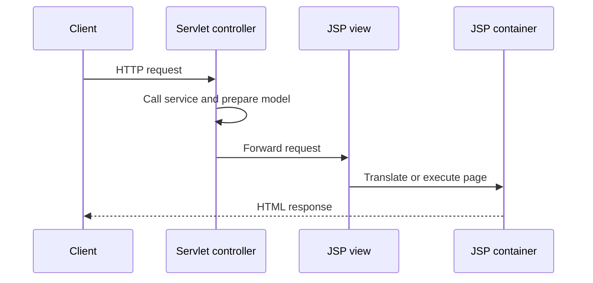

Typical MVC request processing:

1. The client requests a controller URL.
2. A servlet validates the HTTP input.
3. The servlet calls the service layer.
4. The service returns model data.
5. The servlet stores the model in request attributes.
6. The servlet forwards to a JSP under `WEB-INF`.
7. The JSP evaluates EL and tags.
8. The generated servlet writes the response.

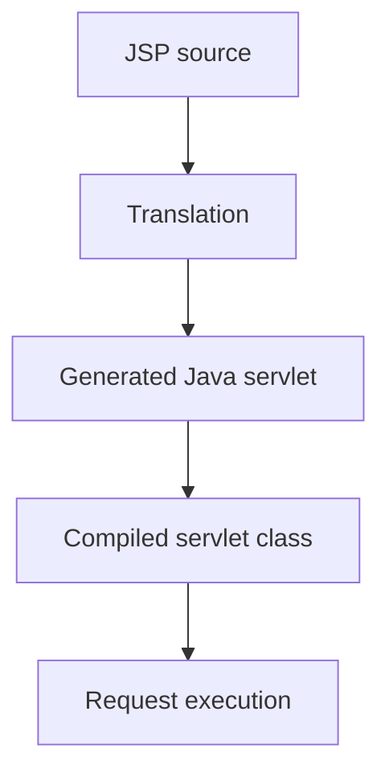

The generated Java class name, package, source layout, and compilation details are container implementation details.

[↑ Go to Table of Contents](#table-of-contents)

## 4. Java 21 and JSP 3.1 Requirements

This material uses the following baseline:

| Item | Version or requirement |
| --- | --- |
| Java | Java 21 |
| Jakarta Server Pages | 3.1 |
| Servlet specification | 6.0 |
| Expression Language | 5.0 |
| Jakarta Standard Tag Library | 3.0 |
| Jakarta EE platform release | Jakarta EE 10 |
| JSP API artifact | `jakarta.pages:jakarta.pages-api:3.1.0` |
| JSP API packages | `jakarta.servlet.jsp.*` |

Java 21 satisfies the Java SE 11 minimum used by the Jakarta EE 10 generation of these specifications.

The application must run in a web container that implements JSP 3.1 and Servlet 6.0. A Servlet-only runtime without a JSP engine cannot translate and execute JSP pages.

Important official references:

- [Jakarta Server Pages 3.1 release page](https://jakarta.ee/specifications/pages/3.1/)
- [Jakarta Server Pages 3.1 specification](https://jakarta.ee/specifications/pages/3.1/jakarta-server-pages-spec-3.1)
- [Jakarta Server Pages 3.1 API documentation](https://jakarta.ee/specifications/pages/3.1/apidocs/)
- [Jakarta Expression Language 5.0](https://jakarta.ee/specifications/expression-language/5.0/)
- [Jakarta Standard Tag Library 3.0](https://jakarta.ee/specifications/tags/3.0/)

JSP 4.0 belongs to a later Jakarta EE platform release. Do not use features added only after JSP 3.1 when targeting Jakarta EE 10.

[↑ Go to Table of Contents](#table-of-contents)

## 5. Web-Application Structure and Dependencies

A common Maven web project has this source layout:

```text
jsp-training/
├── pom.xml
└── src/
    └── main/
        ├── java/
        │   └── com/company/training/web/
        │       └── EmployeeServlet.java
        └── webapp/
            ├── index.jsp
            └── WEB-INF/
                ├── web.xml
                ├── views/
                │   └── employees.jsp
                └── tags/
                    └── panel.tag
```

Important Maven settings include:

```xml
<packaging>war</packaging>

<properties>
    <maven.compiler.release>21</maven.compiler.release>
</properties>

<dependencies>
    <dependency>
        <groupId>jakarta.pages</groupId>
        <artifactId>jakarta.pages-api</artifactId>
        <version>3.1.0</version>
        <scope>provided</scope>
    </dependency>

    <dependency>
        <groupId>jakarta.servlet.jsp.jstl</groupId>
        <artifactId>jakarta.servlet.jsp.jstl-api</artifactId>
        <version>3.0.2</version>
    </dependency>
</dependencies>
```

The JSP API is normally `provided` because the compatible container supplies it. The JSTL API describes standard tag contracts but is not itself a runtime implementation. A standalone servlet/JSP container may require a compatible JSTL implementation to be deployed with the application; a Jakarta EE server may provide it according to its platform support.

Do not package another JSP API implementation into the application. Mixing container APIs and application copies can produce class-loading or linkage failures.

[↑ Go to Table of Contents](#table-of-contents)

## 6. A First JSP Page

Suppose a servlet stores a view model in request scope:

```java
EmployeeView employee = employeeService.findById(employeeId);

request.setAttribute("employee", employee);
request.getRequestDispatcher("/WEB-INF/views/employee.jsp")
        .forward(request, response);
```

The JSP can display that model:

```jsp
<%@ page contentType="text/html;charset=UTF-8"
         pageEncoding="UTF-8" %>
<%@ taglib prefix="c" uri="jakarta.tags.core" %>
<!doctype html>
<html lang="en">
<head>
    <meta charset="UTF-8">
    <title>Employee Details</title>
</head>
<body>
    <h1>Employee Details</h1>

    <p>ID: <c:out value="${employee.id}" /></p>
    <p>Name: <c:out value="${employee.name}" /></p>
</body>
</html>
```

`employee.name` normally resolves a JavaBean-style getter such as `getName()` on the model object.

Keeping the view under `WEB-INF/views` prevents direct browser access. Clients must reach it through an application controller, which prepares the required model.

[↑ Go to Table of Contents](#table-of-contents)

## 7. JSP Translation and Life Cycle

A JSP container manages translation and execution phases.

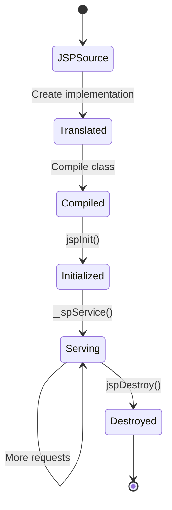

### Translation phase

The container:

- reads the JSP source and included translation units;
- validates directives, actions, tag libraries, and syntax;
- generates a servlet implementation class; and
- compiles or otherwise prepares that implementation.

Translation may occur during deployment, through precompilation, or when the page is first requested.

### Execution phase

The generated page implementation follows a servlet-style life cycle:

| Method | Purpose |
| --- | --- |
| `jspInit()` | Optional page initialization before requests |
| `_jspService(request, response)` | Generated request-processing method |
| `jspDestroy()` | Optional cleanup before the page is removed from service |

The container generates `_jspService()`. A JSP author must not define or override it.

JSP page implementations may process concurrent requests. Scripting declarations that create mutable instance fields have the same concurrency risks as servlet fields.

[↑ Go to Table of Contents](#table-of-contents)

## 8. JSP Page Elements

A JSP page can contain several kinds of content.

| Element | Syntax example | Purpose |
| --- | --- | --- |
| Template data | `<h1>Employees</h1>` | Text sent as part of the response |
| Directive | `<%@ page ... %>` | Translation-time instruction |
| Standard action | `<jsp:include ... />` | Standard request-time behavior |
| Custom action | `<c:forEach ...>` | Behavior supplied by a tag library |
| EL expression | `${employee.name}` | Evaluates model data |
| JSP comment | `<%-- comment --%>` | Removed during translation |
| Scripting element | `<% ... %>` | Embedded Java; avoid in modern JSP |

### JSP comments vs HTML comments

```jsp
<%-- Server-side JSP comment; not sent to the client. --%>

<!-- HTML comment; normally appears in the response source. -->
```

Do not place passwords, tokens, internal paths, or sensitive explanations in HTML comments. The client can inspect them.

### Escaping JSP syntax

Template text and tag attributes follow JSP parsing rules. When literal `${` or `#{` text is needed, use the specification-supported escaping or disable evaluation only for the narrowest required context rather than disabling EL for an entire application casually.

[↑ Go to Table of Contents](#table-of-contents)

## 9. JSP Directives

Directives provide translation-time instructions to the JSP container.

### Page directive

```jsp
<%@ page contentType="text/html;charset=UTF-8"
         pageEncoding="UTF-8"
         session="false"
         trimDirectiveWhitespaces="true" %>
```

Useful page attributes include:

| Attribute | Purpose |
| --- | --- |
| `contentType` | Sets the response MIME type and optional charset |
| `pageEncoding` | Declares JSP source-file encoding |
| `session` | Controls whether the page participates in an HTTP session |
| `errorPage` | Declares a page-local error target |
| `isErrorPage` | Allows access to the `exception` implicit object |
| `isELIgnored` | Controls EL evaluation for the page |
| `buffer` | Configures the `JspWriter` buffer |
| `autoFlush` | Controls behavior when the buffer fills |
| `trimDirectiveWhitespaces` | Removes qualifying template whitespace created around directives |
| `import` | Imports Java types for scripting; unnecessary in scriptless views |

### Include directive

```jsp
<%@ include file="/WEB-INF/fragments/header.jspf" %>
```

The include directive combines source during translation.

### Taglib directive

```jsp
<%@ taglib prefix="c" uri="jakarta.tags.core" %>
```

The prefix is local to the JSP translation unit. The URI identifies the tag library.

[↑ Go to Table of Contents](#table-of-contents)

## 10. Scripting Elements and Why to Avoid Them

Traditional JSP supports three Java scripting elements.

### Declaration

```jsp
<%! private int counter; %>
```

A declaration becomes a member of the generated JSP servlet. Mutable fields are unsafe under concurrent requests unless designed for concurrency.

### Scriptlet

```jsp
<%
    String name = request.getParameter("name");
    out.println(name);
%>
```

### Expression

```jsp
<%= request.getAttribute("employee") %>
```

Modern JSP views should prefer:

```jsp
<c:out value="${employee.name}" />
```

| Scripting problem | Better approach |
| --- | --- |
| Java control flow mixed into HTML | JSTL conditionals and iteration |
| Business logic in a page | Service-layer method called by the servlet |
| Manual output calls | EL with context-appropriate escaping |
| Database access in a page | Repository or DAO behind a service |
| Shared declaration fields | Request model and thread-safe services |
| Difficult page testing | Thin JSP views with tested controller/service logic |

JSP 3.1 still recognizes scripting elements, but applications can reject them centrally with `<scripting-invalid>true</scripting-invalid>`.

[↑ Go to Table of Contents](#table-of-contents)

## 11. JSP Implicit Objects

The JSP container automatically exposes objects to the generated page implementation.

| Implicit object | Type | Purpose |
| --- | --- | --- |
| `request` | `HttpServletRequest` | Current HTTP request |
| `response` | `HttpServletResponse` | Current HTTP response |
| `out` | `JspWriter` | Buffered character output |
| `session` | `HttpSession` | Current session when the page participates in one |
| `application` | `ServletContext` | Web-application environment |
| `config` | `ServletConfig` | Generated servlet configuration |
| `pageContext` | `PageContext` | Access to page facilities and scopes |
| `page` | `Object` | Generated page implementation instance |
| `exception` | `Throwable` | Current failure on an error page only |

Examples using Expression Language normally avoid direct Java calls:

```jsp
<p>Application: ${pageContext.request.contextPath}</p>
<p>User: <c:out value="${pageContext.request.remoteUser}" /></p>
```

The `session` scripting object is unavailable when the page directive sets `session="false"`. EL session access must also be used only when session participation is intended.

`out` is a `JspWriter`, not the servlet response's ordinary `PrintWriter`. It adds JSP buffering behavior used by the generated page and tag mechanisms.

Avoid using implicit objects to perform controller work inside a view. Their availability does not make authentication decisions, redirects, database calls, or parameter validation presentation responsibilities.

[↑ Go to Table of Contents](#table-of-contents)

## 12. PageContext and Web Scopes

`PageContext` gives the generated JSP servlet a unified API for page facilities and scoped attributes.

The four JSP scopes are:

| Scope | Backing location | Typical lifetime |
| --- | --- | --- |
| Page | `PageContext` | Current JSP page evaluation |
| Request | `ServletRequest` | Current request, including forwards |
| Session | `HttpSession` | Multiple requests in one user session |
| Application | `ServletContext` | Web application lifetime in one JVM |

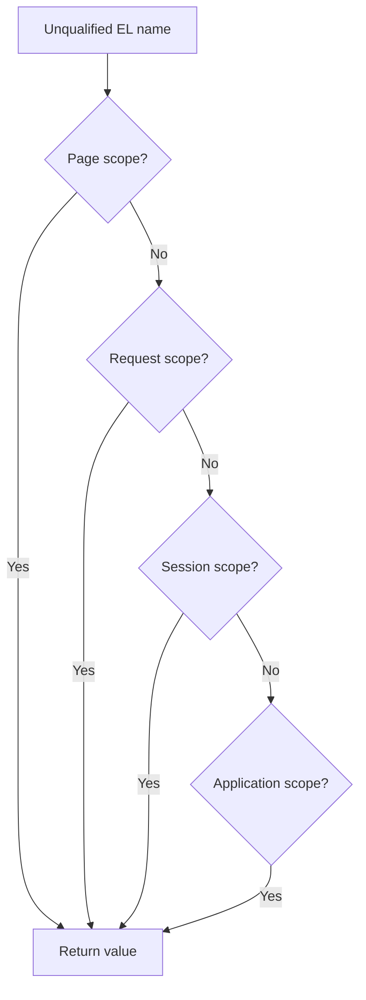

`pageContext.findAttribute("employee")` searches page, request, session, and application scopes in that order.

Programmatic scope access looks like:

```jsp
<%
    pageContext.setAttribute(
            "title",
            "Employees",
            PageContext.PAGE_SCOPE
    );
%>
```

This illustrates the API, but a scriptless page should normally receive model attributes from its controller or use tag-based variable operations.

Use the narrowest scope that satisfies the requirement:

- page scope for temporary page-local values;
- request scope for a controller's view model;
- session scope only for true cross-request user state; and
- application scope only for safely shared application data.

Scope does not provide automatic thread safety. Session and application objects can be reached concurrently.

[↑ Go to Table of Contents](#table-of-contents)

## 13. Expression Language Basics

Jakarta Expression Language, or **EL**, reads and evaluates data without embedding ordinary Java source in the JSP page.

```jsp
<h1>${pageTitle}</h1>
<p>${employee.name}</p>
<p>${employee.department.name}</p>
```

For an unqualified name such as `employee`, JSP EL searches the scoped attributes in this order:

1. page;
2. request;
3. session; and
4. application.

Use an explicit scope when ambiguity matters:

```jsp
${requestScope.employee.name}
${sessionScope.signedInUser.displayName}
${applicationScope.applicationName}
```

### Immediate and deferred expressions

| Syntax | Meaning |
| --- | --- |
| `${expression}` | Immediate evaluation in the normal JSP evaluation context |
| `#{expression}` | Deferred expression where the consuming tag or technology supports it |

`${...}` is the normal choice for JSP template output and JSTL attributes. Do not assume a deferred expression is accepted or writable in every JSP location; its behavior depends on the receiving tag attribute and EL contract.

### Missing values

EL is intentionally tolerant in many display cases. A missing or `null` value may render as empty text rather than producing a visible Java `null`. This convenience can hide model mistakes, so JSP 3.1 configuration can request errors for unresolved EL identifiers.

EL evaluation does not automatically make output safe for HTML. Escaping is a separate responsibility.

[↑ Go to Table of Contents](#table-of-contents)

## 14. EL Property and Collection Access

EL supports dot and bracket notation.

```jsp
${employee.name}
${employee["name"]}
${departments[0].name}
${employeeById[requestScope.selectedId].name}
```

### Common resolution behavior

| Base value | Expression | Conceptual access |
| --- | --- | --- |
| JavaBean | `${employee.name}` | `employee.getName()` or a matching readable bean property |
| `Map` | `${settings.theme}` | `settings.get("theme")` |
| `List` | `${employees[0]}` | `employees.get(0)` |
| Array | `${codes[0]}` | `codes[0]` |

Bracket notation is necessary when the property name:

- contains spaces or punctuation;
- is chosen dynamically; or
- is not a valid identifier.

```jsp
${settings["display.theme"]}
${employeeById[param.id]}
```

Model objects intended for portable JSP EL access should expose conventional readable bean properties. Do not expose a large domain object graph merely because EL can navigate it; pass a purpose-built view model containing only the data required by the page.

### Null-safe display design

Deep property chains can hide where data is missing:

```jsp
${employee.department.manager.name}
```

Prepare predictable view models in the controller or test intermediate values with JSTL rather than relying on accidental null behavior.

[↑ Go to Table of Contents](#table-of-contents)

## 15. EL Operators and Conditional Expressions

EL provides operators suitable for concise view expressions.

### Arithmetic and comparison

```jsp
${order.quantity * order.unitPrice}
${employee.age ge 18}
${status eq 'ACTIVE'}
${score lt 50}
```

| Symbol form | Word form | Purpose |
| --- | --- | --- |
| `==` | `eq` | Equal |
| `!=` | `ne` | Not equal |
| `<` | `lt` | Less than |
| `>` | `gt` | Greater than |
| `<=` | `le` | Less than or equal |
| `>=` | `ge` | Greater than or equal |
| `&&` | `and` | Logical AND |
| `||` | `or` | Logical OR |
| `!` | `not` | Logical negation |

Word forms avoid conflicts with markup characters and often read more clearly in tag attributes.

### `empty` operator

```jsp
${empty employees}
${not empty validationErrors}
```

`empty` can test values such as `null`, empty strings, empty arrays, empty collections, and empty maps.

### Conditional operator

```jsp
${employee.active ? 'Active' : 'Inactive'}
```

Keep expressions presentational. If an expression contains many nested conditions, calculations, or method calls, move that decision into a controller-prepared view model.

[↑ Go to Table of Contents](#table-of-contents)

## 16. EL Implicit Objects

EL supplies maps and helpers distinct from the JSP scripting implicit objects.

| EL implicit object | Purpose |
| --- | --- |
| `pageContext` | Access to the JSP `PageContext` |
| `pageScope` | Page-scope attribute map |
| `requestScope` | Request-scope attribute map |
| `sessionScope` | Session-scope attribute map |
| `applicationScope` | Application-scope attribute map |
| `param` | First request parameter value by name |
| `paramValues` | All parameter values by name |
| `header` | First request-header value by name |
| `headerValues` | All request-header values by name |
| `cookie` | Cookie map by name |
| `initParam` | Servlet-context initialization parameters |

Examples:

```jsp
${param.search}
${paramValues.skill[0]}
${header['User-Agent']}
${cookie.theme.value}
${initParam.applicationName}
${pageContext.request.contextPath}
```

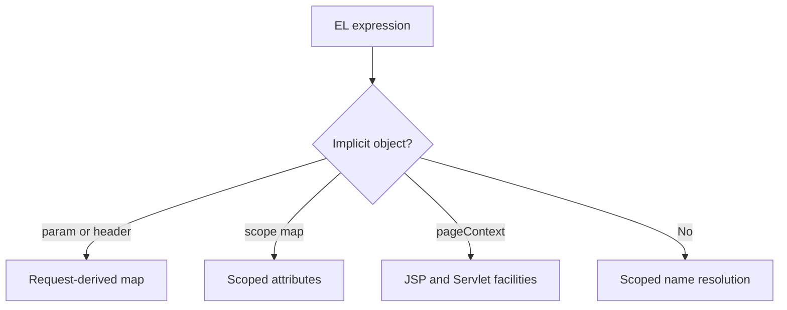

All request parameters, headers, and cookies are untrusted input. Reading them through EL does not validate or escape them.

Prefer controller validation and request attributes instead of allowing a presentation page to drive important decisions directly from `param`.

[↑ Go to Table of Contents](#table-of-contents)

## 17. JSP Standard Actions and JavaBeans

Standard actions use XML-style `jsp:` elements and execute during request processing.

| Action | Purpose |
| --- | --- |
| `jsp:include` | Includes another resource's response output |
| `jsp:forward` | Forwards the request and response |
| `jsp:param` | Adds a request parameter to an include or forward |
| `jsp:useBean` | Locates or creates a JavaBean in a selected scope |
| `jsp:getProperty` | Writes a bean property |
| `jsp:setProperty` | Sets a bean property |
| `jsp:element` | Creates an element with a computed name |
| `jsp:attribute` | Supplies an action attribute through a body |
| `jsp:body` | Supplies an action body explicitly |
| `jsp:text` | Represents template text, especially in JSP documents |

### JavaBean action example

```jsp
<jsp:useBean id="employee"
             class="com.company.training.web.EmployeeView"
             scope="request" />

<p>
    <jsp:getProperty name="employee" property="name" />
</p>
```

If the named bean does not exist in the selected scope, `jsp:useBean` may instantiate the declared class. This requires an accessible no-argument constructor and can blur controller ownership of the model.

Modern MVC applications normally create models in Java controller code and use EL/JSTL in JSP:

```jsp
<p><c:out value="${employee.name}" /></p>
```

Avoid mass assignment such as `property="*"` from request parameters. It can bind untrusted fields that were never intended to be client-controlled.

[↑ Go to Table of Contents](#table-of-contents)

## 18. Include, Forward, and Parameter Actions

### Translation-time include

```jsp
<%@ include file="/WEB-INF/fragments/header.jspf" %>
```

The include directive combines source into the translation unit. Directive declarations and syntax become part of the containing page.

### Request-time include

```jsp
<jsp:include page="/WEB-INF/views/summary.jsp">
    <jsp:param name="mode" value="compact" />
</jsp:include>
```

The included resource executes separately during the request and contributes output to the current response.

### Forward

```jsp
<jsp:forward page="/employees">
    <jsp:param name="source" value="jsp" />
</jsp:forward>
```

Forward transfers control using the current request and response. It must occur before the response is committed.

| Characteristic | Include directive | `jsp:include` | `jsp:forward` |
| --- | --- | --- | --- |
| Phase | Translation | Request | Request |
| Combines source | Yes | No | No |
| Target executes separately | No | Yes | Yes |
| Returns to caller | Not applicable | Yes | No ordinary page continuation |
| Main use | Static fragments and shared directives | Dynamic fragment output | Transfer control |

In MVC, controller decisions normally belong in a servlet. Use JSP forwarding sparingly so navigation does not become hidden inside presentation files.

[↑ Go to Table of Contents](#table-of-contents)

## 19. Jakarta Standard Tag Library Overview

The **Jakarta Standard Tag Library**, often still called **JSTL**, provides reusable tags for common view operations.

JSTL 3.0 uses modern `jakarta.tags.*` URIs:

| Library | Common prefix | URI | Purpose |
| --- | --- | --- | --- |
| Core | `c` | `jakarta.tags.core` | Variables, output, conditions, loops, URLs |
| Formatting | `fmt` | `jakarta.tags.fmt` | Messages, locales, numbers, dates |
| Functions | `fn` | `jakarta.tags.functions` | String and collection-related EL functions |
| XML | `x` | `jakarta.tags.xml` | XML parsing, selection, conditions, iteration |
| SQL | `sql` | `jakarta.tags.sql` | Direct database operations for simple prototypes |

```jsp
<%@ taglib prefix="c" uri="jakarta.tags.core" %>
<%@ taglib prefix="fmt" uri="jakarta.tags.fmt" %>
<%@ taglib prefix="fn" uri="jakarta.tags.functions" %>
```

JSTL 3.0 renamed the older `java.sun.com` taglib URIs but continues to allow them for compatibility. New Jakarta EE 10 material should use the `jakarta.tags.*` names.

### Why use JSTL?

- It avoids ordinary Java scriptlets.
- Tags express common view operations clearly.
- Tag attributes integrate with EL.
- Standard behavior is portable across compatible implementations.
- It encourages a presentation-oriented page instead of a Java-heavy page.

JSTL does not replace controller validation, service logic, repositories, or context-aware security decisions.

[↑ Go to Table of Contents](#table-of-contents)

## 20. Core Tags for Output, Variables, and URLs

### Escaped output with `c:out`

```jsp
<c:out value="${employee.name}" default="Unknown employee" />
```

`c:out` escapes XML-sensitive characters by default. Keep `escapeXml="true"` unless the value is trusted, reviewed markup with a deliberate rendering policy.

### Variables

```jsp
<c:set var="heading"
       value="Employee Directory"
       scope="page" />

<h1><c:out value="${heading}" /></h1>

<c:remove var="heading" scope="page" />
```

`c:set` can also assign bean or map properties, but controllers should normally prepare the model before rendering.

### Context-aware URLs

```jsp
<c:url var="detailsUrl" value="/employees/details">
    <c:param name="id" value="${employee.id}" />
</c:url>

<a href="${detailsUrl}">View details</a>
```

`c:url` performs URL rewriting when required and encodes nested parameter names and values. Use it instead of hard-coding a deployment context path.

### Redirect tag

```jsp
<c:redirect url="/employees" />
```

Redirect decisions are usually clearer in a servlet controller. A JSP should normally render rather than decide application navigation.

### Exception capture

```jsp
<c:catch var="displayFailure">
    <%-- A tag operation that may fail. --%>
</c:catch>
```

Do not use `c:catch` to hide defects silently. Log and handle failures at a suitable layer.

[↑ Go to Table of Contents](#table-of-contents)

## 21. Core Conditional Tags

### `c:if`

```jsp
<c:if test="${empty employees}">
    <p>No employees were found.</p>
</c:if>
```

The optional `var` attribute stores the Boolean result:

```jsp
<c:if test="${signedInUser.admin}" var="isAdmin" />

<c:if test="${isAdmin}">
    <a href="${pageContext.request.contextPath}/admin">Admin</a>
</c:if>
```

Hiding an HTML link is not authorization. The server-side target must independently enforce access control.

### `c:choose`, `c:when`, and `c:otherwise`

```jsp
<c:choose>
    <c:when test="${employee.status eq 'ACTIVE'}">
        <span>Active</span>
    </c:when>
    <c:when test="${employee.status eq 'ON_LEAVE'}">
        <span>On leave</span>
    </c:when>
    <c:otherwise>
        <span>Inactive</span>
    </c:otherwise>
</c:choose>
```

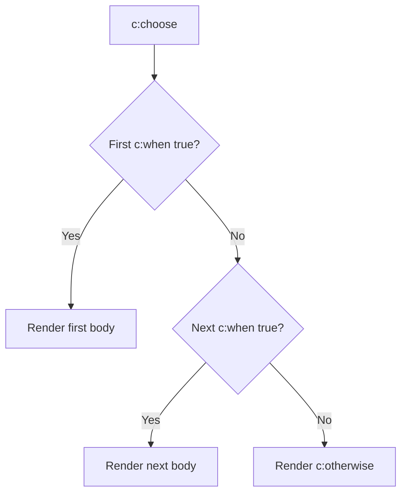

Use `c:choose` for mutually exclusive display branches. Multiple independent `c:if` tags can render several branches.

[↑ Go to Table of Contents](#table-of-contents)

## 22. Core Iteration Tags

### `c:forEach`

```jsp
<table>
    <thead>
        <tr>
            <th>#</th>
            <th>ID</th>
            <th>Name</th>
        </tr>
    </thead>
    <tbody>
        <c:forEach var="employee"
                   items="${employees}"
                   varStatus="status">
            <tr>
                <td>${status.count}</td>
                <td><c:out value="${employee.id}" /></td>
                <td><c:out value="${employee.name}" /></td>
            </tr>
        </c:forEach>
    </tbody>
</table>
```

Useful status properties include:

| Property | Meaning |
| --- | --- |
| `index` | Zero-based current index |
| `count` | One-based current count |
| `first` | Whether this is the first iteration |
| `last` | Whether this is the last iteration |
| `begin` | Configured starting index |
| `end` | Configured ending index |
| `step` | Configured step size |

Numeric iteration is also possible:

```jsp
<c:forEach var="pageNumber" begin="1" end="${pageCount}">
    <a href="?page=${pageNumber}">${pageNumber}</a>
</c:forEach>
```

For tokenized strings:

```jsp
<c:forTokens items="Java,SQL,HTML" delims="," var="skill">
    <span><c:out value="${skill}" /></span>
</c:forTokens>
```

Prefer a collection model over delimiter parsing. Controllers should prepare typed view data rather than making the JSP decode application formats.

[↑ Go to Table of Contents](#table-of-contents)

## 23. Formatting and Internationalization Tags

The formatting library supports locale-sensitive messages, numbers, currencies, percentages, and dates.

```jsp
<%@ taglib prefix="fmt" uri="jakarta.tags.fmt" %>
```

### Resource-bundle messages

```jsp
<fmt:setBundle basename="messages" />

<h1><fmt:message key="employees.heading" /></h1>
```

For locale-specific bundles:

```text
messages.properties
messages_en.properties
messages_hi.properties
```

### Locale selection

```jsp
<fmt:setLocale value="${userPreferences.locale}" />
```

Locale choice should be validated and normally determined by application policy, user preference, or accepted request languages.

### Number formatting

```jsp
<fmt:formatNumber value="${employee.salary}"
                  type="currency"
                  currencyCode="INR" />
```

```jsp
<fmt:formatNumber value="${completionRatio}"
                  type="percent"
                  maxFractionDigits="1" />
```

### Date formatting

```jsp
<fmt:formatDate value="${employee.joiningDate}"
                type="date"
                dateStyle="medium" />
```

Ensure the model value is a type supported by the selected tag implementation and specification contract. For modern `java.time` values, a controller can preformat the display value or deliberately adapt it instead of relying on accidental conversion.

Do not store already localized text in a domain object when the same data must support several locales.

[↑ Go to Table of Contents](#table-of-contents)

## 24. JSTL Functions

The functions library exposes common operations for EL expressions.

```jsp
<%@ taglib prefix="fn" uri="jakarta.tags.functions" %>
```

Examples:

```jsp
<p>Total employees: ${fn:length(employees)}</p>

<c:if test="${fn:containsIgnoreCase(employee.name, param.search)}">
    <p>Match found</p>
</c:if>

<p>${fn:toUpperCase(employee.departmentCode)}</p>
```

Common functions include:

| Function | Purpose |
| --- | --- |
| `fn:length(value)` | Returns collection, array, map, or string length |
| `fn:contains(text, part)` | Tests substring presence |
| `fn:containsIgnoreCase(text, part)` | Case-insensitive substring test |
| `fn:startsWith(text, prefix)` | Tests prefix |
| `fn:endsWith(text, suffix)` | Tests suffix |
| `fn:indexOf(text, part)` | Returns substring position |
| `fn:substring(text, begin, end)` | Returns a substring |
| `fn:replace(text, before, after)` | Replaces occurrences |
| `fn:split(text, delimiter)` | Splits a string |
| `fn:join(array, separator)` | Joins string elements |
| `fn:trim(text)` | Removes surrounding whitespace |
| `fn:toLowerCase(text)` | Converts to lowercase |
| `fn:toUpperCase(text)` | Converts to uppercase |
| `fn:escapeXml(text)` | Escapes XML-sensitive characters |

For ordinary displayed values, `<c:out>` communicates output escaping more clearly than wrapping every expression in `fn:escapeXml`.

Avoid turning EL function chains into business logic. Prepare derived display fields in a view model when complexity grows.

[↑ Go to Table of Contents](#table-of-contents)

## 25. XML and SQL Tags

JSTL defines XML and SQL libraries, but they require careful use.

### XML tags

```jsp
<%@ taglib prefix="x" uri="jakarta.tags.xml" %>

<x:parse xml="${trustedXml}" var="document" />
<x:out select="$document/catalog/title" />
```

XML tags include parsing, XPath-style selection, conditions, and iteration.

Do not parse untrusted XML without a security review. XML external entities, expansion attacks, large inputs, and parser configuration can create severe risks. Prefer a hardened Java service that returns a safe view model.

### SQL tags

```jsp
<%@ taglib prefix="sql" uri="jakarta.tags.sql" %>

<sql:query var="result" dataSource="${trainingDataSource}">
    SELECT id, name FROM employee
</sql:query>
```

SQL tags demonstrate database access but are unsuitable for normal production MVC applications because they mix persistence, control flow, and presentation.

Prefer:

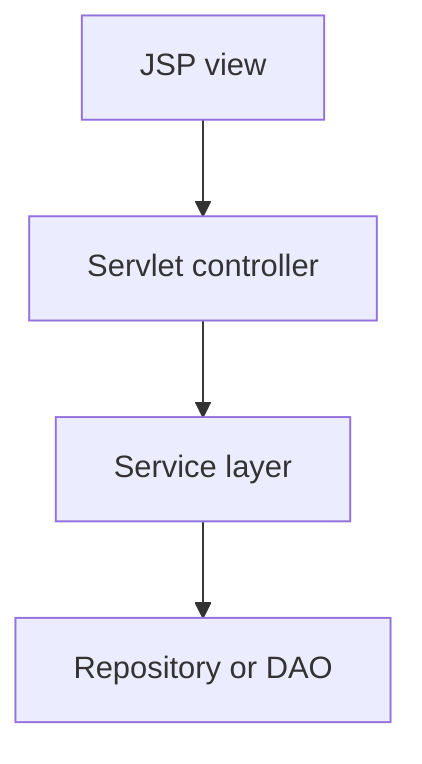

The JSP should receive a collection of view objects, not execute a query.

[↑ Go to Table of Contents](#table-of-contents)

## 26. Servlet and JSP MVC Pattern

The recommended classic design uses a servlet as controller and JSP as view.

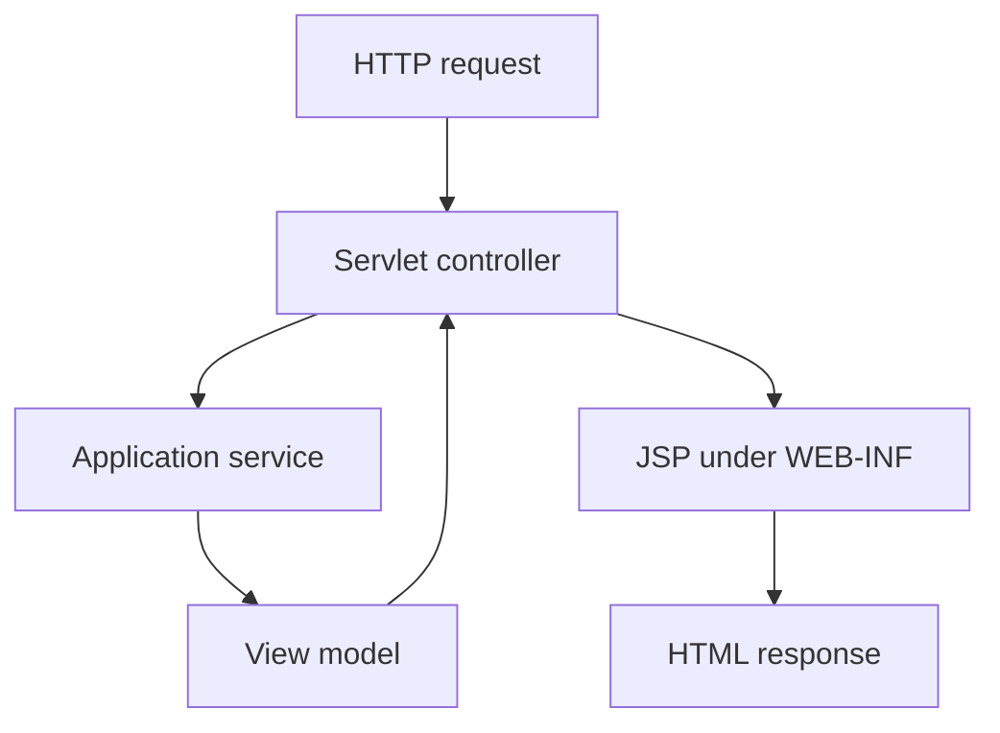

### Controller

```java
@WebServlet("/employees")
public final class EmployeeServlet extends HttpServlet {
    @Override
    protected void doGet(
            HttpServletRequest request,
            HttpServletResponse response)
            throws ServletException, IOException {

        List<EmployeeView> employees = employeeService.findAll();

        request.setAttribute("employees", employees);
        request.getRequestDispatcher(
                "/WEB-INF/views/employees.jsp"
        ).forward(request, response);
    }
}
```

### View

```jsp
<%@ page contentType="text/html;charset=UTF-8"
         pageEncoding="UTF-8" %>
<%@ taglib prefix="c" uri="jakarta.tags.core" %>

<ul>
    <c:forEach var="employee" items="${employees}">
        <li><c:out value="${employee.name}" /></li>
    </c:forEach>
</ul>
```

| Concern | Correct location |
| --- | --- |
| Request parameter parsing | Servlet controller |
| Authorization enforcement | Container/controller/service boundary |
| Business rule | Service |
| Transaction | Service |
| Database access | Repository or DAO |
| Model presentation | JSP |
| Reusable view behavior | JSTL, tag file, or custom tag |

The JSP should not be a front controller. Place views under `WEB-INF` and expose stable controller URLs to clients.

[↑ Go to Table of Contents](#table-of-contents)

## 27. Form Display, Validation, and Post-Redirect-Get

A JSP renders the form and validation messages. The servlet processes the submitted request.

### Form view

```jsp
<%@ taglib prefix="c" uri="jakarta.tags.core" %>
<%@ taglib prefix="fn" uri="jakarta.tags.functions" %>

<c:url var="registrationUrl" value="/employees/register" />

<form method="post" action="${registrationUrl}">
    <label for="name">Name</label>
    <input id="name"
           name="name"
           value="${fn:escapeXml(form.name)}"
           required>

    <c:if test="${not empty errors.name}">
        <p><c:out value="${errors.name}" /></p>
    </c:if>

    <button type="submit">Register</button>
</form>
```

The server must validate even when HTML validation attributes are present.

### Controller validation flow

```java
RegistrationForm form = RegistrationForm.from(request);
Map<String, String> errors = validator.validate(form);

if (!errors.isEmpty()) {
    request.setAttribute("form", form);
    request.setAttribute("errors", errors);
    request.getRequestDispatcher("/WEB-INF/views/register.jsp")
            .forward(request, response);
    return;
}

employeeService.register(form);
response.sendRedirect(
        response.encodeRedirectURL(
                request.getContextPath() + "/employees?registered=true"
        )
);
```

### Post-Redirect-Get

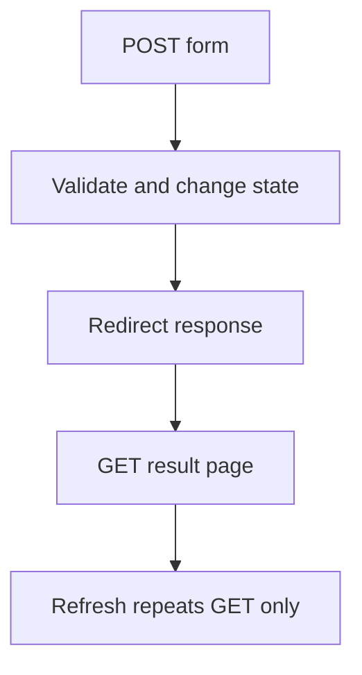

If validation fails, forward so request-scoped errors and entered values remain available. If the POST succeeds, redirect so browser refresh does not normally repeat the state-changing submission.

Protect state-changing forms against CSRF according to the application's security architecture.

[↑ Go to Table of Contents](#table-of-contents)

## 28. Output Escaping and JSP Security

EL evaluates a value but does not automatically escape it for HTML.

Unsafe output:

```jsp
<p>${param.message}</p>
```

If the parameter contains markup or script-capable content, the browser may interpret it.

Safer HTML-text output:

```jsp
<p><c:out value="${param.message}" /></p>
```

For an HTML attribute:

```jsp
<input name="displayName"
       value="${fn:escapeXml(form.displayName)}">
```

### Output contexts

| Output context | Security requirement |
| --- | --- |
| HTML text | HTML/XML character escaping |
| HTML attribute | Attribute-safe encoding and quoted attributes |
| URL parameter | URL component encoding plus safe scheme/target validation |
| JavaScript | JavaScript-string or data encoding; preferably avoid direct insertion |
| CSS | CSS-context encoding; preferably avoid untrusted insertion |

One escaping method is not correct for every context. `c:out` is appropriate for ordinary HTML text and XML-sensitive output, but it is not a universal JavaScript, CSS, or URL security mechanism.

### JSP security checklist

- Treat request parameters, headers, cookies, database text, and external-service data as untrusted.
- Validate input in the controller or service layer.
- Escape every untrusted value for its actual output context.
- Avoid scriptlets and dynamic evaluation of source text.
- Do not build JSP include or forward paths directly from untrusted parameters.
- Use container authorization at protected targets; hiding a link is not access control.
- Use `HttpOnly`, `Secure`, and suitable `SameSite` session-cookie settings.
- Use CSRF protection for state-changing browser requests.
- Keep sensitive views under `WEB-INF`.
- Never store secrets in JSP comments, HTML comments, or hidden inputs.
- Pass minimal view models rather than unrestricted internal objects.
- Configure error pages that do not expose stack traces or implementation details.

Client-side escaping does not replace prepared SQL statements, authentication, authorization, CSRF protection, or safe file handling.

[↑ Go to Table of Contents](#table-of-contents)

## 29. JSP Error Handling

A JSP page can declare a page-specific error target:

```jsp
<%@ page errorPage="/WEB-INF/errors/error.jsp" %>
```

The error JSP declares itself as an error page:

```jsp
<%@ page isErrorPage="true"
         contentType="text/html;charset=UTF-8"
         pageEncoding="UTF-8" %>
<%@ taglib prefix="c" uri="jakarta.tags.core" %>

<!doctype html>
<html lang="en">
<head><title>Request Failed</title></head>
<body>
    <h1>We could not complete the request.</h1>
    <%-- Log diagnostic details server-side; do not expose exception. --%>
</body>
</html>
```

The `exception` implicit object exists only when `isErrorPage="true"` and the page is processing an error.

### Central error-page configuration

```xml
<error-page>
    <error-code>404</error-code>
    <location>/WEB-INF/errors/404.jsp</location>
</error-page>

<error-page>
    <exception-type>java.lang.Throwable</exception-type>
    <location>/WEB-INF/errors/error.jsp</location>
</error-page>
```

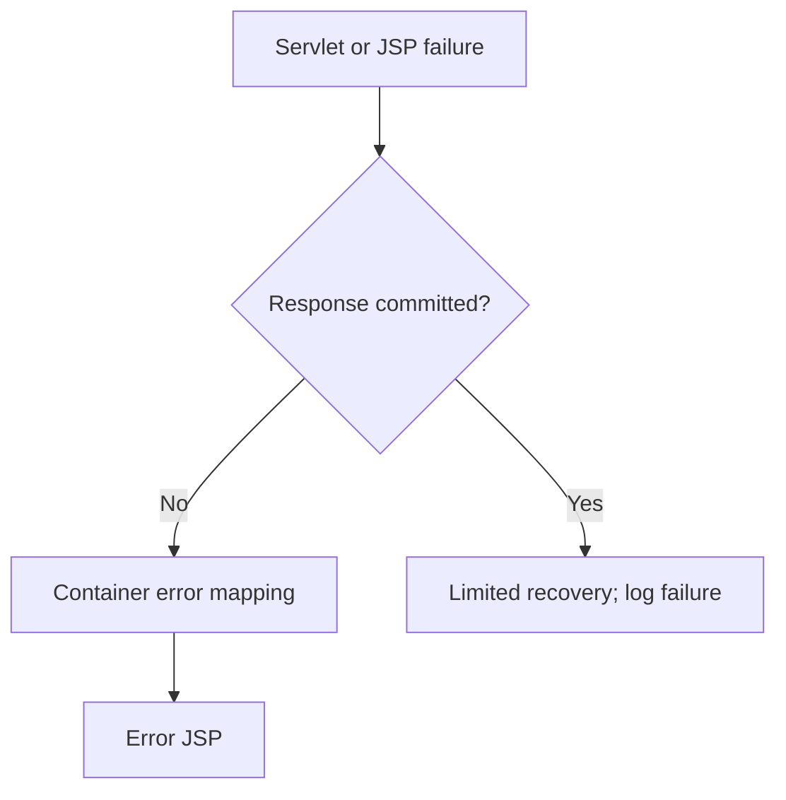

Central configuration is normally clearer than repeating `errorPage` on every JSP.

Good error views should:

- preserve the appropriate status code;
- show a user-safe message;
- provide a correlation or support reference when available;
- avoid printing `${exception}` or a stack trace; and
- avoid failing again because an optional model attribute is absent.

Large buffers may delay commitment, but buffering must not be treated as the main error-handling strategy.

[↑ Go to Table of Contents](#table-of-contents)

## 30. JSP Configuration in web.xml

`jsp-property-group` applies configuration to matching JSP files.

```xml
<?xml version="1.0" encoding="UTF-8"?>
<web-app xmlns="https://jakarta.ee/xml/ns/jakartaee"
         xmlns:xsi="http://www.w3.org/2001/XMLSchema-instance"
         xsi:schemaLocation="https://jakarta.ee/xml/ns/jakartaee
             https://jakarta.ee/xml/ns/jakartaee/web-app_6_0.xsd"
         version="6.0">

    <jsp-config>
        <jsp-property-group>
            <url-pattern>*.jsp</url-pattern>
            <page-encoding>UTF-8</page-encoding>
            <default-content-type>
                text/html;charset=UTF-8
            </default-content-type>
            <el-ignored>false</el-ignored>
            <scripting-invalid>true</scripting-invalid>
            <trim-directive-whitespaces>true</trim-directive-whitespaces>
            <error-on-el-not-found>true</error-on-el-not-found>
        </jsp-property-group>
    </jsp-config>

</web-app>
```

Important properties include:

| Property | Purpose |
| --- | --- |
| `url-pattern` | Selects pages affected by the group |
| `page-encoding` | Declares JSP source encoding |
| `default-content-type` | Defines a default response content type |
| `el-ignored` | Enables or disables EL evaluation |
| `scripting-invalid` | Rejects scripting elements when `true` |
| `trim-directive-whitespaces` | Trims qualifying directive-related whitespace |
| `is-xml` | Declares whether matching pages are JSP documents |
| `include-prelude` | Includes a fragment at the beginning of matching pages |
| `include-coda` | Includes a fragment at the end of matching pages |
| `error-on-el-not-found` | Requests an error when an EL identifier cannot be resolved |

`error-on-el-not-found` is especially useful for detecting misspelled or missing model names instead of silently producing empty output.

Use prelude and coda carefully. Hidden global includes can make a page's dependencies difficult to understand.

[↑ Go to Table of Contents](#table-of-contents)

## 31. Reusable Tag Files

A **tag file** creates a reusable custom tag using JSP syntax instead of a Java handler class.

Tag files placed under `/WEB-INF/tags` can be imported with a `tagdir` directive.

### Tag file: `/WEB-INF/tags/panel.tag`

```jsp
<%@ tag pageEncoding="UTF-8" body-content="scriptless" %>
<%@ attribute name="title"
              required="true"
              type="java.lang.String" %>
<%@ taglib prefix="c" uri="jakarta.tags.core" %>

<section class="panel">
    <h2><c:out value="${title}" /></h2>
    <div class="panel-body">
        <jsp:doBody />
    </div>
</section>
```

### Using the tag file

```jsp
<%@ taglib prefix="app" tagdir="/WEB-INF/tags" %>
<%@ taglib prefix="fn" uri="jakarta.tags.functions" %>

<app:panel title="Employee Summary">
    <p>Total employees: ${fn:length(employees)}</p>
</app:panel>
```

Tag-file directives include:

| Directive | Purpose |
| --- | --- |
| `tag` | Configures the tag file itself |
| `attribute` | Declares an input attribute |
| `variable` | Declares a variable exposed to the calling page |
| `include` | Includes source during translation |
| `taglib` | Imports a tag library |

Useful standard actions inside tag files include:

- `jsp:doBody`, which evaluates the calling tag's body; and
- `jsp:invoke`, which evaluates a named fragment attribute.

Tag files are suitable for reusable presentation components. Do not turn them into service or persistence layers.

[↑ Go to Table of Contents](#table-of-contents)

## 32. Custom Tag Handlers and TLD Files

When reusable view behavior requires Java, a simple tag handler can extend `SimpleTagSupport`.

```java
package com.company.training.web.tag;

import java.io.IOException;
import java.io.StringWriter;
import java.util.Locale;

import jakarta.servlet.jsp.JspException;
import jakarta.servlet.jsp.tagext.SimpleTagSupport;

public final class UppercaseTag extends SimpleTagSupport {
    @Override
    public void doTag() throws JspException, IOException {
        StringWriter body = new StringWriter();

        if (getJspBody() != null) {
            getJspBody().invoke(body);
        }

        getJspContext().getOut().print(
                body.toString().toUpperCase(Locale.ROOT)
        );
    }
}
```

A Tag Library Descriptor, or **TLD**, maps a tag name to its handler.

```xml
<?xml version="1.0" encoding="UTF-8"?>
<taglib xmlns="https://jakarta.ee/xml/ns/jakartaee"
        xmlns:xsi="http://www.w3.org/2001/XMLSchema-instance"
        xsi:schemaLocation="https://jakarta.ee/xml/ns/jakartaee
            https://jakarta.ee/xml/ns/jakartaee/web-jsptaglibrary_3_0.xsd"
        version="3.0">

    <tlib-version>1.0</tlib-version>
    <short-name>training</short-name>
    <uri>https://company.example/tags/training</uri>

    <tag>
        <name>uppercase</name>
        <tag-class>
            com.company.training.web.tag.UppercaseTag
        </tag-class>
        <body-content>scriptless</body-content>
    </tag>

</taglib>
```

Use it in a JSP:

```jsp
<%@ taglib prefix="app"
           uri="https://company.example/tags/training" %>

<app:uppercase>Java web development</app:uppercase>
```

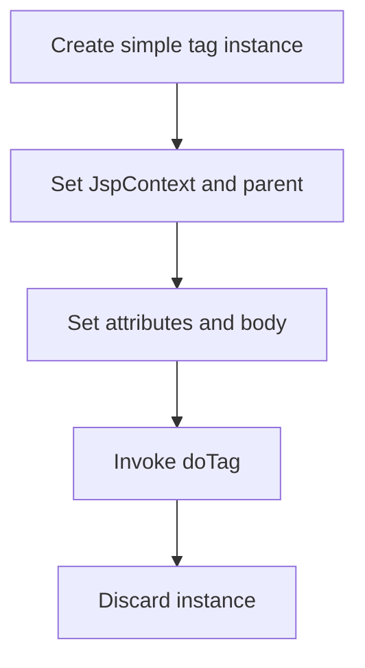

A new simple tag-handler instance is created for each tag invocation. Classic tag handlers have a more complex life cycle and may be pooled; use simple tags for new custom-tag designs unless classic contracts are specifically required.

Custom tags should encode reusable presentation behavior, not hide remote calls, database queries, or transaction logic.

[↑ Go to Table of Contents](#table-of-contents)

## 33. JSP Documents and XML Syntax

A **JSP document** is a JSP page written as a well-formed, namespace-aware XML document. Files commonly use the `.jspx` extension.

```xml
<?xml version="1.0" encoding="UTF-8"?>
<jsp:root xmlns:jsp="http://java.sun.com/JSP/Page"
          xmlns:c="jakarta.tags.core"
          version="3.1">

    <jsp:directive.page
            contentType="application/xhtml+xml;charset=UTF-8"
            pageEncoding="UTF-8" />

    <html xmlns="http://www.w3.org/1999/xhtml">
        <head>
            <title>Employee</title>
        </head>
        <body>
            <h1><c:out value="${employee.name}" /></h1>
        </body>
    </html>

</jsp:root>
```

The standard JSP XML namespace remains `http://java.sun.com/JSP/Page` in JSP 3.1. This must not be confused with the JSTL 3.0 tag URIs, which use `jakarta.tags.*`.

| Traditional JSP syntax | JSP document syntax |
| --- | --- |
| HTML-friendly JSP delimiters | Well-formed XML |
| `<%@ page ... %>` | `<jsp:directive.page ... />` |
| JSP comments and template syntax | XML namespace-based elements |
| Easier for ordinary HTML authoring | Better for XML tooling and XML output |
| May tolerate non-XML HTML structure | Must be well-formed and namespace-aware |

A JSP document can be identified by a matching `jsp-property-group`, a `.jspx` convention, or a `jsp:root` element according to the specification rules.

JSP documents are not required for ordinary HTML views. Choose them when XML validity and namespace-aware tooling provide a real benefit.

[↑ Go to Table of Contents](#table-of-contents)

## 34. Important JSP 3.1 Features and Migration Notes

Jakarta Server Pages 3.1 is the JSP release for Jakarta EE 10 and uses the Servlet 6.0 execution model.

### JSP 3.1 changes

| Change | Developer significance |
| --- | --- |
| `isThreadSafe` page attribute deprecated | `SingleThreadModel` was removed from Servlet 6.0; pages must use normal concurrency-safe design |
| `jsp:plugin` family deprecated | Browser plugin mechanisms and associated HTML elements are obsolete |
| EL resolver feature-descriptor overrides deprecated | Aligns JSP integration with Expression Language 5.0 deprecations |
| Error-on-missing-EL support | `error-on-el-not-found` helps expose missing identifiers |
| Jakarta EE 10 alignment | Designed with Servlet 6.0 and Expression Language 5.0 |

### Namespace and dependency migration

Old Java EE tag-handler imports:

```java
import javax.servlet.jsp.tagext.SimpleTagSupport;
```

JSP 3.1 imports:

```java
import jakarta.servlet.jsp.tagext.SimpleTagSupport;
```

The official JSP 3.1 API coordinates are:

```text
jakarta.pages:jakarta.pages-api:3.1.0
```

JSTL 3.0's preferred tag URIs changed:

| Older URI | Jakarta Tags 3.0 URI |
| --- | --- |
| `http://java.sun.com/jsp/jstl/core` | `jakarta.tags.core` |
| `http://java.sun.com/jsp/jstl/fmt` | `jakarta.tags.fmt` |
| `http://java.sun.com/jsp/jstl/functions` | `jakarta.tags.functions` |
| `http://java.sun.com/jsp/jstl/xml` | `jakarta.tags.xml` |
| `http://java.sun.com/jsp/jstl/sql` | `jakarta.tags.sql` |

JSTL 3.0 still allows the older URIs for compatibility, but new material should use the Jakarta URIs.

Migration checks should cover:

- Java imports in tag handlers and listeners;
- JSP and JSTL dependencies;
- container JSP 3.1 compatibility;
- Servlet 6.0 deployment-descriptor schemas;
- TLD namespace and schema versions;
- JSTL runtime implementation availability;
- taglib directives;
- framework and third-party tag libraries; and
- tests, build plugins, and deployment images.

Do not mix `javax.servlet.jsp` and `jakarta.servlet.jsp` APIs in one JSP 3.1 application.

[↑ Go to Table of Contents](#table-of-contents)

## 35. Testing, Best Practices, and Common JSP Errors

### Testing strategy

| Test level | Suitable focus |
| --- | --- |
| Unit test | Service rules, validation, and view-model construction |
| Controller test | Status, attributes, selected JSP path, redirect or forward |
| Container integration test | JSP translation, EL, JSTL, tag files, TLDs, error pages |
| End-to-end test | Rendered HTML, forms, navigation, sessions, authorization, escaping |

A JSP must be translated by a compatible container to verify actual JSP, EL, and tag behavior. Mock-only tests cannot prove that a taglib resolves or a JSP compiles.

### Best practices

- Use JSP as a view, not a controller or service.
- Place presentation JSP files under `WEB-INF`.
- Expose controller URLs rather than direct JSP URLs.
- Keep pages scriptless and set `scripting-invalid` centrally.
- Use request scope for normal view models.
- Use conventional bean getters or maps for predictable EL access.
- Prefer explicit scope names when attributes could collide.
- Use JSTL 3.0 `jakarta.tags.*` URIs in new applications.
- Use `<c:out>` or context-appropriate encoding for untrusted output.
- Keep authorization at server-side resource boundaries.
- Use `c:url` or context-aware URL construction.
- Keep sessions small and avoid creating them from pages unnecessarily.
- Use tag files for reusable markup and simple tags for reusable Java-based view behavior.
- Centralize encoding, scriptless policy, and EL error behavior with `jsp-property-group`.
- Use Post-Redirect-Get after successful state-changing forms.
- Keep database and external-service calls outside JSP and tag handlers.
- Use minimal view models that reveal only required data.
- Test JSP translation in the same specification generation used in deployment.

### Common errors

| Problem | Likely cause or correction |
| --- | --- |
| JSP source appears as text or downloads | Runtime lacks JSP processing or mapping is incorrect |
| HTTP 404 for a JSP under `WEB-INF` | Direct access is intentionally blocked; forward from a servlet |
| HTTP 500 on first request | JSP translation or compilation error; inspect container diagnostics |
| Tag library cannot be resolved | Wrong URI, missing JSTL implementation, or incompatible version |
| `ClassNotFoundException: javax.servlet.jsp...` | Old namespace or incompatible library/container |
| `NoClassDefFoundError` for JSTL type | JSTL API or implementation missing from the runtime |
| EL is printed literally | EL is disabled, page configuration is old/incompatible, or text was escaped |
| EL displays an empty value | Attribute missing, wrong scope/name, null property, or unresolved identifier |
| Property-not-found error | Typo, missing getter, wrong model type, or strict EL configuration |
| `session` is unavailable | Page has `session="false"` or session was not intentionally created |
| Forward fails after page output | Response buffer was committed |
| Model disappears after redirect | Redirect creates a new request; request attributes do not survive |
| Duplicate content | Fragment included both through directive/config and request-time action |
| Page shows stale markup | Container cache or generated JSP class was not refreshed after deployment |
| XSS appears in rendered page | Raw untrusted EL output or wrong output-context encoding |
| Form value breaks an attribute | Attribute value was not encoded and quoted correctly |
| Controller URL breaks under another context path | Application path was hard-coded |
| TLD handler class is not found | Class name, package, deployment location, or namespace is wrong |
| Custom tag repeats stale state | Unsafe classic-tag pooling assumptions or shared mutable handler state |
| API linkage error | Application packaged APIs that conflict with the container |

### Raw-output trap

```jsp
<!-- Unsafe when employee.name can contain untrusted text. -->
<p>${employee.name}</p>
```

Prefer:

```jsp
<p><c:out value="${employee.name}" /></p>
```

[↑ Go to Table of Contents](#table-of-contents)

## 36. Frequently Asked Interview Questions

> ### Fundamental Questions

### 1. What is JSP?

Jakarta Server Pages is a server-side template technology for creating dynamic responses with template text, EL, standard actions, and tag libraries.

### 2. What happens to a JSP page before it handles requests?

The JSP container translates it into a servlet implementation and compiles or otherwise prepares that implementation for execution.

### 3. Is JSP a replacement for Servlet technology?

No. JSP builds on the Servlet API. The generated JSP implementation is a servlet managed by a web container.

### 4. What is the main role of JSP in MVC?

JSP acts as the view. It renders a model prepared by a servlet controller and service layer.

### 5. Which JSP version belongs to Jakarta EE 10?

Jakarta Server Pages 3.1 is the JSP release for Jakarta EE 10.

### 6. Which Servlet version is used by JSP 3.1?

JSP 3.1 uses the Servlet 6.0 execution model.

### 7. Which Expression Language version accompanies JSP 3.1 in Jakarta EE 10?

Jakarta Expression Language 5.0.

### 8. What are the official JSP 3.1 Maven coordinates?

They are `jakarta.pages:jakarta.pages-api:3.1.0`.

### 9. Why is the JSP API dependency normally marked `provided`?

The application may need it for compilation, but the compatible JSP container supplies the runtime implementation.

### 10. Why are JSP files commonly stored under `WEB-INF`?

Clients cannot request them directly, but a controller can forward to them. This preserves controlled MVC navigation.

> ### Translation, Directives, and Implicit-Object Questions

### 11. What are the two main JSP processing phases?

They are translation, which creates the JSP implementation class, and execution, which processes requests through that class.

### 12. What are the JSP life-cycle methods?

They are optional `jspInit()`, generated `_jspService()`, and optional `jspDestroy()`.

### 13. Can a JSP author define `_jspService()`?

No. The container generates `_jspService()` from the JSP page.

### 14. When can JSP translation occur?

It may occur during deployment, precompilation, or when the page is first requested, depending on container and deployment choices.

### 15. What are the three JSP directives?

They are the `page`, `include`, and `taglib` directives.

### 16. What is the difference between `pageEncoding` and `contentType`?

`pageEncoding` identifies JSP source-file encoding. `contentType` configures the response MIME type and optionally its character encoding.

### 17. What is the difference between a JSP comment and an HTML comment?

A JSP comment `<%-- --%>` is removed during translation. An HTML comment normally becomes part of the client-visible response.

### 18. Name the JSP implicit objects.

They include `request`, `response`, `out`, `session`, `application`, `config`, `pageContext`, `page`, and `exception` on an error page.

### 19. What is `JspWriter`?

It is the JSP character-output abstraction exposed as `out`, with buffering behavior used by generated pages and tags.

### 20. When is the `exception` implicit object available?

It is available on a page declared with `isErrorPage="true"` while that page handles an error.

> ### Scope and Expression-Language Questions

### 21. What are the four JSP scopes?

They are page, request, session, and application scope.

### 22. What is the unqualified EL scope-search order?

JSP EL searches page, request, session, and application scopes in that order.

### 23. What is `PageContext`?

It provides access to JSP facilities, implicit objects, scoped attributes, output, forwarding, inclusion, and error handling.

### 24. What is the difference between `${...}` and `#{...}`?

`${...}` is normally evaluated immediately. `#{...}` is a deferred expression where the receiving tag or technology supports that contract.

### 25. How does `${employee.name}` normally resolve?

It resolves `employee` from scopes and then reads its `name` property, commonly through a JavaBean getter such as `getName()`.

### 26. What is the difference between dot and bracket notation in EL?

Both can access properties. Bracket notation also supports dynamic keys and names containing characters that are not valid in dot notation.

### 27. What does the `empty` operator test?

It tests values such as `null`, empty strings, empty arrays, empty collections, and empty maps.

### 28. What are `param` and `paramValues`?

`param` exposes the first request-parameter value by name. `paramValues` exposes all values as an array.

### 29. Does EL automatically escape HTML output?

No. EL evaluates values. Use `c:out` or a context-appropriate encoder for untrusted output.

### 30. Why might an EL expression display nothing?

The attribute may be missing, null, in another scope, misspelled, or lacking a readable property. Tolerant EL behavior may render an empty result.

> ### Standard-Action and JSTL Questions

### 31. What are JSP standard actions?

They are request-time `jsp:` elements such as `jsp:include`, `jsp:forward`, `jsp:param`, `jsp:useBean`, and `jsp:getProperty`.

### 32. What is the difference between the include directive and `jsp:include`?

The include directive combines source during translation. `jsp:include` executes another resource during the request and includes its output.

### 33. What does `jsp:forward` do?

It forwards the current request and response to another resource before the response has been committed.

### 34. What does `jsp:useBean` do?

It locates a named bean in a scope or may create one from the declared class when it is absent.

### 35. Why is `jsp:setProperty property="*"` risky?

It can mass-assign request parameters to properties that were not intended to be client-controlled.

### 36. What is JSTL?

Jakarta Standard Tag Library is a separate standard providing tags for core control flow, formatting, functions, XML, and SQL operations.

### 37. What is the JSTL 3.0 core URI?

It is `jakarta.tags.core`, commonly used with prefix `c`.

### 38. What is the difference between `c:if` and `c:choose`?

`c:if` renders one independent conditional body. `c:choose` selects the first true `c:when`, otherwise its optional `c:otherwise`.

### 39. What does `c:forEach` do?

It iterates over collections, arrays, maps, iterators, enumerations, or numeric ranges and can expose iteration status.

### 40. Why is `c:url` preferred to a hard-coded application URL?

It builds a context-aware URL, encodes nested parameters, and supports session URL rewriting when required.

> ### MVC, Security, Reuse, and Migration Questions

### 41. Why should business logic not be written in JSP?

It mixes presentation and application responsibilities, makes testing difficult, and tightly couples the page to infrastructure.

### 42. Why should SQL tags be avoided in production JSP pages?

They place persistence and transaction concerns in the view. Use a repository or DAO behind a service instead.

### 43. Is hiding an admin link with `c:if` sufficient authorization?

No. The server-side target must enforce authorization independently.

### 44. What is output-context encoding?

It means encoding untrusted data according to where it is inserted, such as HTML text, an attribute, a URL, JavaScript, or CSS.

### 45. What is a tag file?

It is a reusable custom tag authored with JSP syntax, commonly stored under `/WEB-INF/tags`.

### 46. What is a TLD?

A Tag Library Descriptor defines tag-library metadata and maps custom tag names to handler classes or tag files.

### 47. What is `SimpleTagSupport`?

It is a convenience base class for custom simple tag handlers whose main operation is implemented in `doTag()`.

### 48. What is a JSP document?

It is a JSP page written as a well-formed, namespace-aware XML document, commonly using the `.jspx` extension.

### 49. What is the JSP XML namespace in JSP 3.1?

It remains `http://java.sun.com/JSP/Page`, even though Java APIs use the Jakarta namespace.

### 50. What changed from `javax.servlet.jsp` to JSP 3.1?

Java API imports moved to `jakarta.servlet.jsp`. Dependencies, containers, TLDs, tag libraries, and related integrations must be compatible with Jakarta EE 10.

### 51. What happened to the `isThreadSafe` page directive attribute in JSP 3.1?

It was deprecated because the related Servlet `SingleThreadModel` contract was removed. Pages must use ordinary concurrency-safe design.

### 52. What happened to the `jsp:plugin` action family in JSP 3.1?

It was deprecated because the associated browser plugin mechanisms are no longer supported by major browsers.

> ### Scenario-Based Questions

### 53. A JSP displays `${employee.name}` literally. What should be checked?

Check whether EL is disabled through the page or `jsp-property-group`, whether the file is processed as JSP, and whether the syntax was intentionally escaped.

### 54. A JSP returns 500 only on its first request. What is a likely cause?

The container may be translating and compiling the JSP lazily, revealing a syntax, taglib, Java, or generated-source error.

### 55. A request attribute is available before a redirect but missing afterward. Why?

A redirect creates a new request. Request-scope attributes do not cross that client round trip.

### 56. A taglib directive reports that its URI cannot be resolved. What should be checked?

Check the JSTL or custom-tag runtime implementation, URI, TLD location, version compatibility, class loading, and deployment contents.

### 57. User input creates script execution in a rendered JSP. What failed?

Untrusted output was inserted without correct context-sensitive encoding, creating an XSS vulnerability.

### 58. How should a failed form validation be displayed?

The servlet should place the submitted view model and validation errors in request scope and forward back to the form JSP, which renders them safely.

### 59. How should a successful form submission avoid duplicate processing on refresh?

Use Post-Redirect-Get: process the POST, redirect to a GET URL, and render the result through the GET.

### 60. What JSP rules should a fresher remember?

- JSP is a view technology compiled into a servlet.
- Put presentation JSPs under `WEB-INF`.
- Use a servlet controller and service layer.
- Keep pages scriptless.
- Use request scope for normal models.
- Use EL and JSTL 3.0 with Jakarta URIs.
- Escape untrusted output for its context.
- Use `c:url` for application URLs.
- Keep SQL and business logic outside JSP.
- Test JSP translation in a compatible JSP 3.1 container.

[↑ Go to Table of Contents](#table-of-contents)

---

🏚️ [Home](index.md) 🔸 ⬅️ Previous: [Servlet](servlet.md) 🔸 ➡️ Next: [Next](webservice.md)

<!-- Mermaid rendering support for GitHub Pages/Jekyll. -->
<script type="module">
  import mermaid from "https://cdn.jsdelivr.net/npm/mermaid@11/dist/mermaid.esm.min.mjs";

  document.querySelectorAll("pre > code.language-mermaid").forEach((code) => {
    const diagram = document.createElement("pre");
    diagram.className = "mermaid";
    diagram.textContent = code.textContent;
    code.parentElement.replaceWith(diagram);
  });

  mermaid.initialize({
    startOnLoad: false,
    securityLevel: "strict"
  });

  await mermaid.run({ querySelector: ".mermaid" });
</script>
