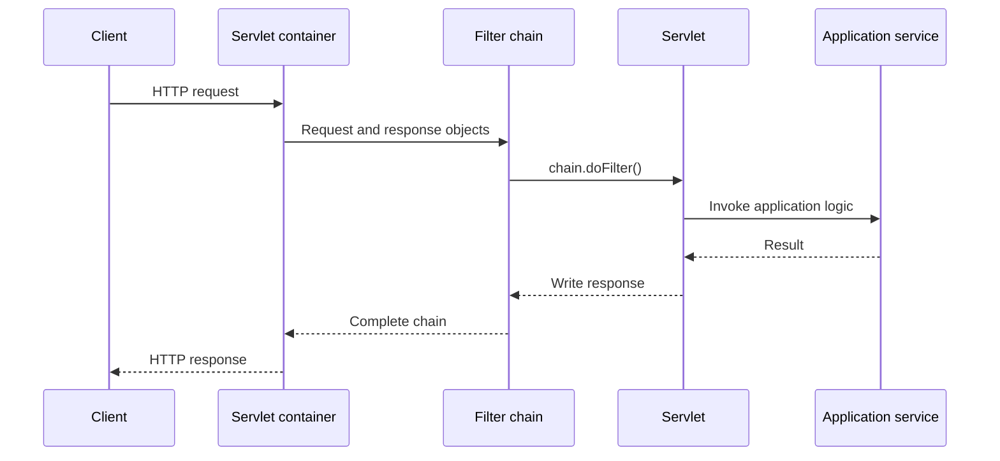
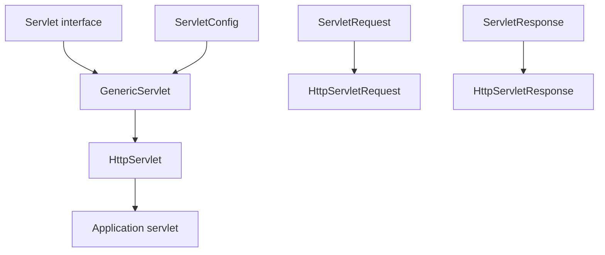
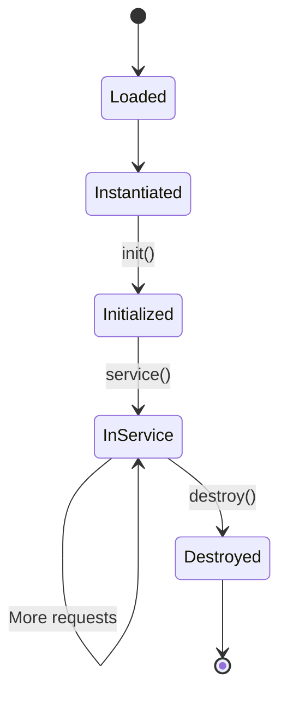
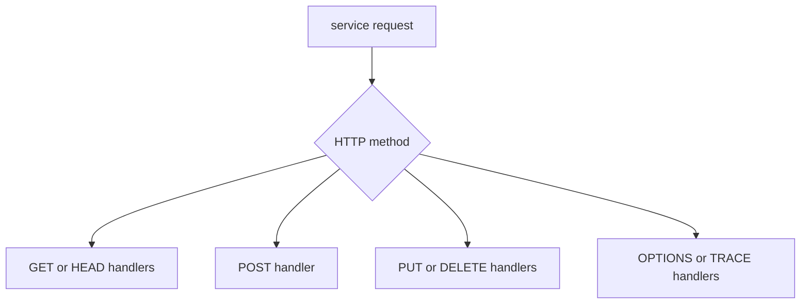
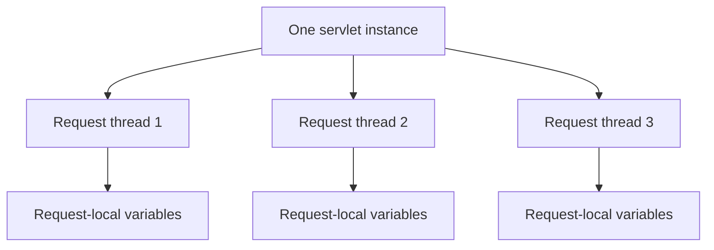
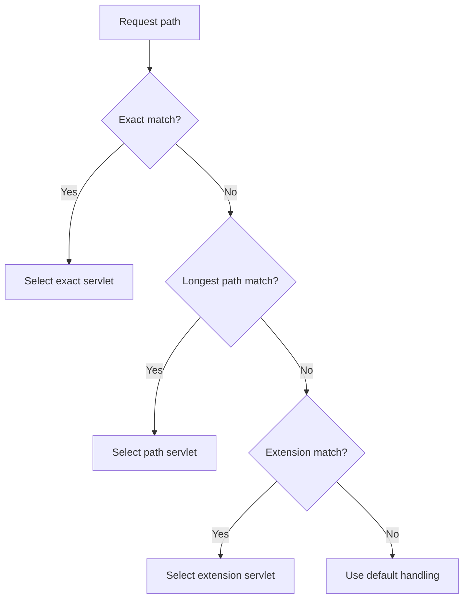
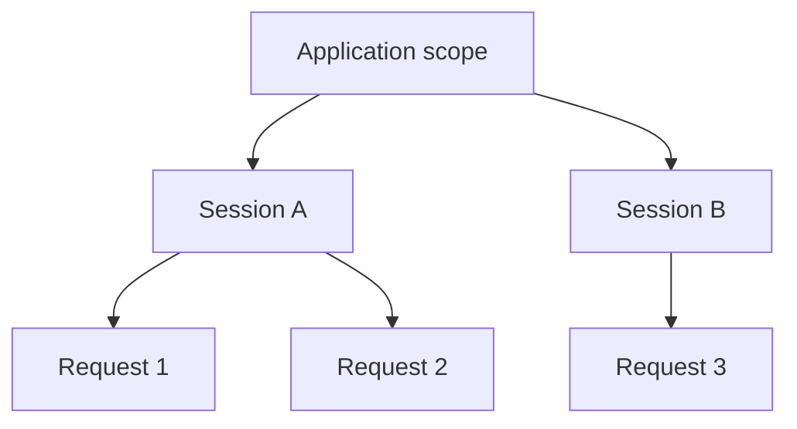
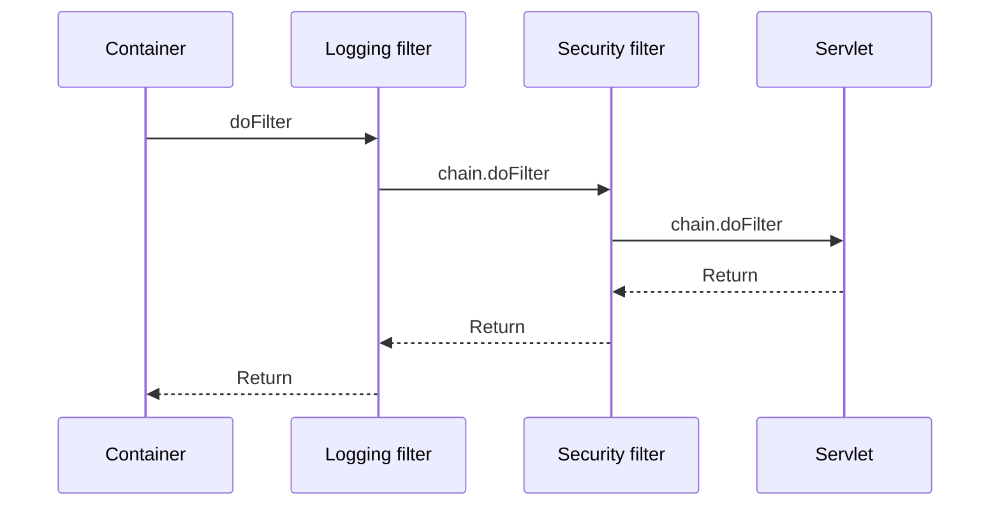
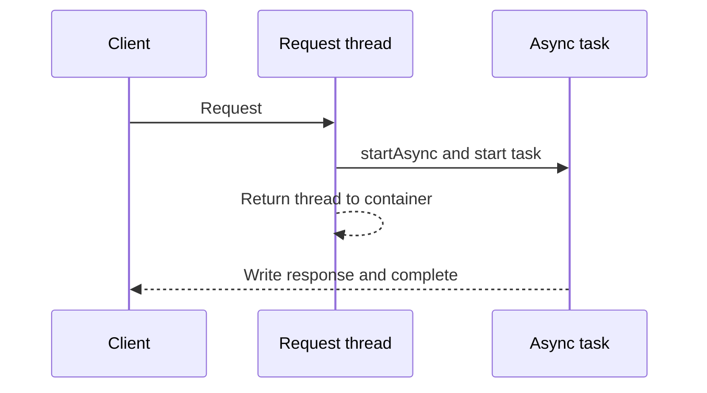
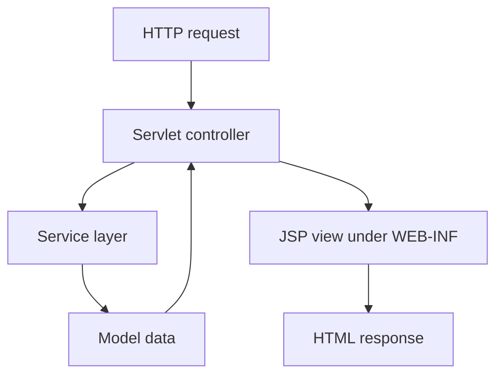

# Jakarta EE Web Reference Material

> # Jakarta Servlet 6.0

🏚️ [Home](index.md) 🔸 ⬅️ Previous: [JDBC](jdbc.md) 🔸 ➡️ Next: [Jakarta Server Pages](jsp.md)

## Table of Contents

1. [What Is Jakarta Servlet?](#1-what-is-jakarta-servlet)
2. [Why Is Servlet Technology Used?](#2-why-is-servlet-technology-used)
3. [Servlet Architecture and Request Flow](#3-servlet-architecture-and-request-flow)
4. [Java 21 and Servlet 6.0 Requirements](#4-java-21-and-servlet-60-requirements)
5. [Servlet API Hierarchy](#5-servlet-api-hierarchy)
6. [A First HTTP Servlet](#6-a-first-http-servlet)
7. [Servlet Life Cycle](#7-servlet-life-cycle)
8. [service() and HTTP Method Handling](#8-service-and-http-method-handling)
9. [Servlet Concurrency and Thread Safety](#9-servlet-concurrency-and-thread-safety)
10. [Web-Application Structure and Maven Dependency](#10-web-application-structure-and-maven-dependency)
11. [Annotation-Based Configuration](#11-annotation-based-configuration)
12. [Deployment-Descriptor Configuration](#12-deployment-descriptor-configuration)
13. [URL Mapping Rules](#13-url-mapping-rules)
14. [HttpServletRequest](#14-httpservletrequest)
15. [Parameters, Request Bodies, and Encoding](#15-parameters-request-bodies-and-encoding)
16. [Request Attributes and Web Scopes](#16-request-attributes-and-web-scopes)
17. [HttpServletResponse](#17-httpservletresponse)
18. [HTTP Methods, Status Codes, and Headers](#18-http-methods-status-codes-and-headers)
19. [Forward, Include, and Redirect](#19-forward-include-and-redirect)
20. [ServletConfig and ServletContext](#20-servletconfig-and-servletcontext)
21. [Cookies](#21-cookies)
22. [Sessions and Session Tracking](#22-sessions-and-session-tracking)
23. [Filters](#23-filters)
24. [Listeners](#24-listeners)
25. [Exception and Error Handling](#25-exception-and-error-handling)
26. [File Upload with Multipart Requests](#26-file-upload-with-multipart-requests)
27. [Asynchronous Processing](#27-asynchronous-processing)
28. [Non-Blocking I/O and Protocol Upgrade](#28-non-blocking-io-and-protocol-upgrade)
29. [Servlet Security](#29-servlet-security)
30. [Programmatic Registration](#30-programmatic-registration)
31. [Servlets in MVC Applications](#31-servlets-in-mvc-applications)
32. [WAR Packaging and Deployment](#32-war-packaging-and-deployment)
33. [Important Servlet 6.0 Features and Migration Notes](#33-important-servlet-60-features-and-migration-notes)
34. [Testing and Debugging Servlets](#34-testing-and-debugging-servlets)
35. [Best Practices and Common Servlet Errors](#35-best-practices-and-common-servlet-errors)
36. [Frequently Asked Interview Questions](#36-frequently-asked-interview-questions)

## 1. What Is Jakarta Servlet?

A **servlet** is a Java class managed by a servlet container to receive requests, execute server-side logic, and create responses.

The **Jakarta Servlet API** defines the contract between a web component and its runtime container. Its main packages are:

- `jakarta.servlet`, which contains protocol-independent contracts;
- `jakarta.servlet.http`, which contains HTTP-specific contracts; and
- `jakarta.servlet.annotation`, which contains configuration annotations.

Most application servlets extend `HttpServlet` and override methods such as `doGet()` or `doPost()`.

```java
public class GreetingServlet extends HttpServlet {
    @Override
    protected void doGet(
            HttpServletRequest request,
            HttpServletResponse response) throws IOException {

        response.setContentType("text/plain;charset=UTF-8");
        response.getWriter().println("Hello from a servlet");
    }
}
```

A servlet is not started using a `main()` method. The **servlet container** creates it, configures it, invokes its life-cycle methods, supplies request and response objects, and manages its runtime environment.

[↑ Go to Table of Contents](#table-of-contents)

## 2. Why Is Servlet Technology Used?

Servlet technology helps Java developers:

- process HTTP requests and responses;
- read form data, query parameters, headers, cookies, and request bodies;
- generate HTML, text, JSON, files, and status responses;
- maintain user state through sessions;
- centralize cross-cutting behavior with filters;
- react to application, request, and session events with listeners;
- use container-managed authentication and authorization;
- process long-running requests asynchronously; and
- build a foundation for higher-level Java web frameworks.

### Static resource vs servlet-generated response

| Static resource | Servlet-generated response |
| --- | --- |
| Content normally already exists as a file | Content is produced while handling a request |
| Same representation is often returned to every user | Output may depend on user, input, database state, or time |
| Usually served by the container's default servlet | Handled by an application servlet |
| Examples: CSS, JavaScript, images | Examples: search result, registration result, report |

Servlets remain important even when a framework is used because many Java web frameworks ultimately run on top of the Servlet API.

[↑ Go to Table of Contents](#table-of-contents)

## 3. Servlet Architecture and Request Flow

The main participants are:

| Participant | Responsibility |
| --- | --- |
| Client | Sends an HTTP request and receives an HTTP response |
| Web server | Accepts network traffic and may serve static resources |
| Servlet container | Maps requests, manages components, and enforces Servlet contracts |
| Filter chain | Applies cross-cutting processing before or after a target resource |
| Servlet | Handles the mapped request and creates a response |
| Application services | Perform business, persistence, or integration logic |



Typical request processing:

1. The client sends a request to a server URL.
2. The container selects a web application using its context path.
3. The container maps the remaining path to a servlet.
4. Matching filters are invoked.
5. The servlet reads the request and calls application logic.
6. The servlet configures and writes the response.
7. The filter chain completes.
8. The container commits and returns the response.

The container, rather than application code, creates the `HttpServletRequest` and `HttpServletResponse` objects.

[↑ Go to Table of Contents](#table-of-contents)

## 4. Java 21 and Servlet 6.0 Requirements

This material uses the following baseline:

| Item | Version or requirement |
| --- | --- |
| Java | Java 21 |
| Servlet specification | Jakarta Servlet 6.0 |
| Servlet API artifact | `jakarta.servlet:jakarta.servlet-api:6.0.0` |
| Servlet namespace | `jakarta.servlet.*` |
| Standard web archive | WAR |
| Servlet 6.0 specification minimum | Java SE 11 or higher |
| Jakarta EE platform release | Jakarta EE 10 |

Java 21 satisfies Servlet 6.0's Java SE 11 minimum. The application must still be deployed to a container that implements Servlet 6.0.

The API dependency supplies interfaces and classes for compilation. The runtime container supplies their implementations, so the dependency is normally marked `provided` rather than packaged into the WAR.

Important official references:

- [Jakarta Servlet 6.0 release page](https://jakarta.ee/specifications/servlet/6.0/)
- [Jakarta Servlet 6.0 specification](https://jakarta.ee/specifications/servlet/6.0/jakarta-servlet-spec-6.0)
- [Jakarta Servlet 6.0 API documentation](https://jakarta.ee/specifications/servlet/6.0/apidocs/)

Servlet 6.1 belongs to a later platform release. Features added only in 6.1 must not be assumed to exist when the course target is Servlet 6.0.

[↑ Go to Table of Contents](#table-of-contents)

## 5. Servlet API Hierarchy

The main servlet type hierarchy is:



| Type | Purpose |
| --- | --- |
| `Servlet` | Defines `init`, `service`, `destroy`, and configuration methods |
| `GenericServlet` | Protocol-independent abstract convenience class |
| `HttpServlet` | HTTP-specific base class that dispatches to `doGet`, `doPost`, and related methods |
| `ServletRequest` | Represents protocol-independent request data |
| `ServletResponse` | Represents protocol-independent response data |
| `HttpServletRequest` | Adds HTTP method, URI, header, cookie, session, and user information |
| `HttpServletResponse` | Adds HTTP status, header, cookie, redirect, and error operations |

Application code normally extends `HttpServlet`:

```java
public final class ProductServlet extends HttpServlet {
    @Override
    protected void doGet(
            HttpServletRequest request,
            HttpServletResponse response) throws IOException {
        // Handle an HTTP GET request.
    }
}
```

Implementing `Servlet` directly is possible but usually unnecessary because `GenericServlet` and `HttpServlet` already implement common life-cycle behavior.

[↑ Go to Table of Contents](#table-of-contents)

## 6. A First HTTP Servlet

The `@WebServlet` annotation can declare a servlet and its URL mapping.

```java
package com.company.training.web;

import java.io.IOException;

import jakarta.servlet.annotation.WebServlet;
import jakarta.servlet.http.HttpServlet;
import jakarta.servlet.http.HttpServletRequest;
import jakarta.servlet.http.HttpServletResponse;

@WebServlet("/hello")
public final class HelloServlet extends HttpServlet {
    @Override
    protected void doGet(
            HttpServletRequest request,
            HttpServletResponse response) throws IOException {

        String name = request.getParameter("name");

        if (name == null || name.isBlank()) {
            name = "Guest";
        }

        response.setContentType("text/plain;charset=UTF-8");
        response.getWriter().println("Hello, " + name);
    }
}
```

For an application deployed with context path `/training`, a request may be:

```text
GET /training/hello?name=Anita HTTP/1.1
```

The parts are:

| Part | Value |
| --- | --- |
| Context path | `/training` |
| Servlet mapping | `/hello` |
| Query parameter | `name=Anita` |
| Method invoked by `HttpServlet` | `doGet()` |

Do not place confidential data in query strings. Query strings may appear in browser history, logs, bookmarks, and intermediary systems.

[↑ Go to Table of Contents](#table-of-contents)

## 7. Servlet Life Cycle

The container controls the life cycle through the methods defined by `Servlet`.



### `init()`

The container calls `init()` after constructing a servlet instance and before routing requests to it. Use it for one-time initialization.

```java
private String reportTitle;

@Override
public void init() throws ServletException {
    reportTitle = getServletConfig().getInitParameter("reportTitle");
}
```

If initialization fails with `ServletException` or `UnavailableException`, the instance is not placed into service.

### `service()`

After successful initialization, the container calls `service()` for each request. `HttpServlet.service()` selects an HTTP-specific method such as `doGet()` or `doPost()`.

### `destroy()`

The container calls `destroy()` before removing an initialized servlet instance from service.

```java
@Override
public void destroy() {
    // Release resources owned for the servlet's lifetime.
}
```

Do not depend on `destroy()` as the only protection for critical data. A process may terminate abnormally without orderly shutdown.

[↑ Go to Table of Contents](#table-of-contents)

## 8. service() and HTTP Method Handling

`HttpServlet.service()` reads the HTTP method and dispatches to the corresponding protected method.



| Method | Typical intention | `HttpServlet` method |
| --- | --- | --- |
| GET | Read a representation | `doGet()` |
| POST | Submit data or create/process a subordinate resource | `doPost()` |
| PUT | Create or replace a resource at a known target | `doPut()` |
| DELETE | Delete a resource | `doDelete()` |
| HEAD | Return GET-like headers without a response body | `doHead()` |
| OPTIONS | Report communication options | `doOptions()` |
| TRACE | Diagnostic loopback where enabled | `doTrace()` |

Example with two handlers:

```java
@Override
protected void doGet(
        HttpServletRequest request,
        HttpServletResponse response) throws IOException {
    response.setContentType("text/plain;charset=UTF-8");
    response.getWriter().println("Display registration form");
}

@Override
protected void doPost(
        HttpServletRequest request,
        HttpServletResponse response) throws IOException {
    response.setStatus(HttpServletResponse.SC_CREATED);
    response.setContentType("text/plain;charset=UTF-8");
    response.getWriter().println("Registration accepted");
}
```

Normally, override `doGet()`, `doPost()`, or another `doXxx()` method rather than overriding `service()`. Servlet 6.0 does not define a `doPatch()` method; an application needing PATCH must handle that method deliberately, for example through controlled `service()` dispatch.

[↑ Go to Table of Contents](#table-of-contents)

## 9. Servlet Concurrency and Thread Safety

A container may invoke the same servlet instance concurrently on multiple request-processing threads. Therefore, a servlet must be designed for concurrent access.



### Unsafe shared state

```java
private int requestCount; // Shared mutable field

@Override
protected void doGet(
        HttpServletRequest request,
        HttpServletResponse response) throws IOException {
    requestCount++; // Read-modify-write race
    response.getWriter().println(requestCount);
}
```

### Safer design

```java
@Override
protected void doGet(
        HttpServletRequest request,
        HttpServletResponse response) throws IOException {
    String employeeId = request.getParameter("employeeId");
    Employee employee = employeeService.findById(employeeId);
    response.getWriter().println(employee.name());
}
```

Request-specific values are local variables. A shared service stored in a servlet field must itself be thread-safe or immutable.

Remember:

- avoid request data in servlet instance fields;
- avoid unsynchronized mutable collections in shared fields;
- do not store one request or response object for later unrelated use;
- use thread-safe infrastructure for shared caches and counters;
- define database transaction state per operation, not per servlet instance; and
- do not synchronize the entire `service()` or `doXxx()` method as a routine fix.

The obsolete `SingleThreadModel` approach is not a solution and was removed from Servlet 6.0.

[↑ Go to Table of Contents](#table-of-contents)

## 10. Web-Application Structure and Maven Dependency

A common Maven web project has this source structure:

```text
servlet-training/
├── pom.xml
└── src/
    └── main/
        ├── java/
        │   └── com/company/training/web/
        │       └── HelloServlet.java
        └── webapp/
            ├── index.html
            └── WEB-INF/
                ├── web.xml
                └── views/
                    └── result.jsp
```

The important Maven settings are:

```xml
<packaging>war</packaging>

<properties>
    <maven.compiler.release>21</maven.compiler.release>
</properties>

<dependencies>
    <dependency>
        <groupId>jakarta.servlet</groupId>
        <artifactId>jakarta.servlet-api</artifactId>
        <version>6.0.0</version>
        <scope>provided</scope>
    </dependency>
</dependencies>
```

The `provided` scope means:

- the API is available while compiling and testing;
- the API is not copied into `WEB-INF/lib`; and
- the Servlet 6.0 container supplies the runtime implementation.

Packaging another copy of the Servlet API inside the application can create class-loading conflicts. A compatible container is part of the runtime requirement, not a replacement for the compile-time dependency declaration.

[↑ Go to Table of Contents](#table-of-contents)

## 11. Annotation-Based Configuration

Servlet annotations reduce the need for XML when configuration can be expressed in code.

### `@WebServlet`

```java
@WebServlet(
        name = "reportServlet",
        urlPatterns = {"/reports", "/reports/*"},
        loadOnStartup = 1,
        initParams = {
            @WebInitParam(
                    name = "defaultFormat",
                    value = "summary")
        },
        asyncSupported = true
)
public final class ReportServlet extends HttpServlet {
    // Request handlers
}
```

| Attribute | Purpose |
| --- | --- |
| `name` | Declares a logical servlet name |
| `value` | Short form for URL patterns |
| `urlPatterns` | Declares one or more mappings |
| `loadOnStartup` | Requests initialization during application startup and influences order |
| `initParams` | Declares servlet-specific initialization parameters |
| `asyncSupported` | Declares whether the servlet supports asynchronous processing |

At least one URL pattern must be supplied through `value` or `urlPatterns`. Do not give non-default values to both because they are aliases.

Other important annotations include:

| Annotation | Purpose |
| --- | --- |
| `@WebFilter` | Declares a filter and its mappings |
| `@WebListener` | Declares a supported web listener |
| `@MultipartConfig` | Enables container multipart processing for a servlet |
| `@ServletSecurity` | Declares servlet security constraints |
| `@DeclareRoles` | Declares application security roles |
| `@RunAs` | Declares a role used while invoking another component |

Annotations are convenient for component-local configuration. A deployment descriptor remains useful for centralized configuration, overrides, environment-specific settings, and security declarations.

[↑ Go to Table of Contents](#table-of-contents)

## 12. Deployment-Descriptor Configuration

The deployment descriptor is stored at `WEB-INF/web.xml`.

```xml
<?xml version="1.0" encoding="UTF-8"?>
<web-app xmlns="https://jakarta.ee/xml/ns/jakartaee"
         xmlns:xsi="http://www.w3.org/2001/XMLSchema-instance"
         xsi:schemaLocation="https://jakarta.ee/xml/ns/jakartaee
             https://jakarta.ee/xml/ns/jakartaee/web-app_6_0.xsd"
         version="6.0">

    <servlet>
        <servlet-name>helloServlet</servlet-name>
        <servlet-class>
            com.company.training.web.HelloServlet
        </servlet-class>
        <init-param>
            <param-name>greeting</param-name>
            <param-value>Welcome</param-value>
        </init-param>
        <load-on-startup>1</load-on-startup>
    </servlet>

    <servlet-mapping>
        <servlet-name>helloServlet</servlet-name>
        <url-pattern>/hello</url-pattern>
    </servlet-mapping>

</web-app>
```

Common descriptor configuration includes:

- servlet, filter, and listener declarations;
- URL mappings;
- context initialization parameters;
- session configuration;
- welcome files;
- error pages;
- MIME mappings; and
- authentication, roles, and security constraints.

### Annotation scanning

When the root element declares `metadata-complete="true"`, the application states that its deployment metadata is complete. Component annotations such as `@WebServlet`, `@WebFilter`, and `@WebListener` are then not used for discovery.

```xml
<web-app xmlns="https://jakarta.ee/xml/ns/jakartaee"
         version="6.0"
         metadata-complete="true">
    <!-- Complete deployment metadata goes here. -->
</web-app>
```

Use the 6.0 namespace, schema, and version consistently. A descriptor copied from a pre-Jakarta application may use obsolete `java.sun.com` or `javax`-era metadata.

[↑ Go to Table of Contents](#table-of-contents)

## 13. URL Mapping Rules

A URL pattern connects a request path to a servlet.

| Mapping kind | Pattern example | Matches |
| --- | --- | --- |
| Exact | `/employees` | Exactly `/employees` |
| Path | `/employees/*` | `/employees/`, `/employees/101`, and deeper paths |
| Extension | `*.report` | Paths whose last segment has the `.report` extension |
| Context-root | Empty string `""` | The application's context root |
| Default | `/` | Requests not matched by a more specific servlet mapping |

The container tries mappings in this order:

1. exact match;
2. longest path-prefix match;
3. extension match; and
4. default handling.



Matching is case-sensitive. Path-prefix selection chooses the longest successful match.

For a request to `/shop/products/42` with context path `/shop` and servlet mapping `/products/*`:

| Request method | Result |
| --- | --- |
| `getRequestURI()` | `/shop/products/42` |
| `getContextPath()` | `/shop` |
| `getServletPath()` | `/products` |
| `getPathInfo()` | `/42` |

Servlet 6.0 also allows mapping inspection:

```java
HttpServletMapping mapping = request.getHttpServletMapping();

String pattern = mapping.getPattern();
MappingMatch matchType = mapping.getMappingMatch();
```

Avoid overlapping patterns unless their precedence is intentional and documented.

[↑ Go to Table of Contents](#table-of-contents)

## 14. HttpServletRequest

`HttpServletRequest` represents an incoming HTTP request.

Important information includes:

| Method | Purpose |
| --- | --- |
| `getMethod()` | Returns the HTTP method |
| `getRequestURI()` | Returns the path including the context path |
| `getRequestURL()` | Reconstructs the request URL without its query string |
| `getQueryString()` | Returns the raw query string or `null` |
| `getContextPath()` | Returns the web application's context path |
| `getServletPath()` | Returns the path that matched the servlet |
| `getPathInfo()` | Returns extra path information after a path mapping |
| `getHeader(name)` | Returns the first value for a request header |
| `getCookies()` | Returns request cookies or `null` |
| `getRemoteAddr()` | Returns the apparent client address for the connection |
| `getUserPrincipal()` | Returns the authenticated principal or `null` |
| `isSecure()` | Tests whether the request arrived through a secure channel |
| `getSession()` | Returns or creates an HTTP session |

```java
String method = request.getMethod();
String uri = request.getRequestURI();
String userAgent = request.getHeader("User-Agent");

response.setContentType("text/plain;charset=UTF-8");
response.getWriter().printf(
        "Method=%s, URI=%s, Agent=%s%n",
        method,
        uri,
        userAgent
);
```

### Headers with multiple values

Use `getHeaders(name)` when a header may contain more than one field value.

```java
Enumeration<String> values = request.getHeaders("Accept-Language");

while (values.hasMoreElements()) {
    String value = values.nextElement();
    // Inspect the value.
}
```

Do not trust forwarded-client headers automatically. When an application is behind a trusted reverse proxy, configure the container's proxy support so scheme, host, port, and client address are interpreted safely.

[↑ Go to Table of Contents](#table-of-contents)

## 15. Parameters, Request Bodies, and Encoding

### Request parameters

Parameter methods return strings supplied through supported request parameter sources.

| Method | Purpose |
| --- | --- |
| `getParameter(name)` | Returns the first value or `null` |
| `getParameterValues(name)` | Returns all values or `null` |
| `getParameterNames()` | Returns all parameter names |
| `getParameterMap()` | Returns a map of names to `String[]` values |

```java
String name = request.getParameter("name");
String[] skills = request.getParameterValues("skill");

if (name == null || name.isBlank()) {
    response.sendError(
            HttpServletResponse.SC_BAD_REQUEST,
            "name is required"
    );
    return;
}
```

For form bodies, automatic parameter parsing applies to POST requests using `application/x-www-form-urlencoded`. Query-string parameters are also exposed through the parameter API.

### Request body

Use one of these access styles:

```java
try (BufferedReader reader = request.getReader()) {
    String body = reader.lines()
            .collect(Collectors.joining(System.lineSeparator()));
}
```

or:

```java
try (ServletInputStream input = request.getInputStream()) {
    byte[] body = input.readAllBytes();
}
```

Do not call both `getReader()` and `getInputStream()` on the same request. Parse JSON with a JSON library; `getParameter()` does not parse an `application/json` body.

### Character encoding

Set request encoding before reading parameters or the request reader when the client has not supplied an encoding:

```java
request.setCharacterEncoding(StandardCharsets.UTF_8.name());

String description = request.getParameter("description");
```

Reading the body and triggering form-parameter parsing can compete for the same input. Choose one model based on the request content type.

[↑ Go to Table of Contents](#table-of-contents)

## 16. Request Attributes and Web Scopes

Parameters and attributes serve different purposes.

| Parameter | Attribute |
| --- | --- |
| Usually comes from client input | Usually created by container or server-side code |
| Value type exposed by parameter API is `String` or `String[]` | Value type is `Object` |
| Read through `getParameter...()` | Read through `getAttribute()` |
| Cannot be replaced through a parameter setter | Can be added, replaced, or removed |

```java
Employee employee = employeeService.findById(employeeId);

request.setAttribute("employee", employee);
request.getRequestDispatcher("/WEB-INF/views/employee.jsp")
        .forward(request, response);
```

### Common web scopes

| Scope | API location | Typical lifetime | Suitable data |
| --- | --- | --- | --- |
| Request | `ServletRequest` | One request, including forwards | Validation result or model for one view |
| Session | `HttpSession` | Multiple requests from one user session | Login identity reference or small workflow state |
| Application | `ServletContext` | Web application lifetime in one JVM | Immutable shared configuration or thread-safe shared service |



Scope does not provide automatic thread safety. Session and application attributes may be reached concurrently. Do not store request or response objects in broader scopes.

[↑ Go to Table of Contents](#table-of-contents)

## 17. HttpServletResponse

`HttpServletResponse` represents the outgoing HTTP response.

The servlet can configure:

- status code;
- response headers;
- cookies;
- content type;
- character encoding;
- buffer behavior; and
- text or binary body content.

### Text response

```java
response.setStatus(HttpServletResponse.SC_OK);
response.setContentType("text/html;charset=UTF-8");

try (PrintWriter writer = response.getWriter()) {
    writer.println("""
            <!doctype html>
            <html lang="en">
            <head><title>Result</title></head>
            <body><h1>Request completed</h1></body>
            </html>
            """);
}
```

### Binary response

```java
response.setContentType("application/pdf");
response.setHeader(
        "Content-Disposition",
        "attachment; filename=report.pdf"
);

try (ServletOutputStream output = response.getOutputStream()) {
    reportInputStream.transferTo(output);
}
```

Do not call both `getWriter()` and `getOutputStream()` for one response. Set the encoding and content type before obtaining the writer.

### Response commitment

A response becomes **committed** when its status and headers have been sent. After commitment, changing headers or forwarding is no longer valid.

```java
boolean committed = response.isCommitted();
```

Writing beyond the response buffer or calling `flushBuffer()` can commit the response.

[↑ Go to Table of Contents](#table-of-contents)

## 18. HTTP Methods, Status Codes, and Headers

Choose an HTTP method and status code that match the operation's semantics.

### Method characteristics

| Method | Safe | Idempotent | Request body normally used |
| --- | --- | --- | --- |
| GET | Yes | Yes | No |
| HEAD | Yes | Yes | No |
| POST | No | No guarantee | Yes |
| PUT | No | Yes | Yes |
| DELETE | No | Yes | Optional by protocol, uncommon in many APIs |

**Safe** means the client does not request a state change. **Idempotent** means repeating the same intended request has the same intended server effect as making it once.

### Common response statuses

| Status | Servlet constant | Typical use |
| --- | --- | --- |
| 200 OK | `SC_OK` | Successful response with a representation |
| 201 Created | `SC_CREATED` | Resource created |
| 204 No Content | `SC_NO_CONTENT` | Successful response without a body |
| 400 Bad Request | `SC_BAD_REQUEST` | Invalid client input |
| 401 Unauthorized | `SC_UNAUTHORIZED` | Authentication is required or failed |
| 403 Forbidden | `SC_FORBIDDEN` | Authenticated or known client is not allowed |
| 404 Not Found | `SC_NOT_FOUND` | Target resource is absent |
| 405 Method Not Allowed | `SC_METHOD_NOT_ALLOWED` | Resource does not support the method |
| 409 Conflict | `SC_CONFLICT` | Request conflicts with current state |
| 500 Internal Server Error | `SC_INTERNAL_SERVER_ERROR` | Unexpected server failure |
| 503 Service Unavailable | `SC_SERVICE_UNAVAILABLE` | Temporary service unavailability |

```java
response.setStatus(HttpServletResponse.SC_CREATED);
response.setHeader("Location", request.getContextPath() + "/employees/101");
response.setHeader("Cache-Control", "no-store");
```

Use `setHeader()` to replace a response header and `addHeader()` to add another value. Use `sendError()` when handing an error to the container's error mechanism.

[↑ Go to Table of Contents](#table-of-contents)

## 19. Forward, Include, and Redirect

### Forward

A forward transfers server-side control to another web resource using the same request and response.

```java
request.setAttribute("employee", employee);

RequestDispatcher dispatcher =
        request.getRequestDispatcher("/WEB-INF/views/employee.jsp");

dispatcher.forward(request, response);
```

The response must not already be committed. The browser does not make a new request and its address bar normally remains unchanged.

### Include

An include adds another resource's output to the current response.

```java
response.getWriter().println("<main>");
request.getRequestDispatcher("/WEB-INF/views/summary.jsp")
        .include(request, response);
response.getWriter().println("</main>");
```

The included resource cannot meaningfully change the outer response's status or headers.

### Redirect

A redirect sends a response instructing the client to make another request.

```java
String target = request.getContextPath() + "/employees";
response.sendRedirect(response.encodeRedirectURL(target));
```

| Characteristic | Forward | Include | Redirect |
| --- | --- | --- | --- |
| Location | Server-side | Server-side | Client-side round trip |
| New client request | No | No | Yes |
| Same request attributes | Yes | Yes | No |
| Browser URL changes | No | No | Yes |
| Can target another site | No | No | Yes, when intentionally allowed |

Do not build a redirect target directly from untrusted input. That can create an open-redirect vulnerability.

[↑ Go to Table of Contents](#table-of-contents)

## 20. ServletConfig and ServletContext

`ServletConfig` contains configuration for one servlet declaration. `ServletContext` represents the web application environment.

| Characteristic | `ServletConfig` | `ServletContext` |
| --- | --- | --- |
| Scope | One servlet declaration | Entire web application in one JVM |
| Main use | Servlet-specific initialization parameters | Application parameters, resources, attributes, registrations, logging |
| Access | `getServletConfig()` | `getServletContext()` |
| Parameter source | `@WebInitParam` or `<init-param>` | `<context-param>` |

### Servlet initialization parameter

```java
String defaultFormat =
        getServletConfig().getInitParameter("defaultFormat");
```

### Application initialization parameter

```xml
<context-param>
    <param-name>supportEmail</param-name>
    <param-value>support@example.test</param-value>
</context-param>
```

```java
String supportEmail =
        getServletContext().getInitParameter("supportEmail");
```

### Application resource

```java
try (InputStream input = getServletContext()
        .getResourceAsStream("/WEB-INF/config/banner.txt")) {
    // Read the protected application resource when present.
}
```

Initialization parameters are strings and are read-only through their getter APIs. Context attributes are mutable objects and require careful concurrency design.

[↑ Go to Table of Contents](#table-of-contents)

## 21. Cookies

A cookie is a small name-value item sent in a response and returned by a client on later matching requests.

```java
Cookie preference = new Cookie("theme", "dark");
preference.setHttpOnly(true);
preference.setSecure(true);
preference.setPath(request.getContextPath());
preference.setMaxAge(7 * 24 * 60 * 60);
preference.setAttribute("SameSite", "Lax");

response.addCookie(preference);
```

Servlet 6.0 added generic cookie attribute support, including the ability to express attributes such as `SameSite`.

### Reading cookies

```java
String theme = "light";
Cookie[] cookies = request.getCookies();

if (cookies != null) {
    for (Cookie cookie : cookies) {
        if (cookie.getName().equals("theme")) {
            theme = cookie.getValue();
            break;
        }
    }
}
```

### Cookie security properties

| Property | Purpose |
| --- | --- |
| `HttpOnly` | Prevents ordinary client-side scripts from reading the cookie |
| `Secure` | Restricts transmission to secure requests |
| `SameSite` | Controls cross-site cookie sending behavior |
| `Path` | Restricts paths to which the cookie is sent |
| `Domain` | Controls eligible hosts; omit unless broader host sharing is required |
| `Max-Age` | Controls persistence in seconds; a negative value is a session cookie |

Do not store passwords or sensitive personal data in cookies. A cookie value can be modified by the client unless it is protected by an appropriate integrity mechanism.

To delete a cookie, send a cookie with the same name, path, and domain and set its maximum age to zero.

[↑ Go to Table of Contents](#table-of-contents)

## 22. Sessions and Session Tracking

`HttpSession` stores server-side state associated with a client across multiple requests.

```java
HttpSession session = request.getSession();
session.setAttribute("userId", authenticatedUser.id());
session.setMaxInactiveInterval(30 * 60);

request.changeSessionId();
```

Change the session ID after authentication or another privilege change to reduce session-fixation risk.

### Reading without creating

```java
HttpSession session = request.getSession(false);

if (session == null) {
    response.sendError(HttpServletResponse.SC_UNAUTHORIZED);
    return;
}
```

### Ending a session

```java
HttpSession session = request.getSession(false);

if (session != null) {
    session.invalidate();
}
```

The container may track a session using a cookie or URL rewriting. Use URL-encoding helpers for links and redirects when cookie-less fallback is supported:

```java
String detailsUrl = response.encodeURL(
        request.getContextPath() + "/account"
);
```

### Session configuration in `web.xml`

```xml
<session-config>
    <session-timeout>30</session-timeout>
    <cookie-config>
        <http-only>true</http-only>
        <secure>true</secure>
    </cookie-config>
    <tracking-mode>COOKIE</tracking-mode>
</session-config>
```

Session timeout is expressed in minutes in the descriptor.

Avoid large session graphs, raw database connections, and request or response objects in a session. In distributed deployments, session attributes may also need to be serializable depending on container strategy and application requirements.

[↑ Go to Table of Contents](#table-of-contents)

## 23. Filters

A filter intercepts requests and responses around a target servlet, static resource, or another filter.

Typical uses include:

- authentication and authorization checks;
- request logging and correlation;
- character-encoding configuration;
- CORS response headers;
- response wrapping or compression;
- timing and metrics; and
- input normalization where appropriate.

```java
package com.company.training.web.filter;

import java.io.IOException;
import java.nio.charset.StandardCharsets;

import jakarta.servlet.Filter;
import jakarta.servlet.FilterChain;
import jakarta.servlet.ServletException;
import jakarta.servlet.ServletRequest;
import jakarta.servlet.ServletResponse;
import jakarta.servlet.annotation.WebFilter;

@WebFilter(urlPatterns = "/*")
public final class EncodingFilter implements Filter {
    @Override
    public void doFilter(
            ServletRequest request,
            ServletResponse response,
            FilterChain chain) throws IOException, ServletException {

        request.setCharacterEncoding(StandardCharsets.UTF_8.name());
        response.setCharacterEncoding(StandardCharsets.UTF_8.name());

        chain.doFilter(request, response);
    }
}
```

### Filter-chain behavior



Code before `chain.doFilter()` runs on the way toward the target. Code after it runs while control returns.

A filter may stop processing:

```java
if (request.getUserPrincipal() == null) {
    response.sendError(HttpServletResponse.SC_UNAUTHORIZED);
    return;
}

chain.doFilter(request, response);
```

Filter mapping can be limited by URL, servlet name, and dispatcher type such as `REQUEST`, `FORWARD`, `INCLUDE`, `ERROR`, or `ASYNC`. A filter participating in asynchronous processing must also support async.

[↑ Go to Table of Contents](#table-of-contents)

## 24. Listeners

Listeners receive notifications about web-application events.

| Event category | Listener interface |
| --- | --- |
| Application start and stop | `ServletContextListener` |
| Application attribute changes | `ServletContextAttributeListener` |
| Request start and completion | `ServletRequestListener` |
| Request attribute changes | `ServletRequestAttributeListener` |
| Session creation and destruction | `HttpSessionListener` |
| Session attribute changes | `HttpSessionAttributeListener` |
| Session ID change | `HttpSessionIdListener` |
| Async completion, timeout, error, or restart | `AsyncListener` |

### Application life-cycle listener

```java
@WebListener
public final class ApplicationListener
        implements ServletContextListener {

    @Override
    public void contextInitialized(ServletContextEvent event) {
        ServletContext context = event.getServletContext();
        context.log("Training application started");
    }

    @Override
    public void contextDestroyed(ServletContextEvent event) {
        event.getServletContext()
                .log("Training application stopped");
    }
}
```

### Session-counting listener

```java
@WebListener
public final class SessionCounter implements HttpSessionListener {
    private final AtomicInteger activeSessions = new AtomicInteger();

    @Override
    public void sessionCreated(HttpSessionEvent event) {
        activeSessions.incrementAndGet();
    }

    @Override
    public void sessionDestroyed(HttpSessionEvent event) {
        activeSessions.decrementAndGet();
    }
}
```

Listener instances may also receive concurrent notifications, so their shared mutable state requires thread-safe design. Keep listener methods small and handle failures deliberately because some listener exceptions can disrupt request or application processing.

[↑ Go to Table of Contents](#table-of-contents)

## 25. Exception and Error Handling

A servlet can report failure by:

- setting an appropriate status;
- calling `sendError()`;
- throwing `ServletException`; or
- allowing an unexpected runtime exception to reach the container.

```java
Employee employee = employeeService.findById(employeeId);

if (employee == null) {
    response.sendError(
            HttpServletResponse.SC_NOT_FOUND,
            "Employee not found"
    );
    return;
}
```

Do not continue writing an ordinary success response after `sendError()`.

### Declarative error pages

```xml
<error-page>
    <error-code>404</error-code>
    <location>/WEB-INF/errors/404.html</location>
</error-page>

<error-page>
    <exception-type>java.lang.Throwable</exception-type>
    <location>/WEB-INF/errors/500.jsp</location>
</error-page>
```

During error dispatch, details are available through standard request attributes:

```java
Object statusCode = request.getAttribute(
        RequestDispatcher.ERROR_STATUS_CODE
);

Throwable failure = (Throwable) request.getAttribute(
        RequestDispatcher.ERROR_EXCEPTION
);
```

Good error handling should:

- return a suitable status code;
- log enough server-side context for diagnosis;
- avoid exposing stack traces, credentials, paths, or database details;
- give clients a stable, minimal error representation; and
- avoid writing sensitive request data to logs.

Once a response is committed, the container may be unable to replace it with a configured error page.

[↑ Go to Table of Contents](#table-of-contents)

## 26. File Upload with Multipart Requests

The container can parse `multipart/form-data` when the target servlet is configured with `@MultipartConfig` or the equivalent descriptor element.

```java
@WebServlet("/documents/upload")
@MultipartConfig(
        fileSizeThreshold = 1024 * 1024,
        maxFileSize = 5L * 1024 * 1024,
        maxRequestSize = 6L * 1024 * 1024
)
public final class DocumentUploadServlet extends HttpServlet {
    @Override
    protected void doPost(
            HttpServletRequest request,
            HttpServletResponse response)
            throws IOException, ServletException {

        Part document = request.getPart("document");

        if (document == null || document.getSize() == 0) {
            response.sendError(
                    HttpServletResponse.SC_BAD_REQUEST,
                    "document is required"
            );
            return;
        }

        String storageName = UUID.randomUUID().toString();
        document.write(storageName);

        response.setStatus(HttpServletResponse.SC_CREATED);
    }
}
```

The example demonstrates the API shape. Temporary multipart storage is not automatically durable application storage. A production design should stream or move validated content into a controlled, deployment-appropriate store.

Important `Part` methods include:

| Method | Purpose |
| --- | --- |
| `getName()` | Returns the multipart field name |
| `getSubmittedFileName()` | Returns the submitted filename where available |
| `getContentType()` | Returns the submitted content type |
| `getSize()` | Returns size in bytes |
| `getInputStream()` | Reads the part content |
| `write(fileName)` | Writes using container multipart storage rules |
| `delete()` | Deletes temporary part storage |

Security rules for uploads:

- enforce request and file size limits;
- allow only required file types and verify content, not only extension or claimed MIME type;
- never use an unsanitized submitted filename as a filesystem path;
- use server-generated storage identifiers;
- store uploads outside the publicly served application tree;
- prevent executable uploads from becoming deployable content;
- scan files when the risk profile requires it; and
- remove temporary data after failure.

`@MultipartConfig.location` is interpreted as an absolute path or relative to the container's multipart temporary directory. Keep deployment-specific storage locations outside source code when possible.

[↑ Go to Table of Contents](#table-of-contents)

## 27. Asynchronous Processing

Asynchronous processing allows the original request thread to return to the container while completion waits for another resource or event.



```java
@WebServlet(value = "/reports/slow", asyncSupported = true)
public final class AsyncReportServlet extends HttpServlet {
    @Override
    protected void doGet(
            HttpServletRequest request,
            HttpServletResponse response) {

        AsyncContext async = request.startAsync();
        async.setTimeout(15_000);

        async.start(() -> {
            try {
                HttpServletResponse asyncResponse =
                        (HttpServletResponse) async.getResponse();

                asyncResponse.setContentType(
                        "text/plain;charset=UTF-8"
                );
                asyncResponse.getWriter()
                        .println(reportService.createReport());
            } catch (Exception exception) {
                async.getRequest().getServletContext()
                        .log("Async report failed", exception);
            } finally {
                async.complete();
            }
        });
    }
}
```

Important operations:

| Method | Purpose |
| --- | --- |
| `request.startAsync()` | Starts asynchronous mode |
| `async.start(task)` | Schedules work through the container |
| `async.dispatch()` | Redispatches to the container |
| `async.complete()` | Completes async processing |
| `async.setTimeout(milliseconds)` | Sets the async timeout |
| `async.addListener(listener)` | Observes completion, timeout, error, or a new async cycle |

Every servlet and filter in the path that must permit async processing needs compatible async support. `asyncSupported` defaults to `false` on `@WebServlet` and `@WebFilter`.

Java 21 provides virtual threads, but a Jakarta web component should not start unmanaged threads casually. Threading and request execution remain container concerns; use container-supported async or concurrency facilities appropriate to the deployment platform.

[↑ Go to Table of Contents](#table-of-contents)

## 28. Non-Blocking I/O and Protocol Upgrade

Asynchronous processing and non-blocking I/O address different forms of waiting.

| Feature | Main purpose |
| --- | --- |
| Async processing | Release the initial request thread while awaiting other work |
| Non-blocking input | Receive callbacks when request data can be read without blocking |
| Non-blocking output | Receive callbacks when response data can be written without blocking |
| Protocol upgrade | Switch an HTTP connection to another protocol supported by the application |

### Non-blocking input shape

```java
AsyncContext async = request.startAsync();
ServletInputStream input = request.getInputStream();

input.setReadListener(new ReadListener() {
    @Override
    public void onDataAvailable() throws IOException {
        while (input.isReady() && !input.isFinished()) {
            int value = input.read();
            // Process available input without blocking.
        }
    }

    @Override
    public void onAllDataRead() {
        async.complete();
    }

    @Override
    public void onError(Throwable failure) {
        request.getServletContext()
                .log("Non-blocking read failed", failure);
        async.complete();
    }
});
```

Non-blocking output uses `ServletOutputStream.setWriteListener()` and calls `isReady()` before writing. Callback code must follow the readiness contract; reading or writing when the stream is not ready is invalid.

### Request and connection identifiers in Servlet 6.0

```java
String requestId = request.getRequestId();
String protocolRequestId = request.getProtocolRequestId();
ServletConnection connection = request.getServletConnection();
```

These values help correlate requests and understand the underlying protocol connection. They are not authentication tokens.

Protocol upgrade uses `request.upgrade(SomeUpgradeHandler.class)`. It is an advanced feature and must include correct concurrency, I/O, resource-cleanup, and protocol handling.

[↑ Go to Table of Contents](#table-of-contents)

## 29. Servlet Security

Servlet security can be enforced by the container using descriptor constraints or annotations.

### Annotation example

```java
@WebServlet("/admin/reports")
@ServletSecurity(
        @HttpConstraint(
                rolesAllowed = "ADMIN",
                transportGuarantee =
                        ServletSecurity.TransportGuarantee.CONFIDENTIAL
        )
)
public final class AdminReportServlet extends HttpServlet {
    @Override
    protected void doGet(
            HttpServletRequest request,
            HttpServletResponse response) throws IOException {

        String user = request.getUserPrincipal().getName();
        response.getWriter().println("Report requested by " + user);
    }
}
```

### Programmatic checks

```java
Principal principal = request.getUserPrincipal();

if (principal == null || !request.isUserInRole("ADMIN")) {
    response.sendError(HttpServletResponse.SC_FORBIDDEN);
    return;
}
```

Container security distinguishes:

| Concept | Purpose |
| --- | --- |
| Authentication | Establishes who the caller is |
| Authorization | Determines whether the caller may access a resource |
| Role | Application-level permission grouping |
| Transport guarantee | Requires confidential transport where configured |

### Application security responsibilities

Container authentication does not replace secure application design. Also:

- validate all untrusted input;
- use prepared SQL statements;
- encode untrusted output for its HTML, JavaScript, URL, or other output context;
- protect state-changing browser requests against CSRF;
- use TLS and secure cookie settings;
- change the session ID after authentication;
- apply least privilege;
- configure CORS using an allowlist rather than reflecting arbitrary origins; and
- avoid logging secrets, session identifiers, or credentials.

Do not write a home-grown password-storage or authentication mechanism when the platform or an established security system can provide the required behavior.

[↑ Go to Table of Contents](#table-of-contents)

## 30. Programmatic Registration

Servlets, filters, and listeners can be registered during application startup through `ServletContext`.

```java
public final class TrainingInitializer
        implements ServletContainerInitializer {

    @Override
    public void onStartup(
            Set<Class<?>> applicationClasses,
            ServletContext context) {

        ServletRegistration.Dynamic servlet =
                context.addServlet("healthServlet", HealthServlet.class);

        servlet.addMapping("/health");
        servlet.setLoadOnStartup(1);

        FilterRegistration.Dynamic filter =
                context.addFilter("requestIdFilter", RequestIdFilter.class);

        filter.addMappingForUrlPatterns(
                EnumSet.of(DispatcherType.REQUEST),
                false,
                "/*"
        );
    }
}
```

A `ServletContainerInitializer` implementation is discovered using this service-provider file inside its JAR:

```text
META-INF/services/jakarta.servlet.ServletContainerInitializer
```

The file contains the initializer's fully qualified class name.

`@HandlesTypes` can ask the container to supply classes matching selected types or annotations.

Programmatic registration is useful for frameworks and reusable libraries. Ordinary applications should choose annotations, `web.xml`, or programmatic setup based on clarity and deployment needs rather than mixing all three without a configuration policy.

Dynamic registration is restricted to the application initialization phase. It must not be treated as a per-request operation.

[↑ Go to Table of Contents](#table-of-contents)

## 31. Servlets in MVC Applications

In a Model–View–Controller design, a servlet commonly acts as the controller.



Typical responsibilities:

| Layer | Responsibility |
| --- | --- |
| Servlet controller | HTTP input, validation coordination, status, navigation, model selection |
| Service | Use-case and transaction logic |
| Repository or DAO | Persistence operations |
| Model | Data supplied to a view or response mapper |
| JSP view | Presentation using Jakarta Server Pages and Expression Language |

```java
@Override
protected void doGet(
        HttpServletRequest request,
        HttpServletResponse response)
        throws ServletException, IOException {

    List<Employee> employees = employeeService.findAll();

    request.setAttribute("employees", employees);
    request.getRequestDispatcher("/WEB-INF/views/employees.jsp")
            .forward(request, response);
}
```

Keeping JSP files below `WEB-INF` prevents clients from requesting them directly while still allowing server-side forwarding.

Avoid:

- JDBC code directly in servlet methods;
- business rules embedded in JSP pages;
- large controller methods handling every use case;
- storing request models in session without a real need; and
- redirecting when a request-scoped model must be preserved.

After a successful state-changing POST, the **Post/Redirect/Get** pattern often prevents duplicate form submission during refresh.

[↑ Go to Table of Contents](#table-of-contents)

## 32. WAR Packaging and Deployment

A web application may be deployed as an expanded directory or a **Web Application Archive** with the `.war` extension.

Conceptual WAR structure:

```text
training.war
├── index.html
├── assets/
│   └── application.css
└── WEB-INF/
    ├── web.xml
    ├── classes/
    │   └── com/company/training/web/HelloServlet.class
    └── lib/
        └── application-dependency.jar
```

| Location | Purpose |
| --- | --- |
| Archive root | Public static resources and application entry content |
| `WEB-INF/web.xml` | Optional deployment descriptor |
| `WEB-INF/classes` | Application classes and classpath resources |
| `WEB-INF/lib` | Application dependency JAR files |
| `META-INF` | Archive metadata |

Resources under `WEB-INF` are protected from direct client access. Servlet code and request dispatching may still access appropriate resources there.

### Context path

If `training.war` is deployed with context path `/training`, a servlet mapped to `/hello` is commonly reached at:

```text
http://localhost:8080/training/hello
```

The final context path is deployment configuration and should not be hard-coded into application links. Use `request.getContextPath()`.

### Container compatibility

The runtime must implement Jakarta Servlet 6.0 and run on Java 21 for this course baseline. A container built for the older `javax.servlet` namespace cannot run a Servlet 6.0 application simply by recompiling it.

Do not package container implementation libraries inside `WEB-INF/lib`. Keep application libraries and container-provided APIs clearly separated.

[↑ Go to Table of Contents](#table-of-contents)

## 33. Important Servlet 6.0 Features and Migration Notes

Servlet 6.0 is the Servlet release for Jakarta EE 10.

### Important changes from Servlet 5.0

| Change | Developer significance |
| --- | --- |
| Minimum Java SE version raised to 11 | Java 21 is valid and exceeds the minimum |
| Generic cookie attributes | Supports attributes such as `SameSite` through `Cookie.setAttribute()` |
| Request identifiers | `getRequestId()` and `getProtocolRequestId()` support correlation |
| Servlet connection information | `getServletConnection()` exposes protocol connection details |
| Java module descriptor | The API includes `module-info.java` |
| URI processing clarifications | Mapping and security use clarified decoding and normalization rules |
| HEAD handling update | Legacy wrapped-response handling was deprecated in favor of container behavior |
| Deprecated API removal | Old types such as `SingleThreadModel`, `HttpSessionContext`, and `HttpUtils` were removed |

### Namespace migration

Applications using Servlet 4.0 or older commonly import `javax.servlet.*`:

```java
// Old namespace: not Servlet 6.0
import javax.servlet.http.HttpServlet;
```

Servlet 5.0 and later use:

```java
// Jakarta namespace used by Servlet 6.0
import jakarta.servlet.http.HttpServlet;
```

Migration is broader than changing one import. Check:

- Java imports;
- API dependencies;
- container version;
- deployment-descriptor namespace and schema;
- JSP and tag-library dependencies;
- filters, listeners, and third-party frameworks; and
- tests and deployment automation.

Do not mix `javax.servlet` and `jakarta.servlet` types in one Servlet 6.0 application. They are different classes from different namespaces.

### Java module name

The Servlet API module can be referenced as:

```java
module com.company.training.web {
    requires jakarta.servlet;
}
```

Traditional WAR deployments commonly rely on the web-application class-loader model instead of making the application itself a named Java module. Confirm module deployment support with the selected container before adopting a modular WAR design.

[↑ Go to Table of Contents](#table-of-contents)

## 34. Testing and Debugging Servlets

A servlet depends on container contracts, so testing normally occurs at more than one level.

| Test level | Suitable focus |
| --- | --- |
| Plain unit test | Validation, mapping, formatting, and service-layer logic extracted from servlet code |
| Servlet-focused test | Controller decisions using carefully selected request/response test doubles |
| Integration test | Mapping, filters, sessions, multipart, async, descriptor, and container behavior |
| End-to-end test | Browser or HTTP-client workflows against a deployed application |

### Test-friendly separation

```java
public final class RegistrationService {
    public RegistrationResult register(RegistrationCommand command) {
        // Business rules that can be tested without a servlet container.
    }
}
```

The servlet remains a thin HTTP adapter:

```java
RegistrationCommand command = new RegistrationCommand(
        request.getParameter("name"),
        request.getParameter("email")
);

RegistrationResult result = registrationService.register(command);
```

### Debugging checklist

When a servlet is not invoked, check:

1. whether the correct Servlet 6.0 container is running;
2. whether deployment succeeded without startup errors;
3. the context path;
4. the servlet URL mapping and its case;
5. whether `metadata-complete` disabled annotation discovery;
6. whether a conflicting mapping exists;
7. the HTTP method;
8. filter behavior; and
9. the server and application logs.

When a response looks wrong, inspect status, headers, content type, character encoding, redirect history, cookies, session ID behavior, and whether output was committed early.

Prefer structured logging with a request correlation identifier. Do not print production diagnostics using `System.out.println()`.

[↑ Go to Table of Contents](#table-of-contents)

## 35. Best Practices and Common Servlet Errors

### Best practices

- Use `jakarta.servlet.*` consistently for Servlet 6.0.
- Keep servlets focused on HTTP concerns and delegate business logic.
- Make servlet fields immutable or safely thread-safe.
- Keep request-specific data in local variables or request scope.
- Validate and normalize untrusted input according to business rules.
- Set request encoding before reading form parameters or character input.
- Set response content type and encoding before obtaining the writer.
- Use `getWriter()` for character output and `getOutputStream()` for binary output.
- Return immediately after `sendError()` or `sendRedirect()` when no further work is intended.
- Use context-aware URLs instead of hard-coded application paths.
- Use secure, HTTP-only, appropriately scoped cookies.
- Change the session ID after authentication and invalidate it during logout.
- Keep sessions small and avoid sensitive unnecessary state.
- Use filters for cross-cutting behavior and listeners for events.
- Use container-managed security and asynchronous facilities.
- Keep API dependencies in `provided` scope.
- Store JSP views and other protected resources under `WEB-INF`.
- Use suitable status codes and the Post/Redirect/Get pattern where appropriate.
- Avoid exposing exception details to clients.
- Test mapping, filter, error, session, and deployment behavior in a compatible container.

### Common errors

| Problem | Likely cause or correction |
| --- | --- |
| `ClassNotFoundException: javax.servlet...` | Old namespace or incompatible dependency/container; use `jakarta.servlet` with Servlet 6.0 |
| HTTP 404 for a servlet | Incorrect context path or URL mapping, case mismatch, or failed deployment |
| HTTP 405 | The servlet does not handle the requested HTTP method |
| HTTP 500 during startup | Constructor, `init()`, listener, dependency, or descriptor failure |
| `IllegalStateException` from `getWriter()` | `getOutputStream()` was already obtained, or the reverse |
| `IllegalStateException` during `forward()` | Response was already committed |
| Garbled form text | Request encoding set too late or client encoding mismatch |
| Garbled response text | Response encoding/content type set after writer creation |
| `getParameter()` returns `null` for JSON | Parameter API does not parse `application/json`; read and parse the body |
| Multipart parts unavailable | Missing `@MultipartConfig`, wrong content type, or size limit exceeded |
| Session unexpectedly created | Used `getSession()` instead of `getSession(false)` |
| Session data disappears | Timeout, invalidation, cookie restrictions, deployment, or distributed-session issue |
| Duplicate form submission | Direct success response after POST; consider Post/Redirect/Get |
| Race condition between users | Request-specific value stored in a servlet field or unsafe broader scope |
| Filter does not reach servlet | `chain.doFilter()` was not called and no final response was intentionally produced |
| Async `IllegalStateException` | A servlet or filter in the path does not support async |
| Cookie is not deleted | Deletion cookie did not match original name, path, or domain |
| Redirect goes to wrong application path | Context path omitted or target constructed incorrectly |
| API classes packaged twice | Servlet API was not marked `provided` |
| Annotation appears ignored | `metadata-complete="true"` or annotation scanning/configuration issue |

### Shared-field trap

```java
private String currentUser; // Wrong: shared by concurrent requests

@Override
protected void doGet(
        HttpServletRequest request,
        HttpServletResponse response) throws IOException {
    currentUser = request.getParameter("user");
    response.getWriter().println(currentUser);
}
```

Use a local variable:

```java
String currentUser = request.getParameter("user");
response.getWriter().println(currentUser);
```

[↑ Go to Table of Contents](#table-of-contents)

## 36. Frequently Asked Interview Questions

> ### Fundamental Questions

### 1. What is a servlet?

A servlet is a Java class managed by a servlet container to process requests and create responses. HTTP servlets normally extend `HttpServlet`.

### 2. What is the Jakarta Servlet API?

It is a specification defining contracts between servlet components and the container that runs them. The container provides implementations of those contracts.

### 3. Is a servlet a standalone Java program?

No. It does not normally have a `main()` method. A servlet container loads, creates, configures, invokes, and destroys it.

### 4. What is a servlet container?

It is the runtime that manages servlet life cycles, mappings, requests, responses, sessions, filters, listeners, security, deployment, and related services.

### 5. Which packages are central to Servlet 6.0?

The central packages are `jakarta.servlet`, `jakarta.servlet.http`, and `jakarta.servlet.annotation`.

### 6. What is the difference between `javax.servlet` and `jakarta.servlet`?

`javax.servlet` is the older namespace. Servlet 5.0 and later use `jakarta.servlet`. They are different types and cannot be mixed as if they were aliases.

### 7. What is the difference between `GenericServlet` and `HttpServlet`?

`GenericServlet` is protocol-independent. `HttpServlet` extends it with HTTP-specific dispatch and methods such as `doGet()` and `doPost()`.

### 8. Why is `HttpServlet` normally extended instead of implementing `Servlet`?

It already implements the common life-cycle and HTTP method-dispatch behavior, so application code can focus on selected `doXxx()` handlers.

### 9. What Java version does Servlet 6.0 require?

The specification minimum is Java SE 11. Java 21 satisfies that requirement and is the runtime used by these notes.

### 10. Which Jakarta EE release contains Servlet 6.0?

Jakarta Servlet 6.0 is part of Jakarta EE 10.

> ### Life-Cycle, Configuration, and Mapping Questions

### 11. What are the main servlet life-cycle methods?

They are `init()`, `service()`, and `destroy()`.

### 12. When is `init()` called?

The container calls it once for a newly created servlet instance before that instance handles requests.

### 13. When is `destroy()` called?

The container calls it before removing an initialized servlet instance from service, allowing orderly resource cleanup.

### 14. What does `HttpServlet.service()` do?

It examines the HTTP method and dispatches to a method such as `doGet()`, `doPost()`, `doPut()`, or `doDelete()`.

### 15. Should an application normally override `service()`?

No. It normally overrides selected `doXxx()` methods. Override `service()` only when deliberate custom method dispatch is needed.

### 16. What does `loadOnStartup` mean?

It asks the container to initialize the servlet during application startup rather than waiting for its first request. Its value also influences startup order among such servlets.

### 17. What is `@WebServlet`?

It declares a servlet and configuration such as name, URL patterns, init parameters, startup loading, and async support.

### 18. What is `web.xml`?

It is the web-application deployment descriptor under `WEB-INF`. It can define components, mappings, sessions, error pages, welcome files, security, and other metadata.

### 19. What does `metadata-complete="true"` do?

It declares that the descriptor metadata is complete, so servlet component annotations are not used for discovery.

### 20. What is the servlet URL-mapping precedence?

The container tries exact mapping, longest path-prefix mapping, extension mapping, and then default handling. The first successful category wins.

> ### Request and Response Questions

### 21. What is `HttpServletRequest`?

It is the container-provided object representing HTTP request data such as method, path, parameters, headers, cookies, body, session, and caller identity.

### 22. What is `HttpServletResponse`?

It is the container-provided object used to set status, headers, cookies, encoding, content type, and response body.

### 23. What is the difference between `getRequestURI()` and `getRequestURL()`?

`getRequestURI()` returns the path beginning with the context path. `getRequestURL()` reconstructs the scheme, server, port where needed, and path, but excludes the query string.

### 24. What is the difference between `getServletPath()` and `getPathInfo()`?

For a path mapping, `getServletPath()` identifies the portion matching the servlet and `getPathInfo()` returns the remaining path after it.

### 25. What does `getParameter()` return?

It returns the first string value for a named request parameter or `null` when absent.

### 26. Why can `getParameter()` not read an ordinary JSON body?

The parameter API does not parse `application/json`. Read the character or byte body and use a JSON parser.

### 27. What is the difference between a request parameter and an attribute?

A parameter is client-supplied string data exposed by the parameter API. An attribute is a server-side object associated with the request and can be set by application or container code.

### 28. Can `getReader()` and `getInputStream()` both be used on one request?

No. Choose character or binary access. Calling one and then the other causes an illegal state.

### 29. What is response commitment?

It is the point at which status and headers have been sent. After commitment, forwarding or changing headers and status is generally no longer possible.

### 30. What is the difference between `getWriter()` and `getOutputStream()`?

`getWriter()` writes character content. `getOutputStream()` writes bytes. A response must use one, not both.

> ### Dispatching, State, Filter, and Listener Questions

### 31. What is the difference between forward and redirect?

A forward transfers server-side control using the same request and normally keeps the browser URL. A redirect tells the client to make a new request and changes the browser URL.

### 32. What is the difference between `forward()` and `include()`?

`forward()` transfers responsibility for producing the response. `include()` adds another resource's output to the current response and does not let it replace outer response headers.

### 33. What is `ServletConfig`?

It represents configuration for one servlet declaration, including servlet init parameters and access to its `ServletContext`.

### 34. What is `ServletContext`?

It represents the web application environment within a container JVM and gives access to application parameters, attributes, resources, registrations, logging, and other services.

### 35. What is an HTTP session?

An `HttpSession` is container-managed server-side state associated with a client across multiple requests for a limited time.

### 36. What is the difference between `getSession()` and `getSession(false)`?

`getSession()` returns the current session or creates one. `getSession(false)` returns the current session or `null` without creating one.

### 37. Why should the session ID be changed after login?

It helps prevent session fixation by replacing a possibly attacker-known pre-authentication ID after the user's privilege changes.

### 38. What is a filter?

A filter performs cross-cutting request or response processing around a target resource through a `FilterChain`.

### 39. What happens if a filter does not call `chain.doFilter()`?

The remaining chain and target servlet are not invoked. The filter must intentionally complete or reject the response in that case.

### 40. What is a listener?

A listener receives container notifications for events such as application startup, request completion, session creation, or attribute changes.

> ### Concurrency, Async, Security, and Deployment Questions

### 41. Are servlets thread-safe automatically?

No. The container may invoke one servlet instance concurrently. Application code must protect or avoid shared mutable state.

### 42. Why should request data not be stored in servlet fields?

Fields are shared across concurrent requests to the instance. One user's request data can race with or leak into another user's request.

### 43. What is asynchronous servlet processing?

It lets the initial request thread return to the container while the request remains open for later completion or redispatch through `AsyncContext`.

### 44. What is required before calling `startAsync()`?

The servlet and every relevant filter in the request path must support asynchronous processing.

### 45. Is asynchronous processing the same as non-blocking I/O?

No. Async processing releases the original thread while other work continues. Non-blocking I/O uses readiness callbacks to read or write without blocking.

### 46. What is `@ServletSecurity`?

It declares container-enforced access constraints, allowed roles, method-specific rules, and transport guarantees for a servlet.

### 47. What is the difference between authentication and authorization?

Authentication establishes the caller's identity. Authorization decides whether that caller may perform an operation or access a resource.

### 48. What is a WAR file?

It is a Web Application Archive containing web resources, classes, libraries, metadata, and protected `WEB-INF` content.

### 49. Why is the Servlet API dependency normally `provided`?

The application needs it for compilation, but the compatible servlet container supplies it at runtime. Packaging another copy can cause class-loading conflicts.

### 50. Why are JSP views commonly stored below `WEB-INF`?

Clients cannot request them directly, but servlet controllers can forward to them. This preserves controller-based navigation.

### 51. Name important additions in Servlet 6.0.

Examples include generic cookie attributes, request and protocol request identifiers, servlet connection access, a Java module descriptor, and clarified URI processing.

### 52. Which old APIs were removed in Servlet 6.0?

Removed deprecated APIs include `SingleThreadModel`, `HttpSessionContext`, `HttpUtils`, and various previously deprecated methods.

> ### Scenario-Based Questions

### 53. A servlet works for one user but mixes data under load. What is the likely cause?

Request-specific values are probably stored in shared servlet fields or another unsafe shared object. Move per-request data to local variables and make shared services thread-safe.

### 54. A POST form containing non-ASCII text is corrupted. What should be checked?

Check the client's encoding and call `request.setCharacterEncoding("UTF-8")` before any operation that reads form parameters or character input.

### 55. A forward throws `IllegalStateException`. What is the likely cause?

The response was already committed, possibly because content was flushed or exceeded the buffer before `forward()` was called.

### 56. A JSON POST returns `null` from `getParameter("name")`. How should it be handled?

Read the request body through `getReader()` or `getInputStream()` and parse it with a JSON library after verifying the content type and size.

### 57. How would you prevent duplicate form submission after a successful POST?

Use Post/Redirect/Get: process the POST, store any deliberately temporary feedback, redirect to a GET URL, and render the result there.

### 58. How should a servlet protect an uploaded file?

Apply size limits, verify content, generate the storage name, prevent path traversal, store outside the public web tree, control access, and scan when required.

### 59. A servlet annotation is correct but the servlet returns 404. What should be checked?

Check deployment success, context path, URL case, annotation discovery, `metadata-complete`, mapping conflicts, package/class loading, and whether the container supports Servlet 6.0.

### 60. How should a fresher structure a servlet-based application?

- Keep servlets as thin HTTP controllers.
- Put business rules in services.
- Put persistence code in repositories or DAOs.
- Keep per-request state out of servlet fields.
- Use request scope for view models and session scope only when necessary.
- Use filters for cross-cutting behavior.
- Use listeners for life-cycle events.
- Use container security and standard status codes.
- Place protected views under `WEB-INF`.
- Test real mappings and behavior in a compatible container.

[↑ Go to Table of Contents](#table-of-contents)

---

🏚️ [Home](index.md) 🔸 ⬅️ Previous: [JDBC](jdbc.md) 🔸 ➡️ Next: [Jakarta Server Pages](jsp.md)

<!-- Mermaid rendering support for GitHub Pages/Jekyll. -->
<script type="module">
  import mermaid from "https://cdn.jsdelivr.net/npm/mermaid@11/dist/mermaid.esm.min.mjs";

  document.querySelectorAll("pre > code.language-mermaid").forEach((code) => {
    const diagram = document.createElement("pre");
    diagram.className = "mermaid";
    diagram.textContent = code.textContent;
    code.parentElement.replaceWith(diagram);
  });

  mermaid.initialize({
    startOnLoad: false,
    securityLevel: "strict"
  });

  await mermaid.run({ querySelector: ".mermaid" });
</script>
